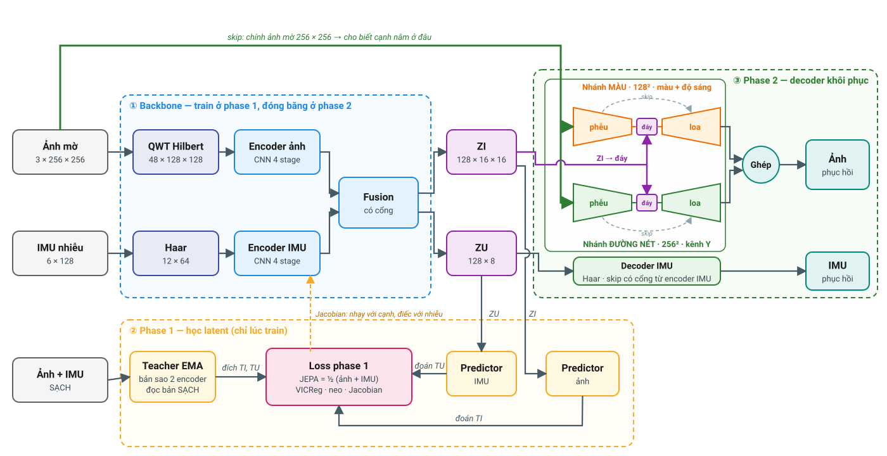

# Sơ đồ kiến trúc QWT–JEPA

**Đọc theo ba vùng màu:**

1. **① Backbone (xanh dương).** Ảnh mờ đi qua **QWT Hilbert**, IMU nhiễu đi qua **Haar**. Mỗi bên
   có một encoder CNN. Fusion trộn hai bên thành latent **ZI** (ảnh) và **ZU** (IMU).
2. **② Phase 1 (vàng, chỉ lúc train).** Teacher EMA (bản sao của hai encoder) đọc bản **sạch**
   và cho ra hai đích: **TI** cho ảnh, **TU** cho IMU. Có **hai predictor riêng**: predictor ảnh
   nhận **ZI** để đoán TI, predictor IMU nhận **ZU** để đoán TU. Loss JEPA = ½ × (ảnh + IMU); loss
   này, cùng VICReg, decoder neo và **Jacobian**, dùng để train backbone. Jacobian ép encoder nhạy
   với đường nét và bỏ qua nhiễu.
3. **③ Phase 2 (xanh lá).** Backbone **đóng băng**. Decoder ảnh nhận ZI và **chính ảnh mờ**
   (mũi tên skip), tách thành hai nhánh: **màu** ở 128×128 và **đường nét** trên kênh sáng Y ở
   256×256, rồi ghép lại. Decoder IMU nhận ZU.

| | Phase 1 | Phase 2 |
|---|---|---|
| Train | backbone 1,33 M | decoder ảnh 0,79 M + decoder IMU 0,36 M |
| Loss | JEPA · VICReg · decoder neo 0,45 · Jacobian 0,05 | L1 ảnh · chi tiết QWT · màu · đường nét · độ dốc cạnh · IMU |

Chi tiết từng lớp: [README](README.md#kiến-trúc-chi-tiết). Vẽ lại hình:
`python3 tools/draw_architecture.py docs/kien_truc.svg`.
