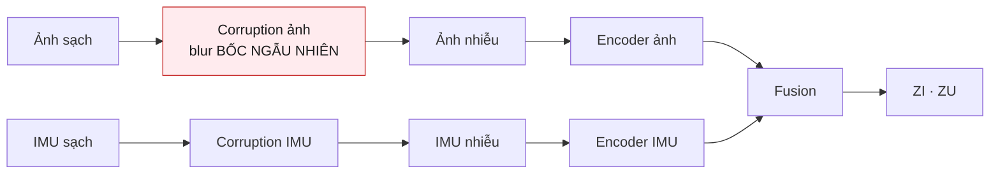
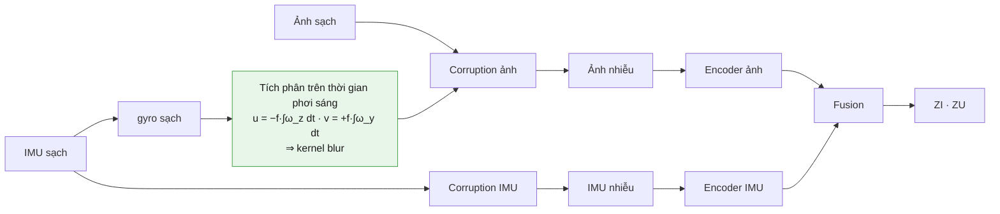

# Kiến trúc: trước và sau

So sánh giữa `d06d214` (trước) và `fc9ebcf` (sau). Mọi con số trong tài liệu này
đều **đo được**, kèm lệnh tái lập; không có số nào là ước lượng.

---

## 1. Tóm tắt

| | Trước | Sau | Thay đổi |
|---|---|---|---|
| **Biến đổi ảnh** | 4 cây db4 lệch 1 mẫu, 8 tap | Cặp Hilbert thiết kế riêng, 14 tap | Bản chất toán học |
| Năng lượng tần số âm | **0,1814** | **0,0677** | tốt hơn **2,68×** |
| Modulus ripple (dịch dưới pixel) | 0,1180 | 0,0957 | tốt hơn 19% |
| **Blur ảnh** | Bốc ngẫu nhiên, độc lập IMU | **giữ nguyên** — xem mục 2 | (cơ chế nối đã dựng, đang tắt) |
| **Khối Jacobian** | 1 hướng Rademacher, phạt đẳng hướng | `log(g_nhiễu / g_tín hiệu)` | Bản chất mục tiêu |
| Trọng số Jacobian | `1e-4` (trơ) | `0,05` (có tác dụng) | ×500 |
| Số tham số backbone | 1.333.120 | 1.333.120 | **không đổi** |
| Latent `ZI` | `128 × 16 × 16` | `128 × 16 × 16` | **không đổi** |
| Loss phase 2 | L1 + detail + energy + variation | y hệt | **không đổi** |
| Test | 100 | 111 | +11 |

Ba thay đổi, không thay đổi nào chạm vào số tham số hay kích thước latent. Đây
là thay đổi về **tính đúng đắn**, không phải về dung lượng.

---

## 2. Blur từ IMU: đã dựng, đã kiểm chứng, nhưng ĐANG TẮT

> **Cập nhật 23/09/2026.** Người dùng quyết định giữ giả định ảnh mờ do **camera**
> và nhiễu IMU do **môi trường** — hai nguyên nhân độc lập. `motion_from_imu`
> mặc định là `false`, nên phần dưới mô tả một **tuỳ chọn**, không phải mặc định.
>
> Đánh đổi: khi hai nhánh độc lập, cửa sổ IMU không mang bit nào về cách ảnh bị
> làm mờ, nên nhánh IMU không đóng góp cho việc khôi phục *ảnh*; liên kết duy
> nhất còn lại là vector tóm tắt 128 chiều toàn cục trong fusion. Bật lại bằng
> một dòng config; cơ chế đã có test và tool kiểm chứng.

### Trước



Hai nhánh corruption **độc lập hoàn toàn**. Cửa sổ IMU không mang một bit nào về
cách ảnh bị làm mờ. IMU ảnh hưởng tới ảnh **chỉ** qua một vector tóm tắt 128
chiều toàn cục trong fusion (`fusion.py:69-79`) — không có thông tin không gian
nào đi từ IMU sang ảnh.

Hệ quả có thể kiểm chứng: xoá hẳn nhánh IMU thì metric ảnh gần như không đổi.

### Sau



Blur do **gyro sạch** điều khiển, còn nhánh IMU chỉ nhận **bản nhiễu** của chính
tín hiệu đó. Khoảng cách giữa hai thứ chính là bài toán: model phải suy ra hướng
và độ dài vệt mờ từ một phép đo có sai số.

Đây là chỗ duy nhất trong toàn bộ pipeline khiến câu hỏi *"vì sao vừa QWT vừa
IMU trong một model"* có câu trả lời.

### Hình học — đo chứ không giả định

`tools/imu_blur_axis_check.py` đối chiếu `pose_lcam_front.txt` với gyro:

```
weakest matching-axis correlation : 0.9998
strongest off-axis correlation    : 0.7124
mean slope (expect ~1.0)          : 1.001
PASS - identity gyro-to-camera mapping in motion.py holds
```

12 trajectory, cả `Data_easy` lẫn `Data_hard`. Kết luận: hệ `lcam_front` **trùng**
hệ body IMU (x trước, y phải, z xuống). Do đó:

| trục gyro | ý nghĩa | tác động lên ảnh |
|---|---|---|
| `gyro_x` | roll quanh trục quang | xoay trong mặt phẳng — **không** gộp vào kernel |
| `gyro_y` | pitch quanh trục phải | dịch **dọc** |
| `gyro_z` | yaw quanh trục xuống | dịch **ngang** |

Roll bị loại khỏi kernel có chủ đích: nó gây xoay **biến thiên theo vị trí**, mà
một kernel tích chập duy nhất không biểu diễn được. Nó được báo riêng ở
`roll_radians` — nói rõ giới hạn còn hơn giả vờ nó không tồn tại.

### Phân phối blur thực tế

400 sample train ngẫu nhiên:

| | px |
|---|---|
| trung vị | 1,08 |
| p90 | 3,11 |
| tối đa | 9,62 |
| `Data_easy` trung bình | 1,06 |
| `Data_hard` trung bình | 2,35 |
| *(cũ: bốc ngẫu nhiên)* | *~1,8 trung bình* |

Độ nặng gần tương đương bản cũ. Cái đổi là **tương quan**, không phải cường độ.
`angular_gain` chỉnh cường độ mà không phá tương quan đó.

Thêm `exposure_tracks_darkness`: frame tối hơn ⇒ màn trập mở lâu hơn ⇒ nhoè mạnh
hơn. Thiếu sáng và nhoè giờ đến **cùng lúc** thay vì được bốc độc lập — đúng vật
lý, và là trường hợp khó nhất.

---

## 3. QWT: từ tên gọi thành tính chất

### Vấn đề của bản cũ

Bản cũ dùng **cùng một** filter db4 cho cả hai cây, lệch 1 mẫu. Docstring của
chính nó đã thừa nhận: *"Hilbert-pair/QWT reference equivalence has NOT been
established"*.

Đây không phải chuyện chọn sai wavelet. Hai cây chạy cùng một filter lệch `d` mẫu
luôn cho:

```
W_B(ω) = W_A(ω) · e^{−jωd}
```

nên dư lượng giải tích **chỉ phụ thuộc phép dịch**, không phụ thuộc filter. Đo
được **đúng 0,1804** cho db2…db20, mọi symlet, mọi coiflet. Đó là **trần cấu
trúc**: không bộ lọc nào cứu được, và mọi phép dò offset cũng không.

| thiết kế | năng lượng tần số âm |
|---|---|
| một cây đơn (đối chứng) | 0,5000 |
| db4 lệch 1 (**bản cũ**) | 0,1804 |
| db4 lệch 2 (mồi nhử) | 0,7840 |
| **cặp Hilbert mới** | **0,0677** |

Hai dòng "mồi nhử" có mặt để chứng minh thước đo không bị đánh lừa bởi một phép
tịnh tiến thuần tuý.

### Bản mới

Thiết kế bằng **liệt kê phân tích phổ** (`tools/design_hilbert_pair.py`): mọi
thừa số phổ của cùng một bộ lọc halfband Daubechies có **cùng đáp ứng biên độ**,
đều **trực chuẩn chính xác**, và chỉ khác nhau ở pha. Nên tập bộ lọc trực chuẩn
độ dài cho trước là **hữu hạn và nhỏ** — tìm cặp có hiệu pha gần độ trễ nửa mẫu
nhất là một phép **liệt kê**, không phải tối ưu.

```
 order  taps  factors   neg-freq  offset
     4     8        4     0.0981      -3
     6    12        8     0.0890      +1
     7    14        8     0.0677      +2   <- chọn
     8    16       16     0.0689      +1
```

Cây B hoá ra là **bản đảo thời gian** của cây A — tức cấu trúc q-shift/Farras,
tìm ra một cách độc lập. Phép đảo phủ định đáp ứng pha, và chính nó tạo độ trễ
nửa mẫu mà một phép dịch số nguyên không tạo được.

### Cái không đổi

Packing `[màu, băng, thành phần]` → 48 kênh **giữ nguyên**, vì nó vốn đã đúng:
`q = f_AA + i·f_BA + j·f_AB + k·f_BB`. Chỉ bộ lọc sai, không phải bố cục.

Nên `coeff_channels = 48`, shape `[48,128,128]` không đổi, encoder không phải sửa
một dòng nào, số tham số không đổi.

### Giá phải trả

Filter dài 8 → 14 tap, tức phép biến đổi tốn ~1,75× phép nhân-cộng. Biến đổi này
không có tham số và chạy một lần mỗi forward, nhỏ so với encoder.

### Hàm mới

`quaternion_modulus()` và `quaternion_phases()` — trước đây không có, vì với một
cặp không-Hilbert thì chúng vô nghĩa. Giờ modulus là cường độ cạnh gần bất biến
dịch, và hai pha mã hoá dịch chuyển dưới pixel.

---

## 4. Jacobian: từ một số vô nghĩa thành một chẩn đoán

### Trước

```python
direction = stateless_rademacher(...)          # một hướng NGẪU NHIÊN
gain = ‖Δh‖² / ‖Δx‖²
total += 1e-4 * gain.mean()                    # TỐI THIỂU HOÁ
```

Hai vấn đề:

1. **Sai hướng về mục tiêu.** Tối thiểu hoá gain theo hướng ngẫu nhiên là phạt co
   **đẳng hướng** — bảo encoder bớt nhạy với *mọi thứ*. Nhưng khôi phục cần
   encoder **nhạy với tín hiệu, trơ với nhiễu**. Nâng trọng số lên sẽ đẩy thẳng
   về collapse, và đó chính là lý do phải giữ VICReg variance ở 1,0 để chống lại.
2. **Trơ.** `1e-4` trên một số hạng cỡ `1e-2`, trong khi JEPA ~0,65. Đóng góp bị
   nuốt trong làm tròn. Khối này **không tác động gì đo được**.

Và nó trả về **một** gain đơn — không có gì để so, nên không đọc ra kết luận nào.

### Sau

Đo **hai** gain quanh cùng một điểm sạch, theo hai hướng có nghĩa:

| hướng | là gì | vì sao |
|---|---|---|
| `g_noise` | `noisy − clean` | nhiễu **thật** của batch này, không phải vector ngẫu nhiên bắn trượt |
| `g_signal` | `clean − lowpass(clean)` | phần tần số cao mà decoder phải dựng lại |

```python
L = log(g_noise + ε) − log(g_signal + ε)
L = clamp_min(L, floor_log_ratio)
```

- **Không thứ nguyên.** Collapse đưa cả hai gain về 0 và tỉ số đứng yên ⇒ khác
  bản cũ, số hạng này **không thưởng cho collapse** ⇒ nâng trọng số lên được thật
  (`1e-4` → `0,05`).
- **Chặn dưới.** Không có `floor_log_ratio` thì mục tiêu vô hạn dưới; một số hạng
  phụ không chặn cạnh tranh với JEPA qua hàng nghìn update là cách một run đi
  lệch mà không ai nhìn ra.
- **Điểm gốc là đầu vào sạch**, mà feature của nó phase 1 đã tính sẵn cho
  variance/covariance ⇒ chi phí thêm là **hai** forward encoder, không phải ba.

### Kết quả đo được — phần đáng giá nhất

30 update đầu trên dữ liệu thật (24.314 sample TartanAir):

| nhánh | `g_noise` | `g_signal` | tỉ số | đọc là |
|---|---|---|---|---|
| ảnh | 1,1 – 25 | 21 – 101 | **0,05 – 0,26** | đã nhạy với tín hiệu hơn nhiễu 4–20× |
| IMU | 0,9 – 12,7 | 0,9 – 4,2 | **1,0 – 3,3** | **nhạy với nhiễu ngang hoặc hơn tín hiệu** |

**Khối này tồn tại chủ yếu vì nhánh IMU**, không phải nhánh ảnh. Encoder IMU đang
để nhiễu lấn át tín hiệu — khớp đúng bất đối xứng đã biết của bài toán: ảnh cần
*thêm* tần số cao, IMU cần *bớt*.

Khối cũ **không thể** cho ra kết luận này, vì một gain đơn không có gì để so.

### Bug chỉ lộ ra trên dữ liệu thật

`clean_probability` để 2% frame ảnh và 5% cửa sổ IMU **sạch nguyên**, nên
`noisy − clean = 0` và hướng nhiễu suy biến → crash. Giờ những mẫu đó được cho
hướng dự phòng để probe vẫn xác định, và bị **loại khỏi trung bình**;
`sensitivity_valid_fraction` báo tỉ lệ còn lại (đo được 0,88–1,00).

---

## 5. Những gì KHÔNG đổi

Quan trọng không kém, để biết cái gì còn nguyên là giới hạn:

| thành phần | trạng thái |
|---|---|
| Latent `ZI = 128×16×16`, `ZU = 128×8` | y nguyên |
| Encoder 4 stage, fusion có cổng | y nguyên, kể cả số tham số |
| Decoder phase 2, `SkipMerge`, sub-pixel conv | y nguyên |
| Loss phase 2 (L1 + detail + energy + variation) | y nguyên |
| Decoder neo phase 1, teacher EMA, VICReg | y nguyên |
| Haar 1-D cho IMU | y nguyên |

Blur ảnh cũng **không đổi**: vẫn bốc ngẫu nhiên, độc lập với IMU (mục 2).

**Vì vậy đừng kỳ vọng SSIM nhảy vọt.** Trần SSIM 0,67 của run trước đến từ hai
thứ chưa đụng tới: loss phase 2 toàn là trung vị (mọi số hạng per-coefficient đều
được tối thiểu hoá bởi ảnh mờ), và chất lượng latent ở phase 1.

### Trần latent — đã đo, và nó đổi ưu tiên

`tools/capacity_ceiling.py` trên 2909 ảnh valid, 23272 mảng 16×16 px:

| số chiều | rút được |
|---|---|
| 32 | 80% |
| 64 | 84% |
| **128** (= số chiều một ô latent) | **89%** |
| 256 | 93% |

Trần của latent hiện tại là **89%**. Con số `latent_probe` của run cũ là **53%**.

**Latent còn cách trần rất xa** ⇒ bottleneck 16×16 **không** phải ràng buộc đang
chặn. Nới latent lợi rất ít (128→256 chiều chỉ nâng trần 89%→93%, tức +4 điểm,
đổi lấy gấp đôi bộ nhớ), trong khi khoảng 53%→89% là **+36 điểm** và không tốn
thêm tham số nào.

Kết luận: **dư địa nằm ở phase 1, không ở kích thước latent.** Đừng sửa
`encoders.py`.

---

## 6. Hệ quả vận hành

### Checkpoint phase 1 cũ mất hiệu lực

Không né được. Biểu diễn đầu vào đổi (bộ lọc wavelet khác) và phân phối blur đổi.
`model.image_transform` nằm trong configuration hash, nên đây là đứt gãy thật,
không phải đổi tên.

### Hai công tắc ablation, không cần sửa code

| nhánh | `model.image_transform` | `corruption.image.motion_from_imu` |
|---|---|---|
| control (bản cũ) | `qwt_dualtree_db4` | `false` |
| chỉ QWT | `qwt_dualtree_hilbert` | `false` |
| chỉ blur-IMU | `qwt_dualtree_db4` | `true` |
| đầy đủ | `qwt_dualtree_hilbert` | `true` |

### Chỉ số mới trong log phase 1

```
sensitivity_noise_gain      g_noise
sensitivity_signal_gain     g_signal   <- sụp về 0 = collapse
sensitivity_ratio           tỉ số      <- nhánh IMU phải GIẢM
sensitivity_valid_fraction  tỉ lệ mẫu đo được
```

Tỉ số **không đọc được nếu thiếu hai gain bên cạnh** — collapse làm tỉ số trông
vẫn đẹp. Luôn nhìn cả ba.

---

## 7. File thay đổi

| file | thay đổi |
|---|---|
| `qjepa/corruptions/motion.py` | **mới** — vật lý blur từ gyro |
| `qjepa/corruptions/image.py` | nhận `gyro`/`imu_times`; **từ chối chạy** nếu thiếu |
| `qjepa/data/dataset.py` | truyền gyro **sạch** xuống corruptor |
| `qjepa/transforms/qwt.py` | cặp Hilbert, hai backend, `quaternion_modulus/phases` |
| `qjepa/training/sensitivity.py` | tỉ số bất đẳng hướng, mask mẫu sạch, chặn dưới |
| `qjepa/training/phase1.py` | hai probe thay một |
| `qjepa/execution.py` | `probe_noise` + `probe_signal` |
| `qjepa/models/backbone.py`, `config.py` | chọn backend qua config |
| `tools/imu_blur_axis_check.py` | **mới** — xác minh hình học |
| `tools/design_hilbert_pair.py` | **mới** — thiết kế bộ lọc, tái lập được |
| `tests/test_imu_motion_blur.py` | **mới** — 17 test |
| `tests/test_qwt_analyticity.py` | **mới** — 10 test |
| `tests/test_sensitivity_ratio.py` | **mới** — 11 test |

Điểm chung: mỗi khẳng định đều có một phép đo đi kèm. Repo cũ chỉ test
**khả nghịch** cho QWT — mà phép đổi cơ sở trực giao nào cũng qua, và nó không
nói gì về tính giải tích.

---

## 8. Lệnh tái lập

```bash
# Hình học gyro→camera
python3 tools/imu_blur_axis_check.py --data-root <root> --trajectories 12

# Thiết kế lại bộ lọc
python3 tools/design_hilbert_pair.py --orders 4 6 7 8

# Trần dung lượng latent
python3 tools/capacity_ceiling.py --config <cfg> --manifest <man> --split valid

# Toàn bộ test
python3 -m pytest tests/ -q     # 111 passed
```
