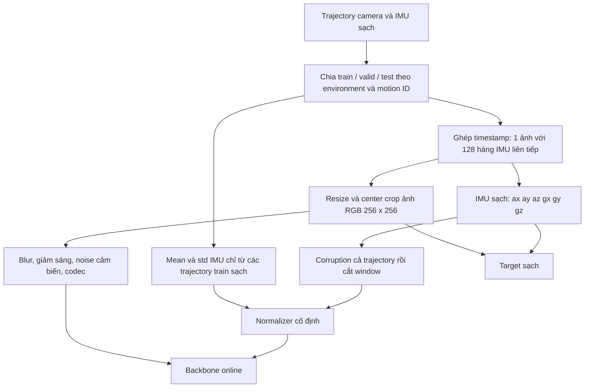
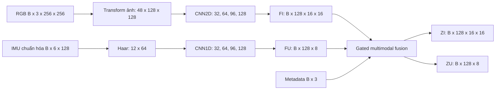
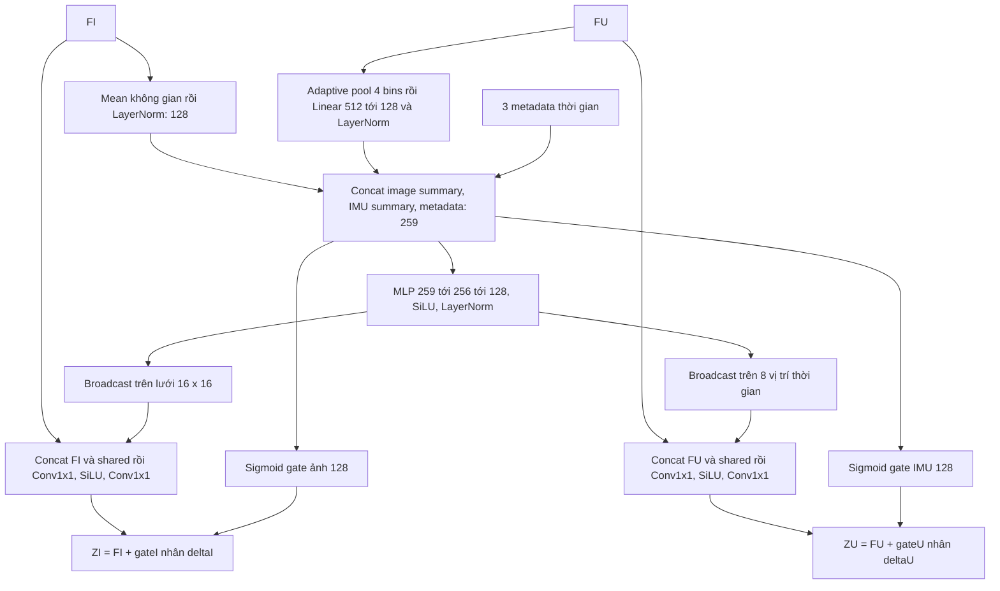
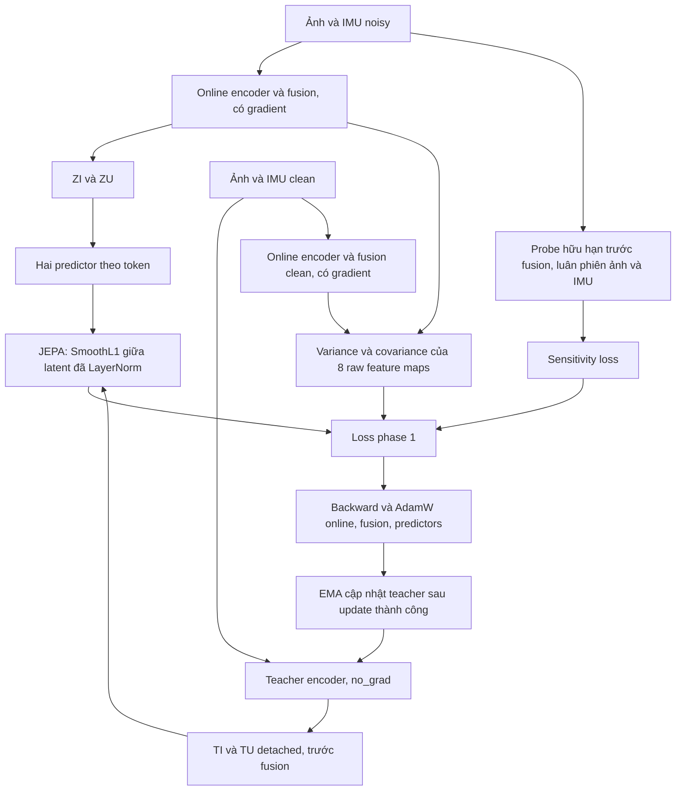
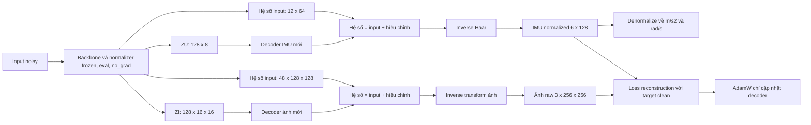
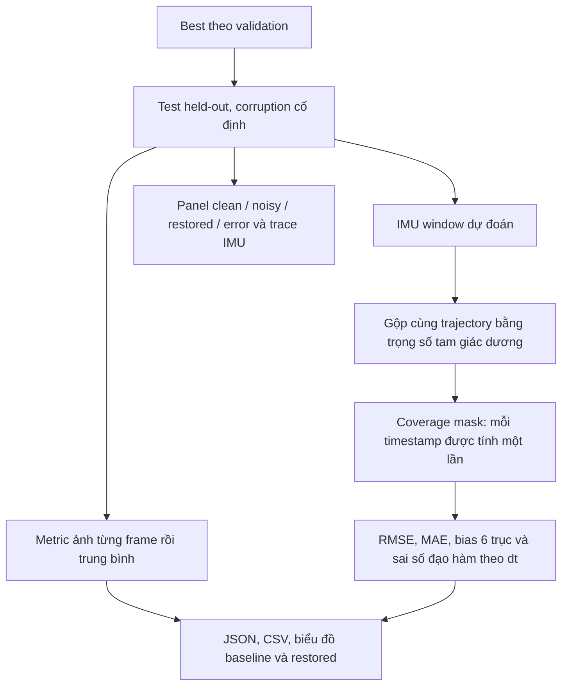

# Kiến trúc thực tế và quy trình train ảnh/IMU

Tài liệu mô tả source `qjepa/` và cấu hình chính `configs/pipeline_v3.yaml` sau
kiểm tra ngày 15/09/2026. Hai tài liệu thiết kế đầu vào vẫn giữ nguyên:
[migration guide](QWT_JEPA_JACOBIAN_MIGRATION_GUIDE.md) và
[architecture diagrams](QWT_JEPA_V3_DETAILED_ARCHITECTURE_DIAGRAMS.md).
Lệnh chạy từng cell: [KAGGLE_TRAIN_CELLS.md](KAGGLE_TRAIN_CELLS.md).

**Ý chính:** phase 1 học biểu diễn ảnh/IMU sạch trong latent space; phase 2 mới
học chuyển latent thành ảnh và chuỗi IMU. Không có decoder hoặc loss khôi phục
trong phase 1. Đây là biến thể JEPA dự đoán latent clean từ input bị corruption,
không triển khai patch masking kiểu I-JEPA.

**Giới hạn transform:** tên lớp `QuaternionWaveletTransform2D` và backend
`qwt_dualtree_db4` hiện trỏ tới bốn cây db4 dùng offset 0/1, pack 48 kênh thực.
Chưa có kiểm chứng filter Hilbert pair hoặc đối chiếu QWT reference. Vì vậy tài
liệu gọi nó là **transform ảnh hiện tại**, không kết luận đã đạt yêu cầu QWT
chuẩn của đặc tả. Encoder/fusion là Conv/MLP số thực; không có Hamilton layer.

## 1. Dữ liệu đi vào model



| Đại lượng | Shape | Đơn vị/quy ước |
| --- | --- | --- |
| Ảnh clean/noisy | `[B,3,256,256]` | float32 RGB, `[0,1]` |
| IMU clean/noisy vật lý | `[B,6,128]` | `ax,ay,az` m/s²; `gx,gy,gz` rad/s |
| IMU normalized | `[B,6,128]` | `(u - mean_train) / scale_train` |
| Timestamp ảnh | `[B]` | giây, float64 |
| Timestamp IMU | `[B,128]` | giây, float64, tăng nghiêm ngặt |
| Metadata thời gian | `[B,3]` | tính chênh lệch bằng float64 rồi mới cast float32 |

`scale_train = max(std_train, floor)` theo từng kênh; floor accel=`1e-3`,
gyro=`1e-4`. Không chuẩn hóa riêng từng
window vì sẽ mất bias/biên độ cần phục hồi. Train normalization tính từ toàn bộ
hàng IMU của trajectory train, loại trùng các stream giống hoàn toàn.

Ảnh được ghép với cửa sổ có **tâm gần timestamp ảnh nhất**, sai số tối đa một
chu kỳ IMU; reject window thiếu hàng hoặc dt lệch quá 2% so với median dt.
Với IMU 100 Hz, 128 mẫu phủ 1,27 giây. Cửa sổ nằm hai phía thời điểm ảnh nên
pipeline hiện tại xử lý offline hoặc cần chờ mẫu tương lai khoảng 0,635 giây.
Không padding, không nối window qua hai trajectory.

Hai bản easy/hard cùng `(environment, trajectory_id)` nằm cùng split. Sampler
train hiện cân bằng tương đối các `trajectory_key`, bảo đảm số trajectory tối
thiểu trong mỗi batch; có thể lấy lại trajectory ít mẫu. Easy/hard vẫn là hai
key sampler khác nhau: điều này không bảo đảm hai chuyển động độc lập. Sampler
không bảo đảm khoảng cách thời gian tối thiểu giữa các frame trong batch.

## 2. Corruption mô phỏng camera kém và IMU

Clean target được giữ nguyên sau resize/crop. Chỉ input bị làm xấu.

Tham số camera bốc theo `segment_seconds: 0,05`, nhỏ hơn khoảng cách giữa hai
frame ở 10 Hz, nên **mỗi ảnh có mức sáng/nhòe riêng**. Tham số IMU bốc một lần
cho cả trajectory, nhưng nền nhiễu trôi chậm dọc trajectory nên mỗi window vẫn
thấy một mức khác nhau.

| Nhóm | Thiết lập mặc định |
| --- | --- |
| Defocus | xác suất 0,68; sigma 0,30–1,45 px |
| Motion blur | xác suất 0,55; chiều dài 3–9 px |
| Giảm độ phân giải | xác suất 0,32; scale 0,72–0,96 |
| Giảm sáng | exposure gain 0,21–0,63, tone curve gamma 0,46–0,79 |
| Màu và tối góc | white balance 0,82–1,18; vignette 0–0,45 |
| Nhiễu cảm biến | shot noise 550–4000 photon; read noise 0,7/255–3,2/255; row noise và hot pixel |
| Lưu ảnh | 6–8 bit; JPEG xác suất 0,35, quality 35–80 |
| Nhiễu accel | white sigma 0,06–0,50 m/s², bias, random walk |
| Bias instability | chỉ 25% trajectory mắc phải; dao động băng hẹp có giới hạn, sigma 0,10–0,60 m/s² và 0,006–0,040 rad/s, hằng số thời gian 0,3–2 s |
| Trôi nền nhiễu | hệ số nhân 0,35–4,0 biến thiên liên tục, hằng số thời gian 1,5 s |
| Nhiễu gyro | white sigma 0,010–0,060 rad/s, bias, random walk |
| Rung cơ học | 0–3 tone băng hẹp 8–45 Hz (kẹp dưới Nyquist), biên độ ≤0,35 m/s² và ≤0,02 rad/s, bao biên độ điều biến 0,2–1,5 Hz |
| Lỗi IMU khác | low-pass, sai scale, trộn trục, spike 0,6 Hz/nhóm (±0,7–3,5 m/s²; ±0,06–0,28 rad/s), dropout 0,10 Hz giữ mẫu, lượng tử |

Trình tự ảnh: blur/giảm phân giải → exposure/màu/gamma → noise → lượng tử/JPEG.
Thông số camera ổn định theo đoạn 1 giây; noise cảm biến thay đổi theo frame.
IMU được tạo nhiễu **trên cả trajectory** để hai window chồng lấn có cùng giá trị
input tại cùng timestamp. Không cộng nhiễu riêng cho từng window.

Train có 5% xác suất giữ clean ở mỗi corruptor. Validation/test dùng realization
cố định và `clean_probability=0`; scenario `clean` được yêu cầu riêng. `full`
nghĩa là hỗn hợp lỗi theo các xác suất trên, không phải mọi frame đều có mọi loại
blur. Train đổi realization mỗi epoch; seeds riêng cho corruption, sampler,
vị trí regularization, probe Jacobian và initialization.

Đây là mô phỏng. Cần hiệu chỉnh khoảng corruption theo camera/IMU thực; độ sáng
mất hoàn toàn hoặc chi tiết bị blur mất không thể được bảo đảm khôi phục chính
xác. Pipeline train hiện cần clean reference đồng bộ, chưa hỗ trợ chỉ có dữ
liệu noisy mà không có target sạch.

## 3. Backbone và kích thước từng tầng



| Tầng | Nhánh ảnh | Nhánh IMU |
| --- | --- | --- |
| Transform | `48×128×128` | `12×64` |
| Stage 0, stride 1 | `32×128×128` | `32×64` |
| Stage 1, stride 2 | `64×64×64` | `64×32` |
| Stage 2, stride 2 | `96×32×32` | `96×16` |
| Stage 3, stride 2 | `128×16×16` | `128×8` |

Mỗi Stage: Conv kernel 3 + GroupNorm(8) + SiLU → residual block gồm hai Conv
kernel 3 và GroupNorm. Không dropout/BatchNorm. Không xuất các feature tầng sớm
cho decoder. Shape bảng không ghi chiều batch.

Transform ảnh xử lý từng kênh RGB, bốn band và bốn component-slot:
`3 × 4 × 4 = 48` kênh, periodic boundary. Synthesis trung bình bốn cây nghịch
đảo. Haar tách `(u_even+u_odd)/sqrt(2)` và `(u_even-u_odd)/sqrt(2)` thành 12 kênh.
Các bộ lọc cố định, không có trọng số trainable.

## 4. Fusion giữ lại lưới ảnh và trục thời gian



Metadata là `(t_image - tâm_window)/span`, `log(span)`,
`log(median_dt / 0.01)`. Gate weight khởi tạo 0, bias −2 nên sigmoid ban đầu
khoảng 0,119. Model bắt đầu bằng hiệu chỉnh nhỏ từ thông tin chung, vẫn giữ
feature của từng modality. Đây là fusion qua summary, không phải cross-attention
theo từng pixel/mẫu IMU. Giữ trật tự thời gian trong FU/ZU và vị trí không gian
trong FI/ZI cho bước khôi phục về sau.

## 5. Phase 1: JEPA trong latent space



### Neo reconstruction trong phase 1

JEPA so biểu diễn học được với teacher EMA của **chính encoder đó**, còn
variance/covariance và sensitivity chỉ là thống kê của biểu diễn. Không số hạng
nào nhìn vào tín hiệu clean, nên cả hệ có thể trôi về một biểu diễn thô mà loss
vẫn giảm — đo thực tế cho thấy JEPA đạt 0,054 trên một latent mà hồi quy tuyến
tính chỉ rút được 17% tín hiệu IMU.

Vì vậy phase 1 có thêm một decoder phụ và số hạng L1 với **hệ số clean thật**:
`coefficient_reconstruction_loss_weight` (0,45) và `reconstruction_detail_weight`
(0,5, cân thêm cho băng LH/HL/HH và Haar detail). Đây là số hạng duy nhất không
tự quy chiếu nên không thể thoả mãn bằng cách vứt tín hiệu.

Decoder phụ dùng đúng `build_decoders`, tức đúng kiến trúc phase 2 sẽ dùng, để
chữ "giải mã được" có nghĩa thực tế. Nó bị **vứt sau phase 1**; phase 2 khởi tạo
decoder mới từ backbone đóng băng. Decoder neo **không bao giờ nhận skip và không
bao giờ dùng residual** (`build_decoders(config, residual=False, skips=False)`):
cả hai đều là đường vòng quanh latent, và neo sinh ra để ép thông tin *vào* latent
chứ không phải để đạt loss thấp. Chi phí: phase 1 chậm thêm ~48% mỗi update.

Đặt `decoder_enabled: false` cùng trọng số 0 để quay lại chế độ latent thuần;
`configs/smoke.yaml` dùng chế độ đó.

Teacher chỉ gồm hai encoder, deepcopy online lúc khởi tạo. Teacher không có
fusion, predictor hoặc decoder. Nhánh clean-online chia sẻ trọng số với online
noisy, vẫn giữ gradient để loss chống collapse điều chỉnh representation clean.

Predictor mỗi modality: token `[B,K,128]` → LN → Linear(128,256) → GELU →
Linear(256,128). Ảnh có `K=256`; IMU có `K=8`.

```text
L_JEPA = 0.5 × [SmoothL1(LN(P_I(ZI)), LN(TI))
               + SmoothL1(LN(P_U(ZU)), LN(TU))]
L_phase1 = L_JEPA + L_variance + 0.01 × L_covariance + lambda(s) × L_FD
```

LN trong phép đo loss không có affine. Variance/covariance tính trên raw
`FI,FU,ZI,ZU` của **cả noisy và clean**, rồi lấy trung bình tám map. Chọn 16 vị
trí ảnh và 8 vị trí IMU; tại mỗi vị trí thống kê qua chiều batch, mẫu số `B−1`.
Không gộp vị trí không gian vào batch. Vì thế phase 1 cần batch vật lý ≥8;
accumulation B4 hai lần không tương đương B8 cho loss này.

Sensitivity dùng probe dấu ±1, ảnh epsilon=1/255 và clamp `[0,1]`, IMU epsilon
=0,01 trong đơn vị normalized. Năng lượng input tính **sau clamp thực tế**.

```text
L_FD = mean_b [mean((LN(F(x+delta)) - LN(F(x)))²)
                / mean(delta_thực_tế²)]
```

F là encoder dense trước fusion; gradient đi qua cả nhánh gốc và nhánh probe.
Không đo Jacobian của decoder hay raw reconstruction. Nguồn probe luân phiên
ảnh/IMU theo số update thành công. Đồ thị ghi `encoder_sensitivity` là gain đã
chuẩn hóa feature; chưa có gain raw riêng.

### Trình tự và lịch tối ưu

1. Lấy một batch noisy/clean ghép đúng timestamp; chuẩn hóa IMU đúng một lần.
2. Forward noisy online, clean online và clean teacher.
3. Tính JEPA, variance/covariance; nếu đến lịch thì forward probe thêm một encoder.
4. Kiểm tra loss, backward, clip gradient norm ở 5; từ chối gradient không hữu hạn.
5. AdamW update online/fusion/predictors; EMA teacher; tăng bộ đếm thành công.
6. Theo lịch checkpoint, đo validation bank rồi lưu `last.pt`.

| Tham số | Phase 1 | Phase 2 |
| --- | --- | --- |
| Optimizer | AdamW, weight decay `1e-4` | AdamW, weight decay `1e-4` |
| LR đỉnh / sàn | `2e-4` / `1e-6` | `2e-4` / `1e-6` |
| Warmup | 500 updates | 250 updates |
| Sau warmup | cosine | cosine |
| Tổng updates | 10.000 | 5.000 |
| Batch vật lý | 8 | 4 |
| Accumulation | 1 | 2 |
| Precision | FP32 | FP32 |
| Teacher EMA | 0,99 → 0,999 | không dùng |
| Sensitivity | off 500 updates, ramp 1.000 tới `1e-4` | không dùng |
| Neo reconstruction | hệ số `0,45`, detail `0,5` | detail `2,0`, sai phân `0,5`, β `0,05` |

## 6. Kiểm tra latent và chuyển phase

Bank validation chọn tối đa 64 mẫu, phân bổ giữa trajectory và trải theo thời
gian, giữ cố định sample ID và corruption realization. Nếu dataset nhỏ, dùng
toàn bộ mẫu; cần ít nhất hai mẫu để tính std/rank. Forward theo minibatch nhưng
**nối feature cả bank trước khi tính thống kê**. Effective rank của pooled
feature bị chặn bởi `min(D,N−1)`; bank 64, D128 không thể đạt rank 128.

Đo raw RMS, same-position std, effective rank; thêm std/rank sau LayerNorm trên
10 map: noisy/clean `FI,FU,ZI,ZU` và teacher `TI,TU`. So với giá trị lúc khởi tạo:
std/rank dưới 10% hoặc raw RMS ngoài `[0,1×;10×]` sẽ cảnh báo. Ba kiểm tra liên
tiếp cảnh báo làm gate FAIL và dừng train. Checkpoint WARN cũng chưa được chuyển
phase. Lịch FD hiện phụ thuộc update count, chưa tự hoãn khi gate WARN.

Phase 2 chỉ nhận checkpoint có đúng version/phase, manifest/config/normalizer/
backbone khớp, đủ toàn bộ ngân sách phase 1 và gate PASS. Hai trường
`trained_with_reconstruction` và `phase1_decoder_forward_calls` phải **nhất
quán với nhau**, để metadata không thể nói dối về cách checkpoint được tạo.

Gate PASS chỉ kiểm tra suy giảm tương đối về phương sai và hạng, **không chứng
minh latent đã đủ thông tin khôi phục** — một biểu diễn có thể đủ hạng, phương
sai đẹp mà vẫn chỉ mã hoá thống kê thô. Dùng `tools/latent_probe.py` ngay trên
checkpoint phase 1 để đo trực tiếp phần thông tin còn lại, thay vì phải train
xong phase 2 mới biết.

## 7. Phase 2: decoder khôi phục từ latent



| Tầng decoder | Ảnh | IMU |
| --- | --- | --- |
| Input latent | `128×16×16` | `128×8` |
| Sub-pixel ×2 + Stage 128→96 | `96×32×32` | `96×16` |
| Sub-pixel ×2 + Stage 96→64 | `64×64×64` | `64×32` |
| Sub-pixel ×2 + Stage 64→32 | `32×128×128` | `32×64` |
| Conv head kernel 3 (zero-init) | `48×128×128` | `12×64` |
| Cộng hệ số input | `48×128×128` | `12×64` |
| Synthesis | `3×256×256` | `6×128` |

Phép nâng độ phân giải là **sub-pixel convolution**, không phải nội suy. Nội suy
bilinear là bộ lọc thông thấp nên không sinh được tần số cao — mọi chi tiết nhỏ
hơn một ô latent sẽ mất trước khi các tầng conv chạy.

### Residual trên hệ số đầu vào

Với `input_coefficient_residual: true`, decoder dự đoán **hiệu chỉnh** chứ không
phải hệ số tuyệt đối:

```text
C_out = C_in + Δ(Z)
```

Head khởi tạo bằng 0 nên **update 0 trả lại đúng hệ số đầu vào**. Đó là sàn đảm
bảo bằng toán: model không bao giờ tệ hơn việc không làm gì. Ở chế độ tuyệt đối
trước đây, một ảnh gần sạch (`blur_only`, PSNR 37,5 dB) bị kéo xuống 15,7 dB.

`Δ` cũng chính là **đóng góp đo được của latent**: ép `Δ = 0` cho ra baseline,
model đầy đủ cho ra baseline cộng phần latent thêm vào.

Decoder phụ của **phase 1 giữ chế độ tuyệt đối** (`build_decoders(residual=False)`).
Cho nó residual sẽ phá vỡ mục đích của neo — nó sẽ học `Δ ≈ 0` và không ép được
thông tin nào vào latent.

### Skip connection từ encoder

`encoder_skips: true` nối ba tầng trung gian của encoder vào đường decoder ở đúng
ba mức phân giải khớp nhau:

| mức | encoder | decoder nhận vào |
|---|---|---|
| 2 | `[96, 32, 32]` | sau `up2` → `[96, 32, 32]` |
| 1 | `[64, 64, 64]` | sau `up1` → `[64, 64, 64]` |
| 0 | `[32, 128, 128]` | sau `up0` → `[32, 128, 128]` |

Hợp nhất bằng **cổng sinh từ đường latent** (`skip_gating: true`):

```text
cổng = sigmoid(conv_gate(x))          # x đi lên từ ZI — mang thông tin latent
ra   = x + cổng × conv_skip(skip)
```

Đây là chỗ phân công giữa hai nguồn. Skip mang đường nét của ảnh **nhiễu**: sắc
nét nhưng chứa cả cạnh thật lẫn hạt nhiễu. Latent mới là thứ biết cạnh nào là
thật, vì nó được huấn luyện để đoán latent của ảnh **sạch** cộng với neo ép nó
giữ hệ số sạch ở băng chi tiết. Cổng phụ thuộc **từng vị trí và từng kênh**, nên
decoder học cách dùng latent để *lọc* skip.

Đặt `skip_gating: false` thì merge quay về một conv pointwise trên tensor nối —
nó chỉ học được một **tỉ lệ pha trộn cố định theo kênh**, giống nhau ở mọi vị trí
và mọi ảnh, tức không lọc được gì. Chênh lệch chi phí không đáng kể (208 so với
200 tham số cho một khối 8→8 kênh).

`conv_gate` khởi tạo trọng số 0 và bias −2.0 theo đúng quy ước của
`SharedGatedFusion`; `conv_skip` zero-init nên đóng góp skip ban đầu **bằng đúng
0**. Nhờ vậy sàn identity của residual sống sót qua cả ba điểm nối — tại update 0 đầu ra vẫn bằng đúng đầu vào (đo được:
sai lệch tối đa 3e-7, tức chỉ là làm tròn float32) — và skip chỉ được dùng dần
theo mức nó tỏ ra hữu ích.

Đánh đổi phải nói rõ: **độ nét đi qua đường này đến từ ảnh đầu vào, không phải từ
latent.** Nó làm ảnh nét hơn thật, nhưng "khôi phục từ latent" không còn mô tả
đúng hệ nữa. Vì vậy `decoder_input` phải khai đúng `latent_plus_encoder_skips`;
`validate_config` từ chối config bật skip mà vẫn khai `fused_dense_latent_only`.

`encoders.py` chỉ trả tầng trung gian khi người gọi **yêu cầu tường minh**
(`return_stages=True`), nên không decoder nào nhặt được skip do vô ý.

Layout dùng cho inverse transform là metadata shape, không chứa tín hiệu.

```text
L_phase2 = L1(image_raw_restored, image_clean)
           + 0.5 × [SmoothL1_β(accel_norm_restored, accel_norm_clean)
                    + SmoothL1_β(gyro_norm_restored, gyro_norm_clean)]
           + 2.0 × [L1(hệ số ảnh băng LH/HL/HH)
                    + 0.5 × L1(hệ số IMU băng detail)]
           + 0.5 × [L1(Δt accel_norm_restored, Δt accel_norm_clean)
                    + L1(Δt gyro_norm_restored, Δt gyro_norm_clean)]
```

**Băng chi tiết (`reconstruction_detail_weight: 2.0`)** phạt riêng phần đường nét
bị mất. L1 trên pixel tối ưu về trung vị có điều kiện, mà với bài toán bất định
như khử mờ thì nghiệm đó **chính là ảnh mờ** — nên cần một số hạng nhắm thẳng vào
băng chi tiết. Trọng số đi từ 0,5 lên 2,0 sau khi đo thấy MAE giảm 45,5% mà SSIM
chỉ tăng 10,7%: dấu hiệu model đang chỉnh phơi sáng chứ chưa dựng lại cấu trúc.

**Sai phân bậc một (`imu_variation_weight: 0.5`)** là số hạng duy nhất nói về độ
*mượt*. Các số hạng khác chấm điểm từng mẫu độc lập, nên một dự đoán bám đúng
biên độ vẫn có thể giật từng mẫu mà không bị phạt. `evaluate` vốn đã báo cáo đại
lượng này dưới tên `variation_rmse` — nó được **đo** nhưng không được **tối ưu**,
và số liệu cho thấy nó gần như không nhúc nhích (−0,7% so với input).

**`smooth_l1_beta: 0.05`**, hạ từ `1.0`. Sai số IMU đã chuẩn hoá đo được là
`|x| ≈ 0,12–0,14`; với `β = 1.0` toàn bộ quá trình train nằm trong vùng **bậc
hai** của SmoothL1, nơi gradient bằng `|x|/β ≈ 0,125` — yếu gấp 8 lần L1, và mất
luôn phần đuôi L1 vốn là lý do dùng SmoothL1 để bền với spike.

Không clamp ảnh trước loss train. Clamp chỉ khi tính image metrics/hiển thị/xuất
PNG. IMU loss dùng normalized để cân bằng scale; chỉ số cuối dùng đơn vị vật lý.
Mỗi update tích lũy hai microbatch B4, mỗi loss chia 2 trước backward. Hash
backbone/normalizer được kiểm tra khi lưu checkpoint để phát hiện thay đổi.

## 8. Checkpoint, đánh giá và cách đọc kết quả

`last.pt` chứa trọng số, optimizer, RNG, số update/microbatch, config và provenance.
Resume giữ tiến độ sampler và corruption epoch; log vượt checkpoint do gián đoạn
được cắt về update đã lưu. Phase 2 giữ best validation score qua resume, parent
so bằng backbone hash nên có thể đổi đường dẫn mount checkpoint. Khi chuyển
session Kaggle, mang theo cả thư mục phase2, gồm best checkpoint và logs.

Validation phase 2 mặc định 32 mẫu cố định trải giữa trajectory/time, không phải
toàn split. Chọn best theo `image_mae_clamped + 0.5×(accel_smooth+gyro_smooth)` sau
gộp overlap IMU. Điểm này khác loss train raw ảnh; cần đọc riêng train và valid.
`evaluate` cuối dùng toàn test khi không truyền `--max-batches`.



Metric ảnh: MAE thấp hơn tốt hơn; PSNR/SSIM cao hơn tốt hơn. SSIM dùng cửa sổ
Gaussian tối đa 11, padding zero, data range 1; PSNR cap120 dB khi MSE≤`1e-12`.
Luôn so với `baseline_*` của chính input noisy; loss giảm không đủ để kết luận
khử nhiễu tốt. Có thể restored tệ hơn input, đặc biệt trên input vốn đã sạch.

IMU gộp prediction/clean/noisy cùng trọng số. Derivative metric chỉ tính hai hàng
kề nhau đều covered, chia dt thực; không nối qua khoảng trống. `.npz` lưu đầy đủ
timestamps, clean/noisy/restored `[N,6]` và `coverage[N]`; plot lấy tối đa4.000
điểm cho dễ xem, metrics vẫn dùng toàn bộ hàng covered.

Outputs gồm curves của hai phase, bảng metrics 10 scenario, panel ảnh, trace IMU
6 trục. Xem [CODE_REVIEW_KAGGLE.md](CODE_REVIEW_KAGGLE.md) để biết phạm vi kiểm
chứng và các giới hạn: chưa có kết quả train chính trên Kaggle/camera thật.
