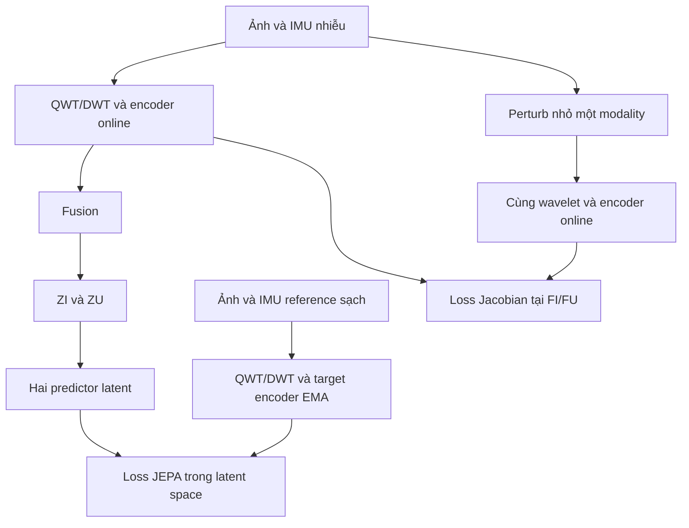
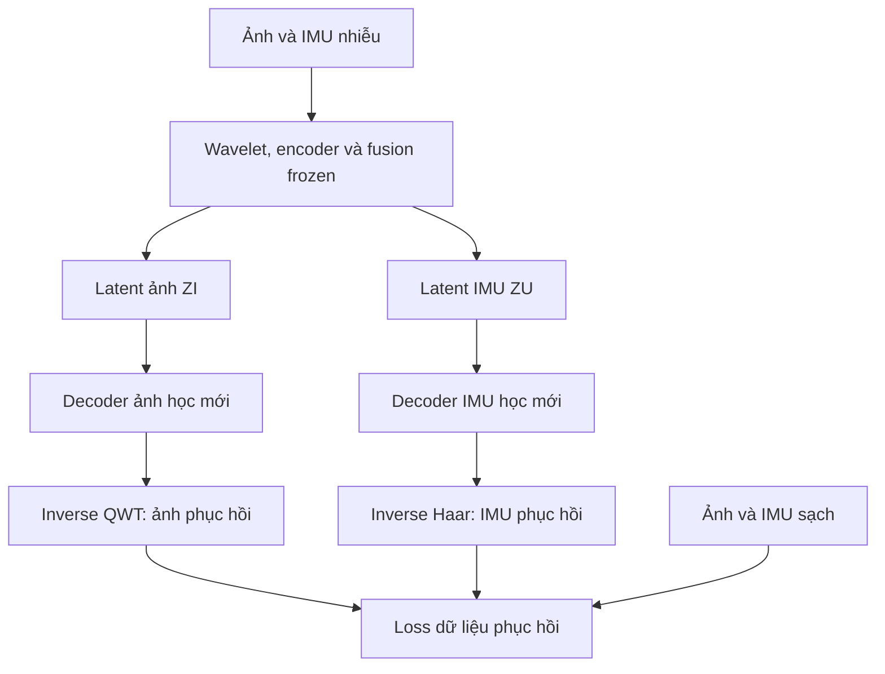

# Pipeline QWT–JEPA: học latent trước, khôi phục ảnh và IMU từ latent sau

**Phiên bản: 3.0 — 15/09/2026.**  
**Thay thế:** các hướng dẫn migration v1/v2 có warm-up phục hồi hoặc loss phục hồi cùng train encoder.  
**Đầu vào:** một frame RGB 256×256 và IMU 128×6 trên TartanAir.  
**Đối tượng:** Agent sửa repository đã build theo đặc tả cũ; tiếp tục source hiện có, không dựng lại toàn bộ dự án.

> Quy trình người dùng yêu cầu: **giai đoạn 1 JEPA học latent; giai đoạn 2 mới train decoder để khôi phục ảnh và IMU từ latent đã học.** Giai đoạn 1 không train decoder và không có reconstruction loss. Giai đoạn 2 đóng băng encoder và fusion, chỉ train decoder. Đây là thay đổi bắt buộc so với v2.

Người viết chưa được cung cấp repository hoặc checkpoint để kiểm chứng thực tế. Tên API/module trong tài liệu là hợp đồng để Agent ánh xạ vào code thật. Không được coi đặc tả hoặc test toy là bằng chứng model đã học được latent hữu ích.

## 0. Quyết định kiến trúc và phần v2 phải bỏ

Bản trước không đưa ảnh đã phục hồi ngược vào JEPA, nhưng có Stage A phục hồi và reconstruction loss cập nhật encoder. Quy trình đó không đáp ứng yêu cầu **học latent độc lập trước khi train phục hồi**. Bản này bỏ hoàn toàn sự phụ thuộc đó.

| Nội dung | Pipeline v3 bắt buộc |
| --- | --- |
| Học latent | Giai đoạn 1, từ đầu vào nhiễu qua wavelet → encoder → fusion |
| JEPA targets | Encoder teacher EMA nhận dữ liệu tham chiếu sạch, tạo target latent |
| Jacobian | Regularize dense feature hai encoder online trước fusion |
| Chống collapse | Loss variance/covariance tường minh và kiểm tra độ đa dạng latent |
| Reconstruction ở giai đoạn 1 | Không có; không forward decoder, không tính pixel/IMU reconstruction loss |
| Khôi phục | Giai đoạn 2, latent → decoder → inverse wavelet → dữ liệu |
| Train giai đoạn 2 | Encoder/fusion/normalizer/transforms frozen; chỉ hai decoder học |
| Đường tắt vào decoder | Không encoder skips, không noisy coefficients, không raw image/IMU |
| Inference | Dữ liệu nhiễu → backbone JEPA đã học → latent → decoder đã học → dữ liệu phục hồi |

Bỏ trong main pipeline: Stage A phục hồi, joint reconstruction warm-up, `L_old=L_reconstruction+L_JEPA` ở phase latent, parent Stage B từng train reconstruction, và decoder có residual từ coefficients đầu vào. Giữ các bản đó như **legacy baselines** có nhãn rõ nếu cần so sánh; không xóa checkpoint người dùng.

Giữ nguyên hợp đồng RGB256/IMU128, QWT/Haar, hai encoder CNN và fusion hiện có nếu đã đúng. Không thêm Transformer, attention, frame lân cận hoặc full VIO trong migration này.

Hướng dẫn v3 ưu tiên khi xung đột với các mục training/decoder cũ. Chỉ các hợp đồng data, transform và metrics tương thích tiếp tục áp dụng. Không yêu cầu Agent phải đọc v1/v2 để hiểu pipeline mới.

## 1. Hợp đồng dữ liệu và tensor

| Tensor/thành phần | Shape/quy tắc |
| --- | --- |
| Ảnh một sample | `[256,256,3]`, RGB |
| IMU một sample lưu | `[128,6]`, cột `ax,ay,az,gx,gy,gz` |
| Ảnh input core | `[B,3,256,256]`, FP32, `[0,1]` |
| IMU input core | `[B,6,128]`, normalized bằng thống kê train cố định |
| Public IMU physical | `[B,6,128]`, accel m/s², gyro rad/s |
| Timestamp | Ảnh `[B]`, IMU `[B,128]`; lưu riêng |
| QWT ảnh tham chiếu | `[B,48,Hc,Wc]`; Hc/Wc tùy backend, tham chiếu128 |
| Haar IMU | `[B,12,64]` |
| FI cuối encoder ảnh | `[B,128,Hi,Wi]`, tham chiếu16×16 |
| FU cuối encoder IMU | `[B,128,8]` |
| ZI/ZU sau fusion | Shape tương ứng FI/FU; đây là latent gửi vào decoder |
| Decoder output | Ảnh `[B,3,256,256]`, IMU `[B,6,128]` |
| IMU export một window | `[128,6]`, physical units và timestamp riêng |

Mỗi sample có một ảnh và 128 hàng IMU liên tục quanh timestamp ảnh. Không ghép 128 frame ảnh. Camera10 Hz/IMU100 Hz phải audit từ timestamp; 128 hàng ở100 Hz trải dài1,27 giây, centered lookahead khoảng0,635 giây. Không gọi pipeline này là causal.

Data pipeline:

1. Split train/validation/test theo **trajectory** trước khi tạo window; mọi camera cùng trajectory cùng split.
2. Ghép ảnh–IMU theo timestamp, đủ128 hàng, không padding giả hoặc nối qua trajectory.
3. Shuffle các sample đã ghép khi train; giữ thứ tự hàng IMU.
4. Normalization IMU fit chỉ từ unique train-clean timestamps, không theo window và không dùng test.
5. Tạo corrupted image và corrupted IMU bằng nguồn nhiễu độc lập. Dữ liệu gốc đã kiểm tra là reference trước corruption nhân tạo.
6. IMU corruption giữ trace nhất quán trên window overlap; timestamp, axes, units không thay đổi do probe Jacobian.

DataLoader có thể trả clean/noisy cùng sample trong cả hai phase. **Clean có mặt ở phase1 không có nghĩa có reconstruction loss:** clean chỉ dùng tạo target latent và ràng buộc latent như mục6. Decoder phase2 mới so output thực với clean image/IMU.

## 2. Audit và cách chuyển source/checkpoint cũ

Đọc hướng dẫn repo, trạng thái git và các thay đổi có sẵn. Dùng `rg` tìm data, transforms, encoders, fusion, predictor, teacher/EMA, decoder, losses, trainer và checkpoint. Không reset hoặc ghi đè công việc người dùng.

Tạo `PIPELINE_V3_AUDIT.md`:

| Hạng mục | File/hàm thật | Hiện trạng | Sửa cần làm | Bằng chứng |
| --- | --- | --- | --- | --- |
| Latent forward | Điền từ repo | Có gọi decoder không? | Tách core | Trace |
| Phase1 optimizer/loss | Điền | Có reconstruction/decoder? | Loại hoàn toàn | Param list/loss keys |
| QWT/Hamilton | Điền | Backend/layout/product | Audit | Reference tests |
| Decoder input | Điền | Skip/raw coefficient? | Latent-only | Signature/leakage tests |
| Checkpoint history | Điền | Đã train reconstruction? | Phân loại | Config/history/hash |
| Phase2 freeze | Điền | Backbone có cập nhật? | Freeze thật | Hash/gradient |

Main experiment phải học representation từ khởi tạo ngẫu nhiên chung của control/treatment, hoặc resume một checkpoint **v3 phase1** có history hợp lệ.

- Checkpoint cũ từng train bằng reconstruction không được làm main parent rồi gọi là latent chưa học từ pixel loss.
- Có thể kiểm tra latent của checkpoint legacy bằng decoder-only để tận dụng code/dữ liệu, nhưng đó là legacy diagnostic, không chứng minh pipeline v3.
- Nếu history checkpoint không rõ, đánh dấu `UNKNOWN`; không tự suy ra từ tên `last.pt`.
- Decoder trained cũ không copy vào decoder phase2 main. Khởi tạo decoder mới.
- Lỗi shape/wavelet/dataloader phải sửa trước; test transform numerical có thể dùng tín hiệu toy, nhưng không phải một phase train phục hồi.

## 3. QWT/Hamilton và backbone được giữ lại

Ảnh dùng Quaternion Wavelet Transform đúng reference; IMU dùng Haar DWT1D. QWT liên quan quaternion của Hamilton; điều đó không tự chứng minh CNN/fusion có Hamilton product.

Audit riêng QWT filter bank, packing RGB/band/quaternion-component, boundary, synthesis, round-trip và gradient. Không đổi tên DWT/DTCWT/Conv2d thường thành QWT/Hamilton. Nếu learned Hamilton layers có thật, kiểm tra thứ tự component/product, `i⊗j=k`, `j⊗i=-k`, reference và gradient. Nếu chưa có, ghi đúng trạng thái; không bắt buộc thay CNN số thực trong cùng patch.

Backbone tham chiếu:

- Ảnh: QWT → CNN2D channels32/64/96/128 → FI dense128 channels.
- IMU: Haar128→64 time positions → CNN1D channels32/64/96/128 với ba lần stride2 → FU dài8.
- GroupNorm8, SiLU, dropout0, các ResBlock như source cũ đã kiểm chứng.
- Fusion lấy summary ảnh128 chiều, summary IMU128 chiều và metadata thời gian3 chiều; MLP input259, hidden256, shared summary128, gated updates cho FI/FU → ZI/ZU.
- Không thay FI/FU bằng vector pooled khi gửi decoder. Giữ dense spatial/time structure.

Encoder được phép có các residual blocks nội bộ. Chỉ cấm đường bypass **từ input/feature tầng trước vào decoder**; không cấm residual connection trong chính CNN.

## 4. Sơ đồ đầy đủ hai giai đoạn

### 4.1 Giai đoạn 1: học latent, không decoder



Sơ đồ trên tập trung JEPA/Jacobian. Còn một forward **clean qua online encoder+fusion dùng chung trọng số**, chỉ để tính variance/covariance trên feature sạch và kiểm tra collapse; xem mục6. Forward này cũng không có decoder và không tạo dữ liệu phục hồi.

### 4.2 Giai đoạn 2: khôi phục từ latent đã học



Đây là decoder phục hồi thực của pipeline v3, không chỉ nhánh đánh giá phụ bên cạnh một decoder bypass khác. Inference cũng đi qua đúng latent-only decoder này.

## 5. Model/API cần tách trong source

Tách hai module logic, có thể giữ code ở cấu trúc repo hiện có:

```python
lat = backbone.encode_online(image_rgb, imu_norm, image_time, imu_times)
# lat.FI, lat.FU: dense trước fusion
# lat.ZI, lat.ZU: dense sau fusion
# Không chạy decoder, không trả ảnh/IMU phục hồi.

pred_I, pred_U = predictors(lat.ZI, lat.ZU)
target_I, target_U = teachers.encode_clean(image_clean, imu_clean_norm)

# Chỉ có ở phase2/inference:
image_hat, imu_hat_norm = latent_decoder(lat.ZI, lat.ZU)
```

Phase1 optimizer chỉ có online encoders, fusion và predictors. Wavelet/normalizer cố định; teacher không optimizer gradient. Decoder không được gọi, không có trainable parameters trong optimizer, tốt nhất không khởi tạo module decoder trong phase1 runtime.

Nếu source monolithic, có thể vẫn load module cho legacy compatibility nhưng forward decoder bị chặn ở phase1 và các parameter bị loại khỏi optimizer. Gate phải chứng minh không sử dụng nó, không chỉ kiểm tra loss weight bằng0.

Phase2 optimizer chỉ có hai decoder mới. Backbone gồm online encoders+fusion được frozen/eval; teacher và predictors không dùng.

Không đổi normalization hoặc state-dict keys không cần thiết. Nếu rename namespace, viết migration map rõ; không `strict=False` để bỏ qua parameter thiếu. Config v1/v2 không được tự hiểu lại thành v3.

## 6. Mục tiêu giai đoạn 1: JEPA và chống collapse

### 6.1 JEPA latent prediction

Online nhận noisy input:

```text
FI,FU,ZI,ZU = online(noisy_image, noisy_imu)
pI = predictor_image(tokens(ZI))
pU = predictor_imu(tokens(ZU))
```

Teacher nhận clean reference cùng sample/window:

```text
tI = target_image_encoder(QWT(clean_image))
tU = target_imu_encoder(Haar(normalize(clean_imu)))
```

Hai predictor riêng: LayerNorm128 → Linear128→256 → GELU → Linear256→128 theo mỗi token. Teacher có hai encoder, không fusion/predictor/decoder.

```text
JI = mean(SmoothL1(LN_no_affine(pI), stopgrad(LN_no_affine(tI))))
JU = mean(SmoothL1(LN_no_affine(pU), stopgrad(LN_no_affine(tU))))
L_JEPA = 0.5 * (JI + JU)
```

Mean từng modality riêng. Không ép latent ảnh phải bằng latent IMU. Token teacher/online cùng timestamp support, spatial ordering và channel dimension.

Main v3 vẫn dùng noisy-to-clean latent prediction, `mask_ratio=0`. Đây là **biến thể lấy cảm hứng từ JEPA**, không tái lập masked I-JEPA gốc. Không đổi thành “I-JEPA chuẩn” chỉ vì bỏ reconstruction.

### 6.2 Vì sao phải bổ sung chống collapse

Nếu mọi sample cho cùng latent, loss JEPA và Jacobian có thể nhỏ mà latent không hữu ích. Khi bỏ reconstruction khỏi phase1, không được chỉ giữ EMA/Jacobian rồi hứa đã chống collapse.

Main v3 thêm regularization variance/covariance lấy cảm hứng từ VICReg. Đây là một cấu hình nghiên cứu mới cần kiểm chứng, không phải cơ chế bảo đảm mọi khởi tạo đều thoát collapse.

Để tránh variance chỉ đến từ corruption, phase1 có thêm forward **clean input qua online backbone** với gradient. Nó dùng chung encoder/fusion, không teacher parameters, không output reconstruction:

```text
FIc,FUc,ZIc,ZUc = online(clean_image, clean_imu)
```

Áp dụng các loss dưới đây riêng lên tám feature maps:

```text
FI,FU,ZI,ZU, FIc,FUc,ZIc,ZUc
```

Teacher không nhận variance/covariance gradient. Online clean branch cần để tín hiệu sạch cũng có feature khác nhau giữa sample; không dùng noise realization làm nguồn diversity duy nhất.

### 6.3 Cách tính variance/covariance có thể triển khai

Với mỗi dense feature `[B,D,...]`, lấy K vị trí thành `H[B,K,D]`:

- Ảnh: tối đa16 vị trí từ lưới dense, sampling seed riêng; cùng vị trí cho mọi sample trong batch và cho các feature image sạch/nhiễu trong update đó.
- IMU: toàn bộ8 vị trí; cùng thứ tự.
- D=128. Dùng **raw feature**, không LayerNorm measurement của Jacobian, không qua một projection head có thể giấu collapse của feature thật.
- Tính statistics theo batch tại **cùng vị trí**, không gộp token/pixel của một sample thành các sample độc lập.

Với từng vị trí k, đặt mean theo B là mu, sample covariance dùng denominator B-1:

```text
std[k,d] = sqrt(var_over_batch(H[:,k,d], unbiased=True) + 1e-4)
V(H) = mean_{k,d}(relu(gamma - std[k,d]))
gamma = 1.0

A[:,k,:] = H[:,k,:] - mean_batch(H[:,k,:])
C[k] = A[:,k,:].T @ A[:,k,:] / (B-1)
Cov(H) = mean_k(sum_{d!=e}(C[k,d,e]^2) / D)

L_var = mean(V(H) cho tám maps)
L_cov = mean(Cov(H) cho tám maps)
```

Hạn chế batch nhỏ:

- Main pilot yêu cầu batch statistics thực có gradient với B>=8, từ >=2 trajectory nếu dataset có đủ; tránh cả batch gồm các frame sát nhau của một window.
- Gradient accumulation không biến batch4 thành batch8 cho variance/covariance. Nếu mỗi forward B4, các stats vẫn B4.
- Ưu tiên một GPU B8 sau khi đo VRAM. Nếu cần multi-GPU, gather feature có gradient đúng, test gradient/DDP trước; detached queue không được giả làm batch statistics có gradient.
- Có thể chạy B2/B4 cho toy/gate code có nhãn, nhưng không báo đó là main B8 pilot. Không tự giảm B để vượt config gate.
- D128 và B8 làm covariance rank tối đa7 ở mỗi vị trí. Không yêu cầu L_cov=0 đồng thời mọi channel variance>=1; đây là hai soft objectives có trade-off.

Tại feature **chính xác hằng số**, L_var dương nhưng gradient variance có thể bằng0 do đạo hàm tại điểm đó. Vì vậy test “constant latent có penalty” không chứng minh tự thoát collapse. Dùng random initialization có diversity, giám sát và dừng chẩn đoán nếu collapse; không tự khẳng định loss bảo đảm hội tụ.

### 6.4 Loss phase1 cuối cùng

```text
L_phase1 = L_JEPA + lambda_var*L_var + lambda_cov*L_cov
           + lambda_encoder*L_encoder_sensitivity

lambda_var = 1.0
lambda_cov = 0.01
```

Các hệ số là điểm bắt đầu pilot, không sao chép kết quả VICReg sang model này. Weight Jacobian bật trễ/ramp theo mục9. Không có L_image, L_imu_reconstruction, edge loss, perceptual loss hoặc coefficient reconstruction loss trong phase1.

## 7. Jacobian tại encoder: hợp đồng giữ từ v2

Regularize FI/FU trước fusion, với perturbation ở dữ liệu trước wavelet:

```text
f_a = encoder_a(wavelet_a(x_a))
f'_a = encoder_a(wavelet_a(x'_a))
h_a = LN_no_affine_channels(f_a, eps=1e-5)
h'_a = LN_no_affine_channels(f'_a, eps=1e-5)
```

LayerNorm chỉ theo128 channels tại từng vị trí, không theo batch. Chỉ dùng h trong phép đo; FI/FU raw vẫn vào fusion. Không có affine scale học được ở normalization đo.

Probe input:

```text
v: Rademacher {-1,+1} độc lập từng phần tử, seed riêng
x'_image = clamp(x_image + alpha*(1/255)*v, 0, 1)
x'_imu_norm = x_imu_norm + alpha*0.01*v
alpha mặc định1
```

Tính delta thực sau clamp. Epsilon IMU trong đơn vị normalized; log `0.01*train_scale[c]` physical từng channel. Không thay timestamp, row order, target hoặc corruption trace gốc.

```text
e[n] = mean_nonbatch((x'[n]-x[n])^2)
d[n] = mean_nonbatch((h'[n]-h[n])^2)
L_encoder_a = mean_batch(d[n] / e[n])
```

Yêu cầu e>1e-12 và hữu hạn. Denominator trong core input units; không dùng công thức output gain v1. Mean image/IMU riêng; luân phiên source theo successful phase1 update, không nhân đôi số pixel ảnh vào trọng số loss.

Giữ graph cả f và f'. Loss này trực tiếp train source encoder, không fusion/predictor/teacher/decoder. Extra forward chỉ wavelet+encoder được perturb, không toàn backbone. Không cần full Jacobian hoặc higher-order gradient trong baseline finite difference.

Đây là độ nhạy directional của LN∘encoder∘wavelet, không exact Jacobian norm. LN làm ít thấy độ lệch chung và scale theo token; phải theo dõi raw_feature_gain, raw norms và variance/rank. Encoder có thể mất thông tin dù loss giảm. Không cam kết mọi biến thiên bị phạt đều là nhiễu.

## 8. Pseudocode phase1 và loss chống collapse

Các helper là hợp đồng; Agent kiểm tra phiên bản PyTorch/source thật. Không xem pseudocode là code đã train.

```python
import torch
import torch.nn.functional as F


def variance_covariance_loss(h, gamma=1.0, eps=1e-4):
    # h: [B,K,D], positions aligned across samples; raw online features.
    if h.ndim != 3 or h.shape[0] < 2:
        raise ValueError("Need H[B,K,D] with B>=2; main pilot requires B>=8")
    h = h.float()
    a = h - h.mean(dim=0, keepdim=True)
    var = a.square().sum(dim=0) / (h.shape[0] - 1)
    lv = F.relu(gamma - torch.sqrt(var + eps)).mean()
    cov = torch.einsum("bkd,bke->kde", a, a) / (h.shape[0] - 1)
    eye = torch.eye(h.shape[-1], device=h.device, dtype=torch.bool)
    offdiag = cov.masked_fill(eye.unsqueeze(0), 0.0)
    lc = offdiag.square().sum(dim=(-2, -1)).mean() / h.shape[-1]
    return lv, lc


def measurement_norm(f, eps=1e-5):
    q = f.float().movedim(1, -1)
    return F.layer_norm(q, (q.shape[-1],), weight=None, bias=None, eps=eps).movedim(-1, 1)


def encoder_fd_loss(f_base, f_perturbed, x_base, x_perturbed):
    e = (x_perturbed.float() - x_base.float()).square().flatten(1).mean(1)
    if not torch.isfinite(e).all() or (e <= 1e-12).any():
        raise ValueError("Invalid perturbation energy")
    d = (measurement_norm(f_perturbed) - measurement_norm(f_base)).square().flatten(1).mean(1)
    loss = (d/e).mean()
    if not torch.isfinite(loss):
        raise FloatingPointError("Non-finite encoder FD loss")
    return loss
```

Phase1 loop:

```python
# Pseudocode; no reconstruction model/function called in this phase.
un = normalizer.normalize(batch.imu_noisy_phys)
uc = normalizer.normalize(batch.imu_clean_phys)
noisy = backbone.encode_online(batch.image_noisy, un, batch.image_time, batch.imu_times)
clean = backbone.encode_online(batch.image_clean, uc, batch.image_time, batch.imu_times)

with torch.no_grad():
    targets = teachers.encode_clean(batch.image_clean, uc)

predictions = predictors(noisy.ZI, noisy.ZU)
lj = jepa_latent_loss(predictions, targets)
feature_maps = [noisy.FI, noisy.FU, noisy.ZI, noisy.ZU,
                clean.FI, clean.FU, clean.ZI, clean.ZU]
# Sampler preserves identical positions across B; shared image positions for paired maps.
terms = [variance_covariance_loss(select_positions(f, position_context)) for f in feature_maps]
lvar = torch.stack([x[0] for x in terms]).mean()
lcov = torch.stack([x[1] for x in terms]).mean()
loss = lj + cfg.phase1.variance_weight*lvar + cfg.phase1.covariance_weight*lcov

if encoder_weight > 0:
    source = "image" if successful_phase1_updates % 2 == 0 else "imu"
    x = batch.image_noisy if source == "image" else un
    xp = make_seeded_input_perturbation(x, source, batch.sample_ids, cfg, seed_context)
    fb = noisy.FI if source == "image" else noisy.FU
    fp = backbone.encode_one_dense(xp, source)
    loss = loss + encoder_weight*encoder_fd_loss(fb, fp, x, xp)

(loss / actual_accumulation_count).backward()
# After accumulation: unscale if needed, clip, optimizer.step.
# Only after a successful update: scheduler, teacher EMA, successful counter.
```

`select_positions` biết feature modality/shape từ context, không tự bốc vị trí riêng cho từng sample. Không tạo projection được học để tính variance thay cho raw feature maps đã nêu.

Normalizer/transforms cố định. Noisy và clean online forward dùng cùng trọng số; teacher dùng parameter tách storage. `requires_grad=False`/eval/no_grad cho teacher; không dùng no_grad cho clean online branch vì L_var/L_cov cần gradient.

## 9. Lịch train latent, EMA và kiểm tra collapse

Main khởi tạo backbone/predictor ngẫu nhiên. Tạo teacher bằng deepcopy online encoder ngay trước update phase1 đầu tiên; không cần Stage A phục hồi trước đó.

- Pilot phase1: 10.000 successful optimizer updates, AdamW2e-4, weight_decay1e-4, cosine warm-up500, minimum LR1e-6.
- Microbatch thống kê thực B8, accumulation1 mặc định; thử phần latent trên GPU thật để xác minh memory.
- Teacher EMA momentum từ0,99 lên0,999 theo cosine qua phase1; update sau optimizer step thành công đúng một lần. Không EMA từng forward/clean branch/microbatch.
- Control/treatment dùng cùng initialization, data order, noise và latent losses. Chỉ khác Jacobian encoder.
- Bật JEPA và variance/covariance từ đầu.
- Jacobian tắt500 updates đầu để quan sát diversity; sau đó ramp1.000 updates tới1e-4.

Với s là số successful updates đã thực hiện trước update hiện tại:

```text
if s < 500: lambda_encoder = 0
else: lambda_encoder = 1e-4 * min((s - 500 + 1)/1000, 1)
```

500 updates này là warm-up **latent-only**, không train phục hồi. Nếu diversity đã hỏng, không bật Jacobian chỉ vì đạt mốc500; dừng chẩn đoán. Main config không cho tự bật reconstruction để cứu run.

Theo dõi trên bank cố định >=64 sample nếu đủ, ưu tiên nhiều trajectory:

1. Raw và normalized FI/FU, ZI/ZU: norm/RMS, std qua sample ở cùng vị trí/channel.
2. Effective rank và spectrum của pooled per-sample feature; pooling chỉ diagnostic.
3. Clean-online variance riêng và teacher variance/rank; không chỉ noisy-online.
4. JEPA loss, variance/covariance losses, Jacobian/raw feature gain và gradient norms.
5. Sample-wise similarity và input dependence; shuffle feature/sample để tìm shortcut nếu cần.

Reference ở initialization dùng để phát hiện suy giảm tương đối, không coi random feature là representation tốt. Rank tính trên bank Bbank bị chặn bởi min(D,Bbank-1); không yêu cầu rank128 khi bank64.

Các trigger pilot cần điều tra: std/rank giảm xuống<10% reference qua3 lần đánh giá; raw RMS thay đổi>10 lần; clean-online feature gần hằng số; variance penalty không giảm mà JEPA/Jacobian giảm về0; teacher collapse. Chốt thresholds trước test, không sửa sau để gọi pass.

Variance loss có thể khác0 nhưng không tạo lực thoát tại trạng thái chính xác hằng số. Random init, data diversity và gate vẫn cần thiết. Nếu fail: sửa wiring/batch/corruption/weight trong run mới có log hoặc báo chưa đạt. Không khôi phục reconstruction trong phase1 âm thầm.

## 10. RNG, precision, chi phí và checkpoint phase1

Probe input, sampled positions, corruption và sampler dùng các seed streams riêng. Dùng băm ổn định như SHA-256 của namespace, seed, phase/update, sample_id, realization/source/draw để reproducible; không dùng Python hash ngẫu nhiên giữa process.

- Control/treatment nhận cùng corrupted data, không bị probe làm thay đổi global RNG.
- Source Jacobian giống nhau trong một accumulation group; counter chỉ tăng khi update thành công.
- Main FP32 cho latent forwards, covariance và FD. Cast BF16 output sang FP32 không khôi phục sai phân nhỏ đã mất.
- Giữ GroupNorm/dropout0. Nếu source có BatchNorm/stateful randomness, xử lý repeatability và clean/noisy state trước pilot.
- Phase1 có noisy-online forward, clean-online forward, clean-teacher forward và đôi khi một selected-encoder probe. Đo memory/time; không báo runtime ước đoán như số đo.
- Main verified path một GPU. DDP/gather statistics phải test gradient, global sample diversity và reproducibility riêng trước khi gọi hỗ trợ.

Checkpoint phase1 lưu encoder/fusion/predictor, teacher, normalizer, transform metadata, optimizer/scheduler/RNG, phase counters, data/config/initialization hashes và loss lịch sử. Metadata bắt buộc:

```text
pipeline_version = 3
phase = latent_pretrain
trained_with_reconstruction = false
phase1_decoder_forward_calls = 0
```

Metadata phải được hỗ trợ bằng code/history, không chỉ sửa nhãn checkpoint cũ. Resume phase1 load full state; warm-start từ legacy checkpoint là experiment khác có provenance rõ.

Chọn backbone để chuyển phase2 theo rule đã chốt: mặc định `last` cùng fixed update budget sau khi latent gates đạt. Không chọn chỉ theo loss JEPA nhỏ nhất. Không dùng decoder được train trên test để chọn encoder.

## 11. Decoder giai đoạn 2: chỉ nhận latent

Đóng băng **toàn bộ online encoder + fusion + normalizer + transforms**, eval và no_grad khi tạo ZI/ZU. Teacher/predictor không tham gia phase2 inference path.

Tạo mới hai decoder; mỗi decoder chỉ nhận latent modality tương ứng **sau fusion**, tức ZI hoặc ZU. Không dùng output predictor làm latent mặc định; latent phục hồi phải nhất quán giữa train và inference.

Cấm input decoder:

- Raw image/IMU, noisy coefficients CI/CU.
- Skips từ encoder S0/S1/S2 hoặc V0/V1/V2.
- Clean/teacher features, corruption severity thật hoặc trajectory label.
- Dynamic layout chứa dữ liệu sample; chỉ dùng filter/boundary/shape metadata tĩnh.

### 11.1 Decoder ảnh

Với ZI `[B,128,16,16]` và QWT coefficients128×128:

| Bước | Thao tác | Shape |
| --- | --- | --- |
| D2 | Resize32×32, ConvBlock2D128→96, ResBlock96 | `[B,96,32,32]` |
| D1 | Resize64×64, ConvBlock2D96→64, ResBlock64 | `[B,64,64,64]` |
| D0 | Resize128×128, ConvBlock2D64→32, ResBlock32 | `[B,32,128,128]` |
| Head | Conv2D32→Ccoeff, kernel3, linear | `[B,Ccoeff,Hc,Wc]` |
| Inverse | Synthesis trực tiếp từ coefficients dự đoán | `[B,3,256,256]` |

Predict **absolute coefficients**, không delta rồi cộng input coefficients. Ccoeff48 chỉ khi QWT audit xác nhận. Nếu Hc/Wc khác, derive resize sizes từ cấu hình encoder tĩnh: ceil(Hc/4), ceil(Hc/2), Hc; không lấy nội dung skip hoặc resize output để che inverse sai.

### 11.2 Decoder IMU

ZU `[B,128,8]` → resize16 + Conv128→96 → resize32 + Conv96→64 → resize64 + Conv64→32 → head32→12 → inverse Haar → `[B,6,128]` normalized. Sau đó denormalize để xuất units physical.

Mỗi block Conv3/padding1/stride1 + GroupNorm8 + SiLU + ResBlock. Bilinear ảnh/linear IMU, align_cornersFalse. Residual **nội bộ decoder** được phép; không có encoder skip/raw residual vào decoder.

Head linear không clamp coefficients. Khởi tạo conv ngẫu nhiên theo cùng rule/seed cho C/T, biases0; không copy decoder legacy đã train. Không dùng zero-init correction logic vì decoder này dự đoán absolute coefficients.

Synthesis phải có gradient tới coefficients/decoder, kể cả transform weights cố định. Output ảnh không clamp khi tính loss train; clamp chỉ theo protocol metrics/export. IMU không clamp.

## 12. Train decoder sau khi latent đã được học

Loss phase2:

```text
L_image = mean(abs(image_hat - image_clean))
L_acc = mean(SmoothL1(imu_hat_norm[:,0:3], imu_clean_norm[:,0:3]))
L_gyro = mean(SmoothL1(imu_hat_norm[:,3:6], imu_clean_norm[:,3:6]))
L_phase2 = L_image + 0.5*(L_acc + L_gyro)
```

Không L_JEPA/Jacobian/variance/covariance train ở phase2. Backbone đã frozen, không EMA. Clean image/IMU giờ mới đóng vai trò target **dữ liệu phục hồi**.

```python
backbone.eval()
for p in backbone.parameters():
    p.requires_grad_(False)

for batch in decoder_train_loader:
    with torch.no_grad():
        u = normalizer.normalize(batch.imu_noisy_phys)
        z = backbone.encode_online(batch.image_noisy, u, batch.image_time, batch.imu_times)
    # Decoder ngoài no_grad để học từ latent cố định.
    image_hat, imu_hat_norm = latent_decoder(z.ZI, z.ZU)
    loss = reconstruction_loss(image_hat, imu_hat_norm, batch)
    optimizer_decoder.zero_grad(set_to_none=True)
    loss.backward()
    optimizer_decoder.step()
```

Production tích hợp accumulation/scheduler và precision theo config. Không gọi model.train() làm backbone trở lại train mode; backbone và decoder nên là hai module wrapper tách biệt.

Pilot phase2: 5.000 successful updates, AdamW2e-4, weight_decay1e-4, warm-up250, cosine, batch4/accum2, FP32. Đây là budget ban đầu, không đủ để hứa hội tụ. Nếu learning curves còn cải thiện, mở rộng cả control/treatment cùng ngân sách khi còn tài nguyên, ghi rõ.

Train decoder trên train split, validation theo dõi/chọn checkpoint, test chỉ đánh giá cuối. C/T dùng cùng architecture, initial state dict hash, data/noise order và budgets. Decoder phase2 chính là mô hình phục hồi sẽ dùng, không phải decoder phụ chỉ để kiểm tra.

Checkpoint phase2 lưu decoder weights/optimizer/scheduler/RNG, frozen-backbone hash, transform/normalizer hash và train config. Cache latent nếu dùng phải đúng checkpoint/split/corruption realization; không dùng clean-teacher latent hoặc cache control cho treatment.

## 13. YAML pipeline v3

Overlay dưới đây deep-merge vào config data/backbone tương thích, không merge mù toàn bộ trainer v2. Validator phải chặn các loss/phase cũ xung đột.

```yaml
pipeline_version: 3
experiment_name: qwt_jepa_latent_then_reconstruction_v3

data_contract:
  images_per_sample: 1
  image_size: [256, 256]
  imu_window_samples: 128
  imu_channels: [ax, ay, az, gx, gy, gz]
  split_unit: trajectory
  shuffle_paired_samples: true
  shuffle_imu_rows: false

phase1:
  name: latent_pretrain
  initialization: random_shared_control_treatment
  initialization_seed: 73128
  decoder_enabled: false
  reconstruction_loss_weight: 0.0
  coefficient_reconstruction_loss_weight: 0.0
  jepa_enabled: true
  jepa_weight: 1.0
  mask_ratio: 0.0
  online_clean_forward_for_regularization: true
  variance_weight: 1.0
  covariance_weight: 0.01
  variance_gamma: 1.0
  variance_eps: 0.0001
  regularized_maps: [FI, FU, ZI, ZU, FI_clean, FU_clean, ZI_clean, ZU_clean]
  statistics_axis: batch_at_same_position
  feature_statistics: raw_no_projection
  image_positions_per_update: 16
  imu_positions_per_update: 8
  minimum_statistics_batch: 8
  batch_size: 8
  gradient_accumulation: 1
  optimizer: adamw
  learning_rate: 0.0002
  weight_decay: 0.0001
  max_successful_updates: 10000
  scheduler: warmup_cosine
  warmup_updates: 500
  minimum_lr: 0.000001
  precision: fp32
  teacher_initialize: deepcopy_random_online_before_first_update
  teacher_momentum_start: 0.99
  teacher_momentum_end: 0.999
  teacher_update: after_successful_optimizer_step
  validation_every_updates: 250
  checkpoint_selection_for_phase2: last_fixed_budget_after_latent_gates

encoder_sensitivity:
  enabled: true
  target: online_dense_before_fusion
  measurement: channel_layer_norm_no_affine
  layer_norm_eps: 0.00001
  feature_to_fusion: raw_unchanged
  method: finite_difference
  image_epsilon: 0.00392156862745098
  imu_normalized_epsilon: 0.01
  alpha: 1.0
  direction: rademacher
  image_boundary: clamp_and_measure_actual_delta
  denominator: mean_actual_delta_squared_core_units
  minimum_energy: 1.0e-12
  detach_base_feature: false
  source_schedule: alternate_successful_phase1_update
  weight_max: 0.0001
  start_after_updates: 500
  ramp_updates: 1000
  probe_seed: 73129

phase2:
  name: latent_decoder_train
  backbone_checkpoint: null
  require_backbone_pipeline_version: 3
  require_backbone_trained_with_reconstruction: false
  freeze_encoders: true
  freeze_fusion: true
  freeze_normalizer_and_transforms: true
  backbone_eval_mode: true
  teacher_enabled: false
  predictor_enabled: false
  decoder_input: fused_dense_latent_only
  encoder_skips: false
  input_coefficient_residual: false
  output_coefficients: absolute_prediction
  decoder_initialization: fresh_shared_state_dict
  decoder_initialization_seed: 73131
  decoder_channels: [96, 64, 32]
  image_loss: l1
  imu_loss: balanced_accel_gyro_smooth_l1
  reconstruction_loss_weight: 1.0
  jepa_loss_weight: 0.0
  sensitivity_loss_weight: 0.0
  optimizer: adamw
  learning_rate: 0.0002
  weight_decay: 0.0001
  batch_size: 4
  gradient_accumulation: 2
  max_successful_updates: 5000
  scheduler: warmup_cosine
  warmup_updates: 250
  minimum_lr: 0.000001
  precision: fp32
  validation_every_updates: 250
  save_last_and_best_joint_validation: true

monitor:
  latent_collapse: true
  clean_and_noisy_online_separately: true
  teacher_diversity: true
  bank_target_samples: 64
  raw_and_normalized_features: true
  raw_scale_ratio_warning: [0.1, 10.0]
  relative_rank_std_warning: 0.1
  consecutive_warning_checks: 3
  output_sensitivity_only_after_phase2: true
  sensitivity_evaluation_seed: 73130
  directions_per_source: 4
  alpha_sweep: [0.5, 1.0, 2.0]
```

Null backbone path phải resolve bằng checkpoint v3 thật sau phase1; không tự pick legacy last.pt. All options phải được map vào code hoặc validator giới hạn giá trị hỗ trợ. Không để stale `stage_a`, `L_old`, `joint_restoration` từ config gốc sống ngầm trong phase1.

Legacy configs vẫn có thể chạy bằng entrypoint/version legacy riêng để reproduce kết quả cũ. Main v3 phải reject decoder/reconstruction ở phase1, unfrozen backbone/bypass ở phase2, hoặc anti-collapse tắt mà vẫn gọi main recipe đã kiểm chứng. Các ablation cần run type riêng có nhãn, không silent fallback.

## 14. Gate kiểm thử bắt buộc

### G0 — Chứng minh tách phase đúng

- Phase1: thay decoder.forward bằng hàm raise exception; training step phase1 vẫn chạy vì không gọi decoder.
- Phase1 optimizer param IDs chỉ thuộc online encoder/fusion/predictor; không decoder/teacher.
- Phase1 loss keys chỉ JEPA, variance, covariance và encoder sensitivity; không image/IMU reconstruction/coeff loss kể cả có target clean trong batch.
- Không gọi restoration warm-up trước checkpoint phase1 main. Audit history từ initialization, không chỉ nhãn metadata.
- Phase2: backbone parameters/buffers/hash không đổi sau optimizer step; decoder có gradient và thay đổi.

### G1 — Data/transform/shape

B1/B2 toy shapes, B8 main statistics; normalization đúng một lần; QWT/Haar reference/round-trip/inverse gradient đúng; FI/FU trước fusion, ZI/ZU sau fusion; timestamp pairing/shuffle như mục1. Chưa QWT thật thì chỉ báo Haar baseline, chưa hoàn thành QWT.

### G2 — Variance/covariance có ý nghĩa

- Constant H qua batch: L_var dương, L_cov=0. Báo rõ gradient tại exact constant có thể0; test không phải bằng chứng tự thoát collapse.
- H khác theo vị trí nhưng giống giữa sample: variance theo batch vẫn gần0 và bị phạt; bắt lỗi gộp token vào sample axis.
- So covariance với reference numpy theo B-1; diagonal phải bị loại đúng khỏi covariance penalty.
- Feature đa dạng: có gradient hữu hạn tới raw online maps; clean-online branch không detach.
- Teacher không có variance gradient. Batch4 accumulation2 không vượt minimum-statistics-B8 validator.
- Cov rank<=B-1 là đúng toán học; không fail vì B8 không rank128.

### G3 — Jacobian và graph

- LayerNorm measurement chỉ theo channel, không affine, không thay feature input fusion.
- Actual input delta và energy đúng sau clamp. Input/targets/time không đổi in-place.
- Analytic/numeric gradient trên toy matrix encoder qua LN khớp; test phát hiện detach base feature.
- Riêng L_encoder có gradient chỉ tới source encoder, không fusion/predictor/teacher/decoder.
- FD bật trễ theo successful steps; clean-online/Jacobian forwards không làm EMA update thêm.

### G4 — Decoder chỉ latent, inference không bypass

- API decoder chỉ ZI/ZU và metadata layout tĩnh.
- Giữ ZI/ZU cố định và thay raw input trong harness không đổi output decoder.
- Permute batch latent thì output permute tương ứng; latent hằng số không tái hiện riêng từng ảnh input qua hidden bypass.
- Không cộng noisy CI/CU vào head. Synthesis từ absolute coefficients cho shape đúng.
- Decoder khởi tạo mới, không copy legacy decoder. Backbone frozen thật và cùng mode ở train/inference.
- Export không cần teacher/predictor, clean target hoặc perturbation; chỉ noisy inputs/timestamps → latent → output.

### G5 — Resume/reproducibility

Checkpoint phase1/phase2 riêng, parent/backbone hashes khớp, probe seed/source/counters đúng sau resume. EMA/scheduler không tăng khi optimizer skip. Gate single-GPU trước; DDP/cross-device stats có gradient phải test riêng.

### G6 — Pilot thực tế

Control/treatment phase1 từ cùng random initialization, phase2 decoder từ cùng decoder initialization và budget. Không có data/GPU → `NOT_RUN` cùng lý do. Test toy không được gọi là model có latent hữu ích hoặc ảnh khôi phục nét.

## 15. Kiểm tra latent trước và dữ liệu phục hồi sau

**Trong phase1:** chỉ báo latent losses, diversity/rank/std, scale, gradients và throughput. Không báo PSNR phục hồi vì decoder chưa được train. Không lén train reconstruction để đạt gate phase1.

**Sau phase2:** đánh giá outputs trên held-out trajectory:

- Image MAE/PSNR/SSIM, protocol nhất quán với bản gốc. PSNR data_range1, không trộn aggregation qua frame/trajectory khác nhau giữa run.
- Fixed panels: clean/noisy/restored/error cùng ROI và scale; xem chi tiết biên, không chọn ảnh đẹp riêng.
- IMU denormalize physical, merge overlap theo original indices/timestamps trước metric; không đếm một hàng nhiều lần do window overlap.
- Merge triangular positive weights `w[k]=1-abs((2*k-(L-1))/(L+1))`, L128; chỉ metric vùng coverage có prediction, không điền GT vào vùng thiếu.
- RMSE/MAE từng axis, accel/gyro riêng, mean bias và lỗi biến thiên `diff(output)/dt - diff(clean)/dt` trên đoạn liên tục.
- Xem biên độ/timing các đỉnh chuyển động, không coi càng phẳng càng tốt.
- Clean/clean, noisy-image/clean-IMU, clean-image/noisy-IMU, noisy/noisy; blur-only/white-noise-only và các noise groups khác phải cùng protocol giữa runs.

Chọn decoder bằng validation, test sau khóa config. So fixed-budget last và best_joint_validation riêng. PSNR thấp có thể do latent thiếu thông tin hoặc decoder capacity/budget chưa đủ; kiểm tra learning curve và decoder ablation có kiểm soát, không tự kết luận chỉ qua một hình.

Giảm latent sensitivity không suy ra chắc chắn tăng chất lượng phục hồi. Main conclusion cần cả diversity và phase2 results. Latent collapse, latent chứa thông tin yếu, decoder chưa học đủ và transform bug là các nguyên nhân khác nhau cần báo riêng.

Có thể đo output sensitivity sau phase2 bằng hai forward cùng frozen backbone+decoder. Nó chỉ diagnostic, không loss. Không cần decoder để tính encoder Jacobian trong phase1. Cross gains không phải độ tin cậy đã calibration.

## 16. Ablation và so sánh công bằng

| Run | Phase1 | Phase2 |
| --- | --- | --- |
| C1 | JEPA + variance/covariance, không Jacobian | Chưa train decoder |
| T1 | Như C1 + encoder Jacobian | Chưa train decoder |
| C2 | Freeze C1 | Decoder mới chỉ từ latent |
| T2 | Freeze T1 | Cùng init/architecture/budget decoder với C2 |
| Legacy | Có lịch sử reconstruction cũ, nhãn riêng | Chỉ để tham khảo, không thay C1/C2 |

Không so treatment train thêm nhiều bước với baseline chưa tiếp tục rồi quy lợi ích cho Jacobian. Báo cả updates và wall-time vì Jacobian/clean online branch có chi phí. C/T phải cùng anti-collapse recipe; thay variance/covariance cùng lúc chỉ ở một run làm mất tính cô lập.

Không cần thêm toàn bộ masking/Hamilton/no-JEPA/no-fusion trong migration chính. Nếu cần chứng minh đóng góp JEPA hoặc fusion, lập ablation tương ứng sau baseline chạy đúng. Không gọi tổ hợp này là mới về khoa học nếu chưa rà soát nghiên cứu liên quan và có bằng chứng.

## 17. Sửa module, deliverables và prompt giao Agent

| Nhóm source | Sửa cần làm |
| --- | --- |
| Model/backbone | `encode_online` không decoder; FI/FU/ZI/ZU rõ |
| Phase1 trainer | JEPA + anti-collapse + delayed encoder FD; remove reconstruction |
| Anti-collapse helper | Batch-at-same-position variance/covariance raw maps; clean-online gradient |
| EMA | Init từ random online; step đúng, không cần restoration parent |
| Phase2 decoder | Latent-only, absolute coefficients, không skip/raw residual |
| Phase2 trainer | Freeze backbone/fusion; optimizer decoder-only |
| Config/CLI | Version3, entrypoints phase1/phase2 riêng, reject stale joint pipeline |
| Checkpoint | History trained_with_reconstruction, hashes và phase routing |
| Tests/docs | No-decoder phase1, no-bypass phase2, collapse/statistics/FD tests |

Agent bàn giao `PIPELINE_V3_AUDIT.md`, patch source, configs resolved, lệnh thực tế đã chạy, tests và `PHASE1_LATENT_REPORT.md`, `PHASE2_RECONSTRUCTION_REPORT.md`. Ghi mọi gate PASS/FAIL/NOT_RUN; chỉ link checkpoint/output thật. Không bịa đường dẫn/lệnh repo chưa có.

Prompt có thể dùng nguyên văn:

> Sửa repository hiện có theo `QWT_JEPA_JACOBIAN_MIGRATION_GUIDE.md` phiên bản3.0. Mục tiêu bắt buộc: phase1 chỉ học latent JEPA từ RGB256 và IMU128×6 qua QWT/Haar, encoder và fusion; không decoder, không reconstruction warm-up hoặc pixel/IMU reconstruction loss. Giữ Jacobian tại encoder trước fusion và bổ sung variance/covariance raw features theo batch đúng vị trí, có clean-online branch và kiểm tra collapse. Main phase1 khởi tạo ngẫu nhiên, không dùng checkpoint đã train reconstruction làm main parent. Phase2 mới khởi tạo decoder, freeze encoder/fusion, khôi phục từ ZI/ZU qua absolute coefficients và inverse wavelet; cấm skip/raw-input/noisy-coefficient bypass. Audit source/QWT/Hamilton/checkpoint history, migrate configs rõ version, chạy targeted tests và control/treatment công bằng. Bàn giao pipeline đúng, configs/lệnh thật, hai báo cáo phase riêng và mọi phần chưa chạy. Không tự thêm reconstruction vào phase1 để cứu collapse; nếu latent không học được, báo và chẩn đoán đúng.

## 18. Cơ sở và giới hạn của thiết kế

- [I-JEPA](https://arxiv.org/abs/2301.08243): dự đoán target representation trong latent space. Bản này dùng noisy-to-clean multimodal latent prediction, không tự nhận là tái lập masking/backbone/loss của I-JEPA gốc.
- [VICReg](https://arxiv.org/abs/2105.04906): cơ sở cho variance/covariance nhằm hạn chế collapse. Thiết kế eight-map, same-position batch statistics và các weights ở đây là adaptation cho dự án, chưa được paper chứng minh.
- [Contractive Auto-Encoders](https://icml.cc/2011/papers/455_icmlpaper.pdf): regularization Jacobian của encoder; paper có reconstruction trong mô hình gốc. Pipeline v3 không dùng reconstruction ở phase1, nên không kế thừa lập luận chống collapse từ reconstruction của paper đó.
- [Robust Learning with Jacobian Regularization](https://arxiv.org/abs/1908.02729): tham khảo tính toán/độ nhạy; không bảo đảm phục hồi TartanAir.
- [QUAVE](https://arxiv.org/html/2310.10224v3), [QWT repository](https://github.com/ispamm/QWT): nguồn audit wavelet/backend. Hamilton layers nếu có phải được kiểm chứng riêng.

Đặc tả này hoàn thiện **pipeline đúng thứ tự người dùng yêu cầu**, không bảo đảm latent sẽ lưu đủ thông tin cho ảnh sắc nét hoặc IMU chính xác. Chính tách phase và cấm bypass giúp thí nghiệm trả lời câu hỏi đó một cách kiểm tra được.