# Sơ đồ kiến trúc chi tiết QWT–JEPA v3

**Ngày:** 15/09/2026.  
**Pipeline:** JEPA học latent trước; decoder học khôi phục từ latent sau.  
**Đầu vào:** một ảnh RGB 256×256 và IMU 128×6.  
**Tài liệu đi kèm:** `QWT_JEPA_JACOBIAN_MIGRATION_GUIDE.md`, **phiên bản 3.0**. File này diễn giải kiến trúc bằng sơ đồ; lịch train, cấu hình và gate triển khai theo migration v3.

> **Phase 1 không có decoder hoặc reconstruction loss. Phase 2 đóng băng encoder và fusion, chỉ train decoder.** Không có bước khôi phục ảnh trước rồi đưa ảnh đó vào JEPA. Ảnh/IMU phục hồi chỉ xuất hiện sau khi decoder phase2 đã được tạo và huấn luyện.

Các sơ đồ dùng Mermaid. Mỗi khối có tên chức năng ngắn; bảng bên dưới giải thích shape, quyền truy cập dữ liệu và gradient. Đây là sơ đồ đặc tả, chưa phải sơ đồ trích xuất từ source hoặc bằng chứng mô hình đã được train.

## 1. Cách đọc ký hiệu và hai giai đoạn

| Ký hiệu | Ý nghĩa |
| --- | --- |
| `I_n`, `U_n` | Ảnh nhiễu và IMU nhiễu đã normalize |
| `I_c`, `U_c` | Dữ liệu reference sạch; IMU đã normalize |
| `FI`, `FU` | Dense feature cuối encoder, **trước fusion** |
| `ZI`, `ZU` | Dense latent **sau fusion**, dùng để khôi phục |
| `TI`, `TU` | Target latent từ hai encoder teacher |
| `PI`, `PU` | Dự đoán latent từ hai predictor |
| `FIc`, `FUc`, `ZIc`, `ZUc` | Feature của clean input đi qua online backbone |
| `CI_hat`, `CU_hat` | Hệ số wavelet tuyệt đối do decoder dự đoán |
| `B` | Batch size; phase1 pilot thống kê thực B8, phase2 microbatch4 |
| `D=128` | Số channel feature; khác với 128 hàng IMU |
| Mũi tên liền | Luồng dữ liệu hoặc phụ thuộc tính toán |
| `stop-gradient` | Không backprop qua target/frozen branch |
| `EMA` | Cập nhật teacher từ trọng số online sau optimizer step thành công |

| Giai đoạn | Module học | Output dùng tính loss | Checkpoint tạo ra |
| --- | --- | --- | --- |
| Phase1 | Online encoder ảnh/IMU, fusion, predictors | Latent prediction; variance/covariance; encoder sensitivity | Backbone JEPA và trạng thái train latent |
| Phase2 | Hai decoder mới | Ảnh/IMU khôi phục so với reference | Decoder gắn với frozen-backbone hash |
| Inference | Không module nào học | Ảnh và IMU phục hồi | Dùng backbone + decoder đã train |

Trong thiết kế này, representation là **cặp dense latent ZI/ZU có trao đổi thông tin qua fusion**. Không ép ảnh và IMU thành một vector pooled duy nhất rồi mất cấu trúc không gian/thời gian.

## 2. Sample dataset và chuẩn bị đầu vào

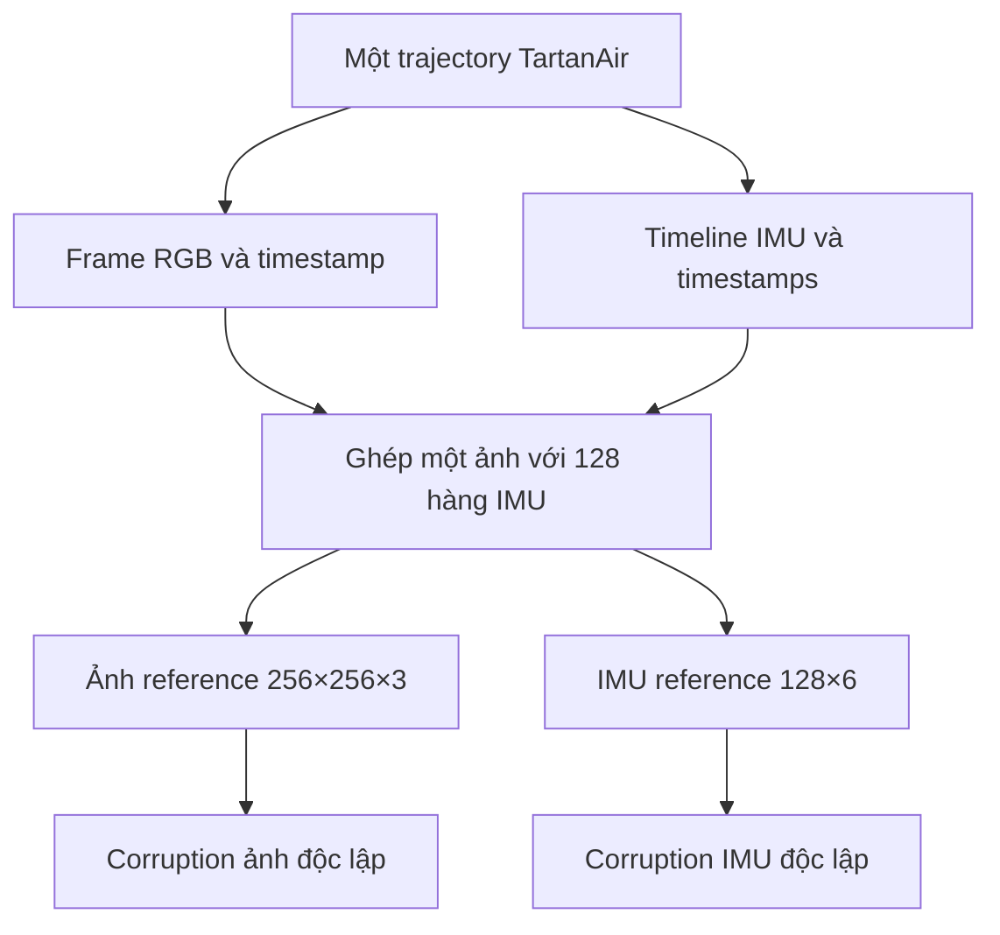

Split theo trajectory thực hiện trước khi tạo sample. Sau khi ghép theo timestamp, train có thể shuffle **cả sample**; không shuffle 128 hàng IMU hoặc hai nguồn riêng biệt. Window không nối qua trajectory.

| Thành phần | Trước batch | Tensor core |
| --- | --- | --- |
| Ảnh sạch/nhiễu | `[256,256,3]` RGB | `[B,3,256,256]` |
| IMU sạch/nhiễu | `[128,6]` | `[B,6,128]` sau transpose và normalize |
| Timestamp ảnh | Một số giây | `[B]` |
| Timestamp IMU | 128 số giây | `[B,128]` |

Sáu kênh IMU là `ax,ay,az,gx,gy,gz`. Timestamp không phải channel thứ7. Accel physical m/s², gyro rad/s; normalization dùng thống kê train cố định và được lưu với checkpoint. Corruption IMU ở units physical trước normalize.

Chỉ dùng một ảnh; 128 hàng IMU là cửa sổ centered offline. Nếu IMU100 Hz thì window trải dài1,27 giây; tần số thật phải audit từ timestamp. Một trajectory khoảng1.200 hàng không có nghĩa toàn dataset chỉ có1.200 hàng.

## 3. Sơ đồ lõi JEPA trong phase1

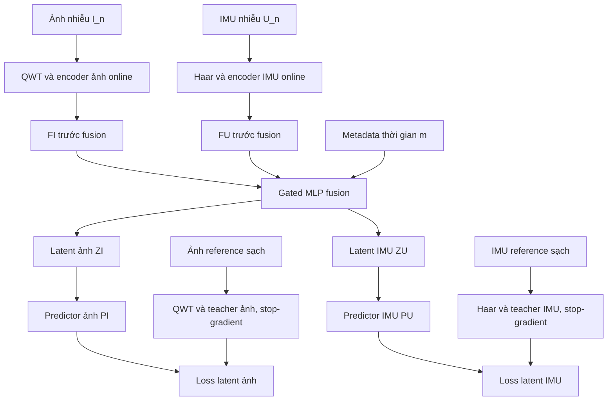

Đây là nhánh dự đoán **đặc trưng sạch**, không phải dự đoán pixel trực tiếp:

- PI so với TI tại cùng vị trí latent ảnh.
- PU so với TU tại cùng vị trí latent IMU.
- Không ép PI bằng PU hoặc TI bằng TU.
- Teacher chỉ có encoder modality, không fusion/decoder/predictor.
- Loss ảnh/IMU trong sơ đồ này đều là **loss latent**, không phải reconstruction loss.

Sơ đồ này chưa vẽ hai mục tiêu bổ sung để tránh dồn nhiều nhánh: Jacobian ở mục8, chống collapse ở mục9. Tất cả cùng thuộc phase1.

## 4. Chi tiết hai encoder và wavelet

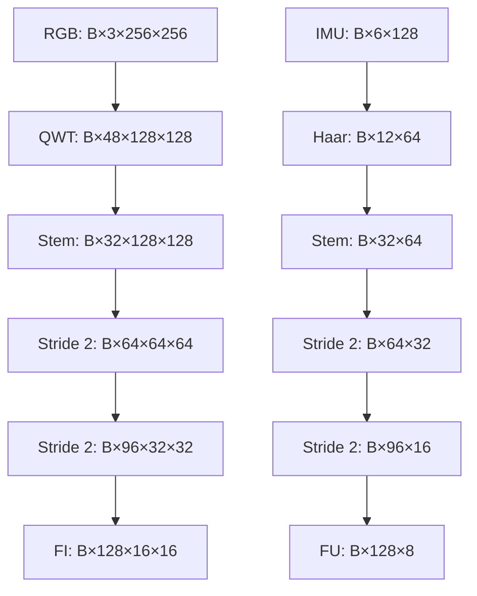

**Shape QWT trong sơ đồ là layout tham chiếu**, chỉ đúng nếu backend trả Hc=Wc=128. Nếu boundary/filter cho grid khác, CNN và decoder dùng size thực được audit; không cắt coefficients để ép bảng.

| Tầng | Ảnh | IMU |
| --- | --- | --- |
| Wavelet | QWT2D cho từng kênh RGB | Haar DWT1D theo thời gian từng channel |
| Stem | ConvBlock2D(Ccoeff,32,stride1) + ResBlock32 | ConvBlock1D(12,32,stride1) + ResBlock32 |
| Down1 | ConvBlock32→64,stride2 + ResBlock64 | Như vậy trong1D |
| Down2 | ConvBlock64→96,stride2 + ResBlock96 | Như vậy trong1D |
| Down3 | ConvBlock96→128,stride2 + ResBlock128 | Như vậy trong1D |
| Feature tap Jacobian | FI sau Down3, trước fusion | FU sau Down3, trước fusion |

ConvBlock dùng Conv kernel3/padding1, GroupNorm8, SiLU. ResBlock có residual nội bộ encoder; các feature tầng trước **không nối vào decoder phase2**.

QWT/Hamilton:

- QWT dùng cấu trúc quaternion; packing tham chiếu `RGB × band_group × component` thành48 real channels.
- CNN nhận các real channels này; không tự coi đó là Hamilton convolution.
- Learned Hamilton layer chỉ được ghi trong sơ đồ triển khai nếu source thực sự có phép nhân Hamilton được audit.
- IMU dùng Haar1D, không đổi tên nó thành QWT.

## 5. Fusion: tạo thông tin chung nhưng giữ hai dense latent

### 5.1 Tạo summary chung

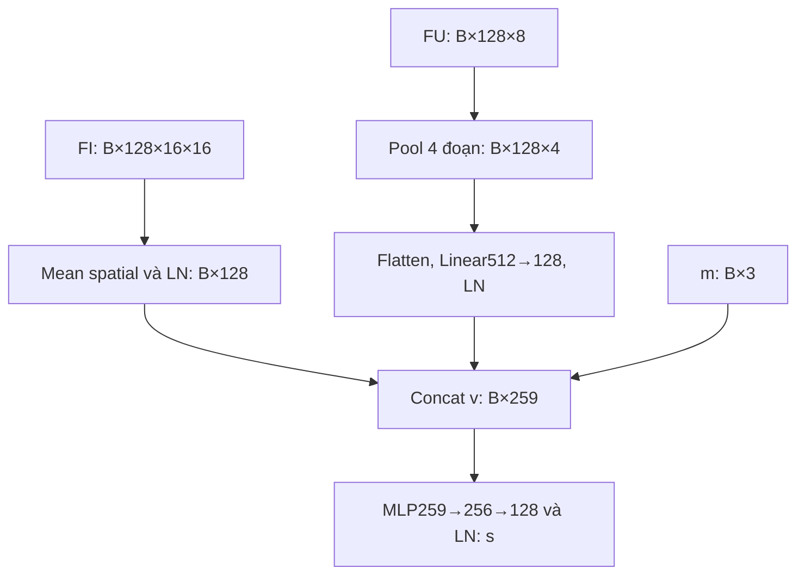

Metadata m gồm offset tương đối giữa ảnh và tâm window, log window duration và log median IMU dt theo scale cố định của bản gốc. Timestamp tuyệt đối không được dùng như trajectory label học được.

```text
v = concat(gI, gU, m)          # 128 + 128 + 3 = 259
s = LN(Linear128(SiLU(Linear256(v))))
```

Tạo summary không làm mất FI/FU: các dense features vẫn được giữ để tạo ZI/ZU.

### 5.2 Cổng điều tiết và residual trong fusion

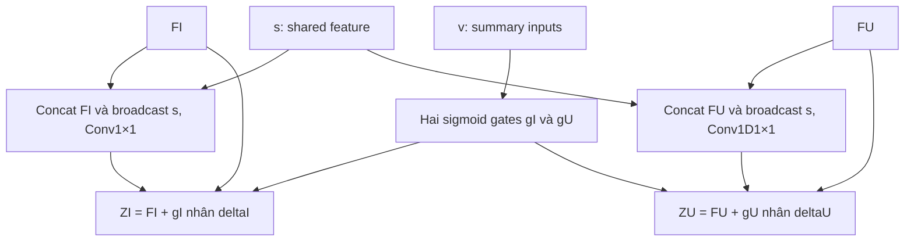

| Tensor/phép toán | Shape |
| --- | --- |
| gI/gU | `[B,128]`, sigmoid từ Linear259→128 riêng |
| concat FI và s broadcast | `[B,256,Hi,Wi]` |
| deltaI | Conv1×1 256→128, SiLU, Conv1×1 128→128 |
| concat FU và s broadcast | `[B,256,8]` |
| deltaU | Conv1D1×1 256→128, SiLU, Conv1D1×1 128→128 |
| ZI/ZU | `[B,128,Hi,Wi]` và `[B,128,8]` |

Gate weights ban đầu0, bias-2 như đặc tả nền; gate có gradient và được học. Gate không phải xác suất sensor đáng tin đã calibration. Residual ở fusion là một phần của latent; nó không tạo bypass từ input vào decoder.

## 6. Predictor, teacher và loss JEPA

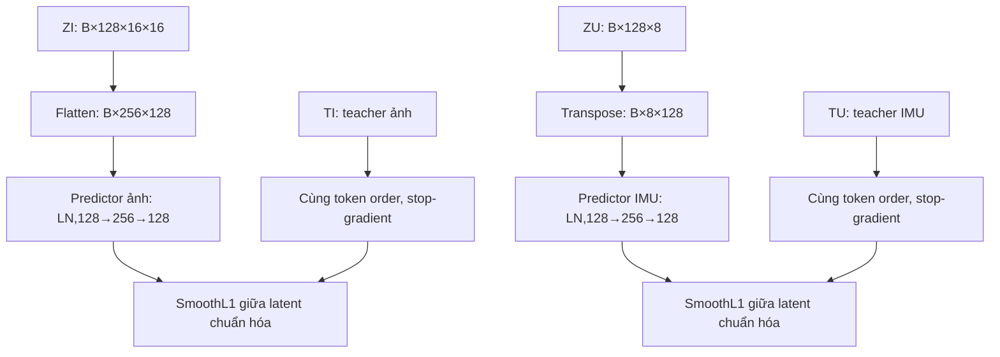

Mỗi predictor có LayerNorm128 → Linear128→256 → GELU → Linear256→128. LayerNorm trong predictor có thể là layer học được như bản nền; **normalization trước phép so loss** là LN không affine, epsilon1e-5.

\[
L_{\mathrm{JEPA}}=\tfrac12\left(L_{\mathrm{latent,image}}+L_{\mathrm{latent,IMU}}\right).
\]

Mean từng modality riêng. Ảnh có256 vị trí và IMU có8 vị trí trong layout tham chiếu; không gộp tất cả token thành một mean khiến ảnh tự áp đảo32 lần.

Teacher được deepcopy từ encoder online ngẫu nhiên trước update phase1 đầu tiên. Teacher nhận clean reference, stop-gradient, không optimizer parameters. Nó thay đổi qua EMA như mục7.

Đây là noisy-to-clean latent prediction với mask_ratio0, một biến thể lấy cảm hứng từ JEPA. Sơ đồ không tuyên bố tái lập I-JEPA masked nguyên gốc.

## 7. Trình tự một optimizer update và EMA

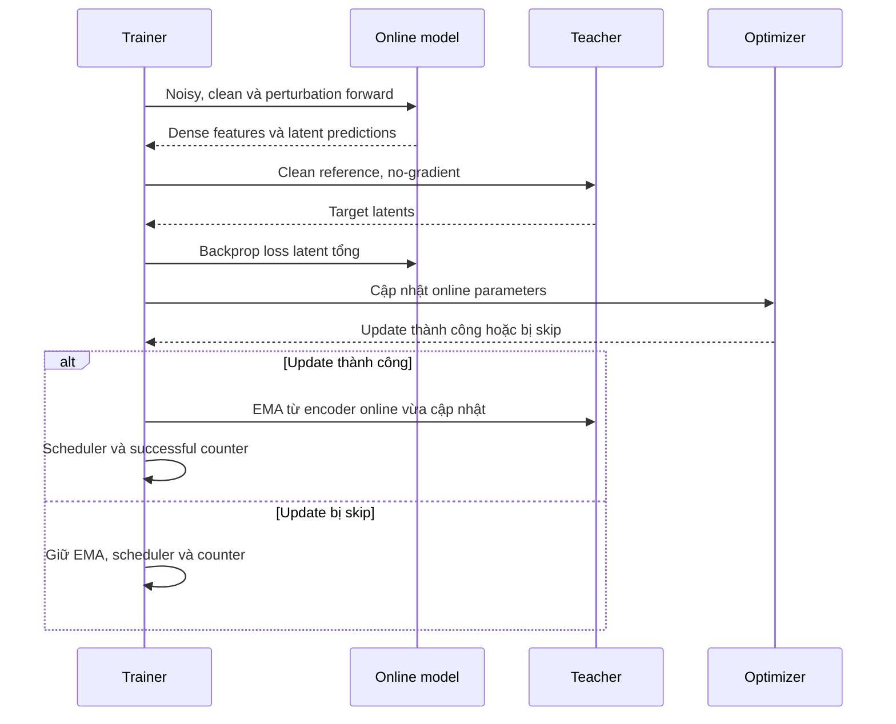

Nếu gradient accumulation, hoàn tất các microbatch rồi mới optimizer/EMA một lần. “Online parameters” ở đây gồm encoder, fusion và predictors, **không có decoder**.

\[
\theta_{teacher}\leftarrow m\theta_{teacher}+(1-m)\theta_{online\ encoder}.
\]

m từ0,99 đến0,999 theo lịch phase1. Không EMA teacher fusion vì teacher không có fusion. Các forward noisy, clean-online và perturbation không tự cập nhật teacher.

## 8. Jacobian nằm ở đâu?

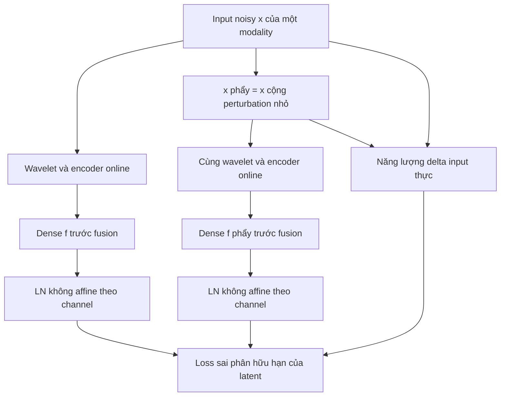

Sơ đồ áp dụng riêng cho nhánh ảnh hoặc IMU. Hai node wavelet+encoder là **cùng trọng số**, không phải hai encoder mới.

- Thêm perturbation **trước QWT/Haar**, đo thay đổi **sau encoder, trước fusion**.
- Ảnh: epsilon1/255, clamp input probe về `[0,1]`, đo actual delta sau clamp.
- IMU: epsilon0,01 normalized, không clamp; giữ timestamp và row order.
- Rademacher ±1, alpha mặc định1; cùng sample/target/corruption realization.
- Luân phiên ảnh/IMU theo successful phase1 update; một selected encoder extra forward.

\[
e_n=\operatorname{mean}\!\left[(x'_n-x_n)^2\right],\qquad
L_{enc}=\operatorname{mean}_n\frac{\operatorname{mean}\!\left[(h'_n-h_n)^2\right]}{e_n}.
\]

Các mean bên trong tính trên mọi chiều không phải batch; yêu cầu e_n>1e-12. LN measurement chỉ đo, không thay FI/FU đi vào fusion. Giữ gradient cả base và perturbed encoder outputs.

Jacobian loss trực tiếp cập nhật **encoder được perturb**. Nó không có đường gradient trực tiếp tới fusion/predictor/teacher. Fusion vẫn học từ JEPA và chống collapse.

Đây là xấp xỉ directional Jacobian của LN∘encoder∘wavelet. Nó không tự đo mọi thông tin latent hoặc chứng nhận chống mọi loại nhiễu. Phase1 log cả raw gain/norm và diversity để tránh nhầm giảm scale với tiến bộ.

## 9. Nhánh chống collapse: noisy-online và clean-online

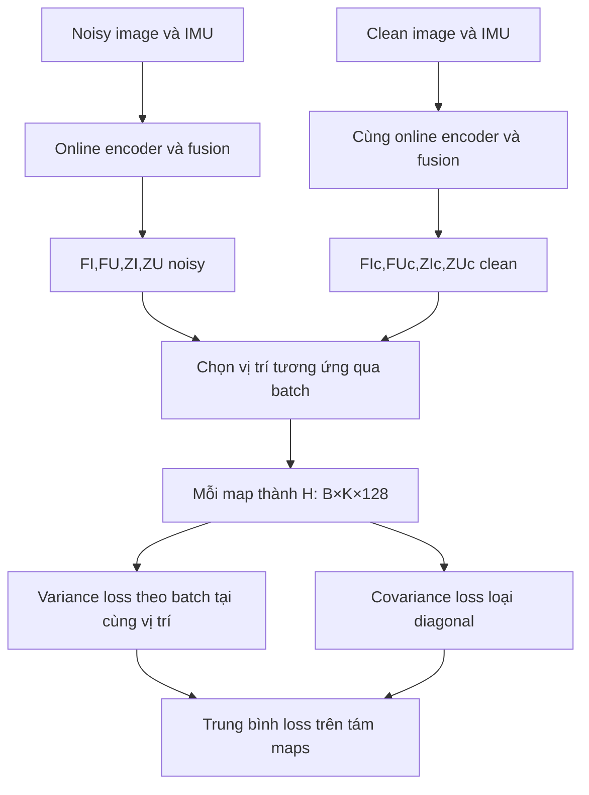

Các node online noisy/clean dùng cùng một backbone. Clean-online forward **có gradient** cho variance/covariance; nó khác clean-teacher forward stop-gradient của JEPA.

| Nhánh | Dữ liệu vào | Có gradient? | Dùng cho |
| --- | --- | --- | --- |
| Noisy online | Nhiễu | Có | JEPA prediction, anti-collapse, base Jacobian |
| Clean online | Reference sạch | Có | Anti-collapse trên tín hiệu sạch |
| Clean teacher | Reference sạch | Không | Target JEPA |
| Perturbed online | Noisy input cộng perturbation nhỏ | Có | Encoder Jacobian |

K ảnh tối đa16 vị trí, K IMU8 vị trí. Tại mỗi vị trí, dùng B sample khác nhau để tính variance/covariance. Không biến các pixel/token trong một sample thành sample độc lập.

Main pilot có B8 thực cho statistics. Gradient accumulation không làm statistics B4 thành B8. Mỗi covariance128×128 có rank tối đa B-1; không yêu cầu covariance bằng0 và mọi variance đạt1 đồng thời.

\[
L_{var}=\operatorname{mean}\max\!\left(0,1-\sqrt{\operatorname{Var}_{batch}(H)+10^{-4}}\right).
\]

Covariance loss là mean theo vị trí của tổng bình phương phần ngoài diagonal, chia D=128. Dùng raw feature, không projection head học được và không LN measurement của Jacobian.

Tại latent hằng số, variance penalty dương nhưng đạo hàm có thể bằng0 ở trạng thái chính xác đó. Anti-collapse loss không phải bảo đảm tự thoát mọi collapse. Theo dõi raw/normalized std, rank, scale, teacher diversity và clean/noisy riêng theo migration v3.

## 10. Loss phase1 và bản đồ gradient

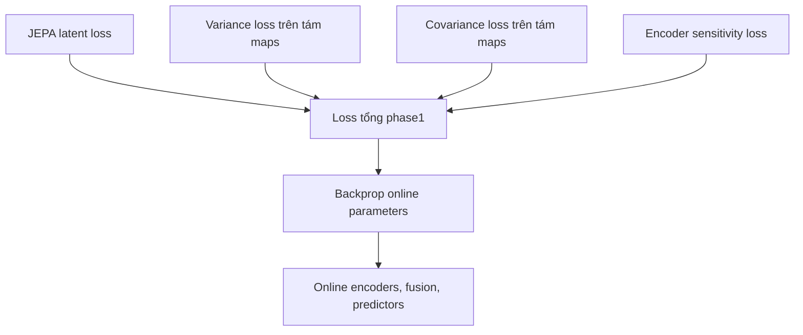

\[
L_{phase1}=L_{JEPA}+1.0L_{var}+0.01L_{cov}+\lambda_{enc}L_{enc}.
\]

λ_enc=0 ở500 successful updates đầu, sau đó ramp1.000 updates tới1e-4. Đây là warm-up **latent-only**, không phải warm-up phục hồi. Hệ số là điểm bắt đầu pilot, cần kiểm tra gradient/quality.

| Loss | Encoder ảnh/IMU | Fusion | Predictors | Teacher | Decoder |
| --- | --- | --- | --- | --- | --- |
| JEPA | Qua noisy forward | Có | Có | Không | Không tồn tại trong phase1 path |
| Variance/covariance | Noisy và clean-online | Có qua ZI/ZU maps | Không | Không | Không |
| Encoder sensitivity | Chỉ source được perturb | Không trực tiếp | Không | Không | Không |
| Reconstruction | **Không có trong phase1** | — | — | — | — |

Loss phase1 không chứa L1 ảnh, SmoothL1 dữ liệu IMU, coefficient reconstruction, edge hoặc perceptual loss. Test phải chặn được mọi decoder forward trong phase1, không chỉ nhìn weight bằng0.

## 11. Ranh giới checkpoint giữa hai giai đoạn

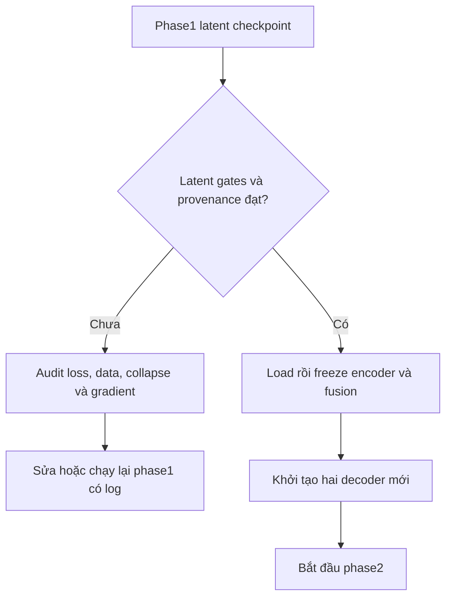

Main checkpoint phase1 phải có history:

```text
pipeline_version: 3
phase: latent_pretrain
trained_with_reconstruction: false
phase1_decoder_forward_calls: 0
```

Không đổi nhãn checkpoint legacy từng train reconstruction để vượt gate. Giữ legacy như baseline riêng nếu cần. Chọn backbone mặc định theo fixed-budget last sau latent gates, không theo Jacobian loss nhỏ nhất.

Khi chuyển phase2:

- Freeze online encoder và fusion, normalization và transforms; eval/no_grad lúc tạo latent.
- Bỏ teacher/predictor khỏi forward inference/phase2.
- Decoder khởi tạo mới, không copy decoder legacy.
- Optimizer phase2 chỉ chứa decoder parameters.

## 12. Phase2: latent đi vào hai decoder như thế nào?

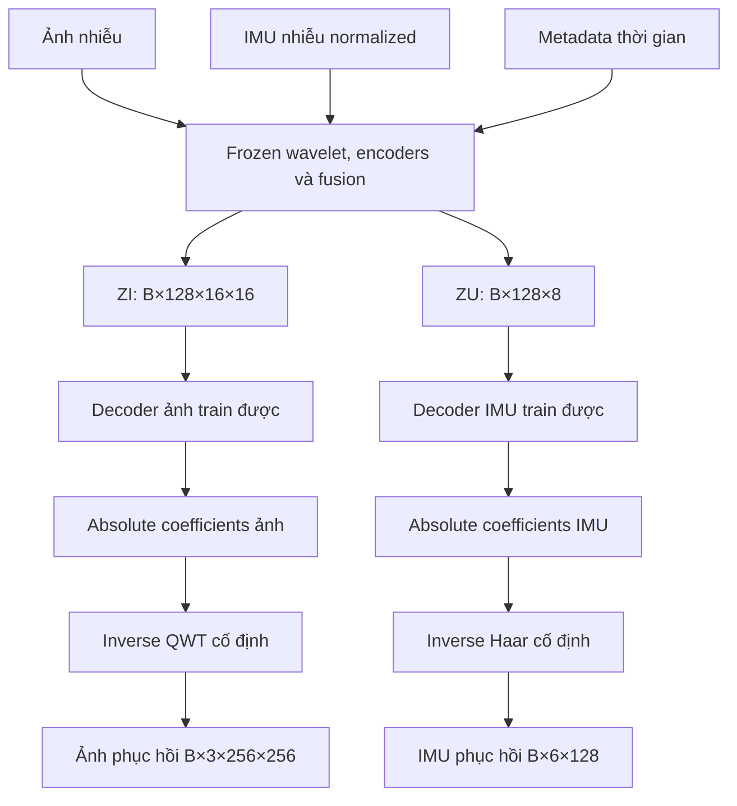

Input decoder chỉ là **ZI hoặc ZU**. Shape/layout tĩnh phục vụ inverse được phép; ảnh, IMU, coefficients đầu vào, encoder skips, teacher features và corruption severity không đi vào decoder.

Hai branch latent đã có thông tin chung qua fusion. Không thêm một fusion mới được train trong phase2; fusion đã frozen.

### 12.1 Các tầng decoder ảnh

| Tầng | Input/thao tác | Output tham chiếu |
| --- | --- | --- |
| ZI | Dense latent frozen | `[B,128,16,16]` |
| D2 | Bilinear32×32; ConvBlock128→96; ResBlock96 | `[B,96,32,32]` |
| D1 | Bilinear64×64; ConvBlock96→64; ResBlock64 | `[B,64,64,64]` |
| D0 | Bilinear128×128; ConvBlock64→32; ResBlock32 | `[B,32,128,128]` |
| Head | Conv3×3, 32→Ccoeff, linear | `[B,Ccoeff,Hc,Wc]` |
| Synthesis | Inverse QWT của coefficients dự đoán | `[B,3,256,256]` |

QWT Ccoeff48 là tham chiếu backend đã audit. Không cộng `CI_noisy` vào head. Head dự đoán toàn bộ coefficients tuyệt đối; inverse trả đúng image shape.

### 12.2 Các tầng decoder IMU

| Tầng | Input/thao tác | Output |
| --- | --- | --- |
| ZU | Dense latent frozen | `[B,128,8]` |
| D2 | Linear resize16; ConvBlock128→96; ResBlock96 | `[B,96,16]` |
| D1 | Linear resize32; ConvBlock96→64; ResBlock64 | `[B,64,32]` |
| D0 | Linear resize64; ConvBlock64→32; ResBlock32 | `[B,32,64]` |
| Head | Conv1D kernel3, 32→12, linear | `[B,12,64]` |
| Synthesis | Inverse Haar | `[B,6,128]` normalized |
| Denormalize | Nhân train scale, cộng train mean | `[B,6,128]` physical |

Decoder ConvBlock dùng Conv3, padding1, stride1, GroupNorm8, SiLU; resize align_cornersFalse. Residual nội bộ ResBlock được phép. Không concat encoder skips hoặc cộng noisy CU vào head.

## 13. Loss và gradient trong phase2

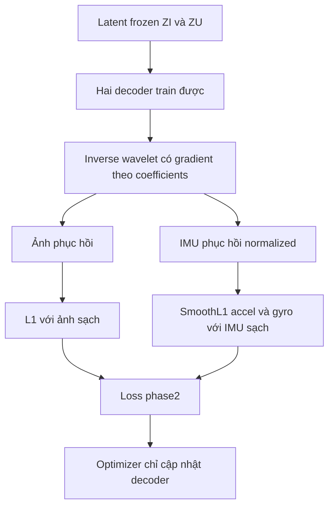

\[
L_{phase2}=L_{image}+\tfrac12(L_{accel}+L_{gyro}).
\]

| Thành phần | Phase2 gradient/trạng thái |
| --- | --- |
| Encoder/fusion | Frozen, no_grad khi tạo latent |
| Normalizer/transforms weights | Cố định |
| Decoder ảnh/IMU | Có gradient từ reconstruction loss |
| Inverse wavelet | Cho phép gradient tới coefficients/decoder, dù filter không học |
| Teacher/predictors | Không dùng |
| JEPA/Jacobian/variance losses | Không dùng để train phase2 |

Không đặt decoder forward vào no_grad. Không gọi `.train()` trên wrapper làm backbone frozen trở lại mode thay đổi buffers. Test hash parameter/buffer backbone trước/sau decoder update để xác minh freeze.

Output ảnh raw float dùng trong loss; không clamp coefficients hoặc output trước loss. Metrics/export có thể clamp ảnh theo protocol cố định. IMU denormalize trước metrics physical.

## 14. Inference sau khi hoàn thành hai giai đoạn

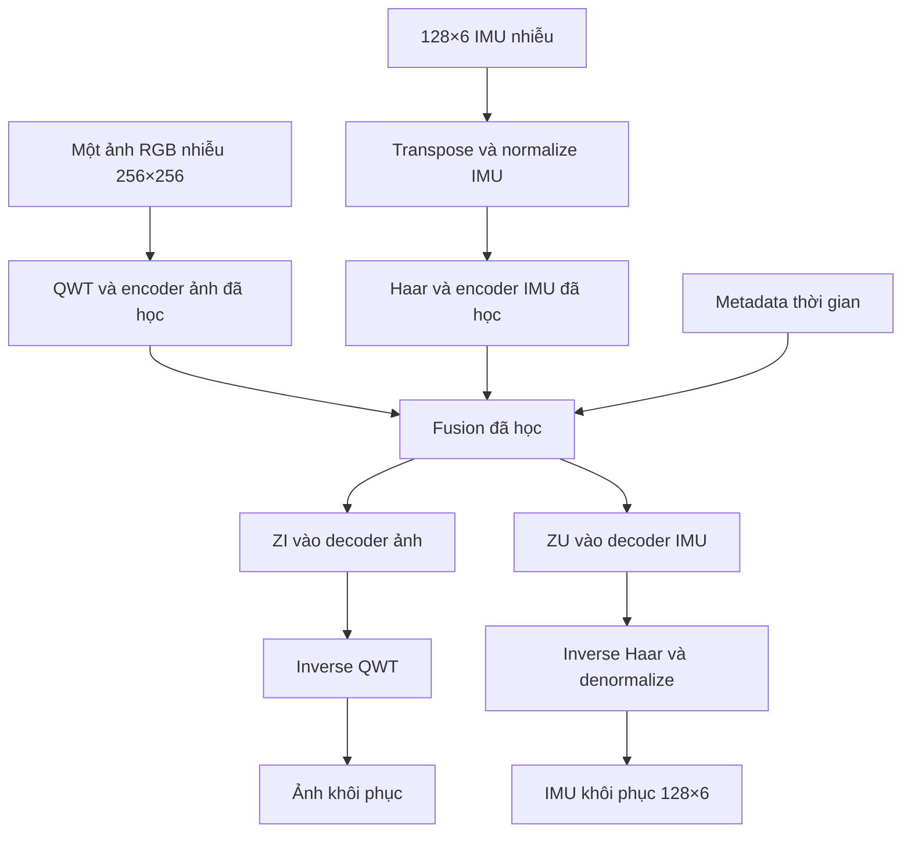

Inference chỉ cần noisy inputs, timestamp và checkpoint/normalization/layout. Không clean teacher, clean-online branch, predictor, anti-collapse loss hoặc perturbation Jacobian. Mỗi sample chỉ một forward backbone và decoder.

Khi chạy cả trajectory, window IMU có thể overlap. Ghép theo original indices với trọng số tam giác dương; không ghi đè theo thứ tự batch tùy ý hoặc đếm một timestamp nhiều lần khi tính metric. Không ghép qua trajectory.

Chất lượng output phải đo sau phase2. Phase1 chưa có decoder học nên không có PSNR phục hồi để tuyên bố thành công.

## 15. Bảng tổng hợp tensor và quyền dùng dữ liệu

| Tensor | Shape tham chiếu | Phase1 | Phase2/inference |
| --- | --- | --- | --- |
| I_n | `[B,3,256,256]` | Online input | Frozen-backbone input |
| U_n | `[B,6,128]` | Online input | Frozen-backbone input |
| I_c/U_c | Như input | Teacher targets và clean-online regularization | Chỉ loss train/eval; inference không dùng |
| FI/FU | `[B,128,16,16]` / `[B,128,8]` | Jacobian, anti-collapse, fusion | Nội bộ frozen backbone |
| ZI/ZU | Shape FI/FU | Predictor, anti-collapse | **Input duy nhất mang dữ liệu vào decoder** |
| TI/TU | Shape FI/FU | Stop-gradient JEPA targets | Không dùng |
| PI/PU | `[B,256,128]` / `[B,8,128]` | Predicted latent dùng JEPA loss | Không dùng |
| CI_hat/CU_hat | `[B,48,128,128]` / `[B,12,64]` | Không tạo | Absolute coefficients decoder |
| I_hat/U_hat | `[B,3,256,256]` / `[B,6,128]` | Không tạo | Dữ liệu phục hồi |

Backbone latent không chỉ là vector summary s128 của fusion. Decoder nhận dense ZI/ZU; s chỉ là thông tin chung dùng để điều tiết chúng.

## 16. Kiểm tra sơ đồ đã được triển khai đúng trong code

Agent cần đối chiếu đường dữ liệu thật với các sơ đồ, không chỉ đặt tên module giống tài liệu:

1. Phase1 gọi decoder là lỗi pipeline; monkeypatch decoder.forward để raise và xác minh latent training vẫn hoạt động.
2. Clean-online có gradient từ anti-collapse; clean-teacher không gradient. Hai nhánh này không được nhập làm một.
3. Jacobian tap đúng FI/FU trước fusion; không lấy PI/PU hoặc output phục hồi.
4. FI/FU raw đi vào fusion; LN không affine chỉ dùng ở measurement/loss theo hợp đồng.
5. Phase2 backbone thật sự frozen; decoder được train mới từ latent, không input skip/noisy coefficient residual.
6. Giữ ZI/ZU cố định và thay raw input ngoài decoder không được đổi output decoder.
7. Teacher EMA sau successful optimizer update, không mỗi noisy/clean/perturbed forward.
8. Data vẫn một frame + IMU128×6, chia trajectory trước shuffle sample.
9. Dùng đúng QWT backend/layout; shape48×128×128 chỉ là tham chiếu, không lý do crop sai coefficients.
10. Báo riêng latent diversity phase1 và restoration metrics phase2. Ảnh mềm hoặc IMU quá mượt cần kiểm tra bằng reference, không suy luận chỉ từ latent loss nhỏ.

**Phạm vi:** các sơ đồ này khớp pipeline v3 trong `QWT_JEPA_JACOBIAN_MIGRATION_GUIDE.md`. Chúng mô tả một thiết kế nghiên cứu lấy cảm hứng từ JEPA; hiệu quả học latent, chống collapse và chất lượng phục hồi vẫn cần code/data/GPU và các gate thực nghiệm của tài liệu migration.