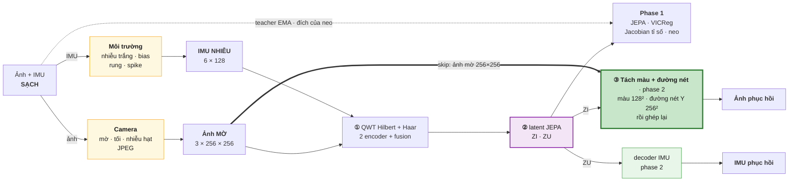
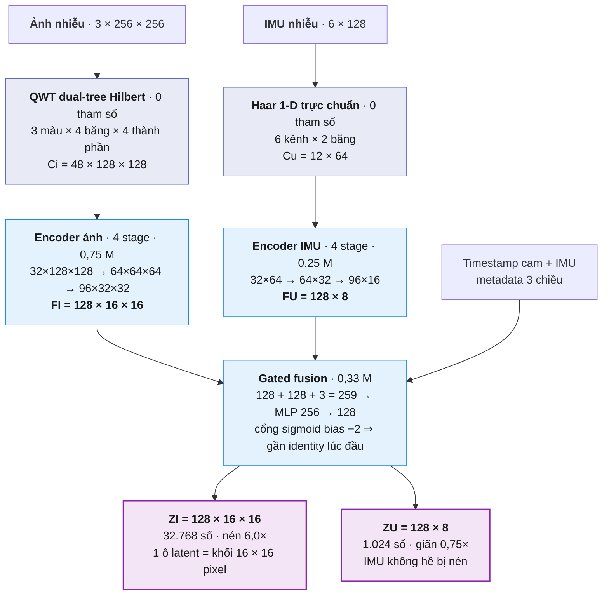
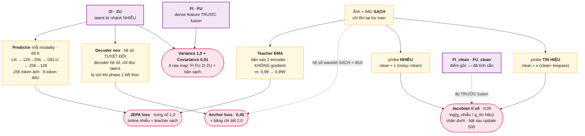
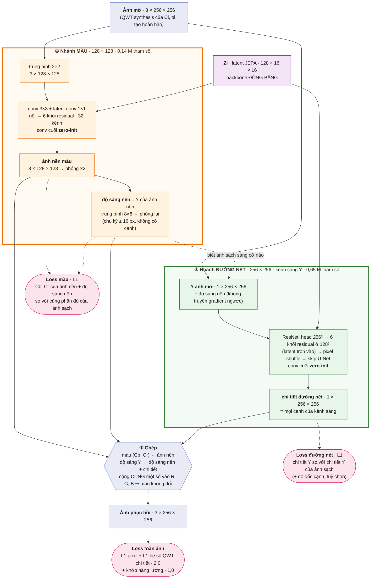
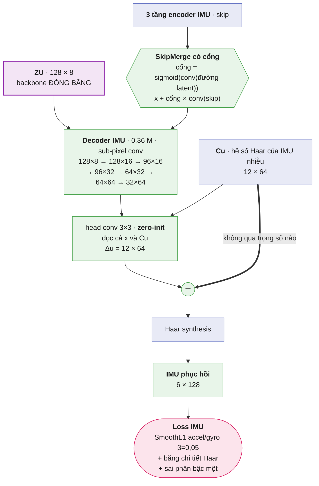

# QWT–JEPA v3 cho ảnh thiếu sáng, mờ và IMU nhiễu

Source: [leesanghyoek/qwt_jepa_ver4](https://github.com/leesanghyoek/qwt_jepa_ver4),
nhánh `main`. Trên Kaggle dùng notebook
[`qwt-jaco-jepa-ver4.ipynb`](qwt-jaco-jepa-ver4.ipynb): Cell 1 clone source và ghim
commit, rồi chạy lần lượt các cell.

Pipeline hai giai đoạn. **Phase 1**: JEPA học latent — encoder đọc ảnh + IMU
**nhiễu** và học dự đoán latent mà teacher EMA tạo từ bản **sạch**, kèm
variance/covariance chống collapse, một decoder neo và số hạng Jacobian. **Phase 2**:
backbone đóng băng, chỉ train decoder khôi phục — cho ảnh là decoder **tách màu và
đường nét** (màu ở 128×128, đường nét trên kênh sáng Y ở 256×256, rồi ghép lại), cho
IMU là decoder hệ số Haar.

Run Kaggle hiện tại là **p8** (`configs/kaggle_tartanair_v2.yaml`, OUT
`outputs/p8_color_edge`): phase 1 **dùng lại** checkpoint của p5 (5.000 update, neo
0,45, detail 2,0, Jacobian tỉ số 0,05); phase 2 5.000 update với **decoder tách màu +
đường nét**, loss màu và loss đường nét riêng, cộng loss toàn ảnh chấm trên ảnh khôi
phục (L1 hệ số · 2,0, energy · 1,0); IMU giữ decoder hệ số với skip có cổng, sai phân
bậc một IMU · 2,0.

## Tài liệu

- [**Kiến trúc: trước và sau**](KIEN_TRUC_TRUOC_VA_SAU.md) — so sánh từng thay đổi
  kèm phép đo.
- Notebook Kaggle [`qwt-jaco-jepa-ver4.ipynb`](qwt-jaco-jepa-ver4.ipynb). Cell 18 in
  báo cáo train (`tools/training_report.py`), gồm cả độ nét thật và độ sọc so với ảnh
  sạch.

Backend ảnh mặc định là `qwt_dualtree_hilbert`: **cặp Hilbert thật**, thiết kế
bằng liệt kê phân tích phổ (`tools/design_hilbert_pair.py`), 14 tap, đo được
**năng lượng tần số âm 0,0677** — thấp hơn 2,68 lần so với trần **0,1814** mà
backend cũ `qwt_dualtree_db4` đứng yên ở đó. Trần này là cấu trúc, không phải
vấn đề chọn wavelet: hai cây dùng *cùng* một filter lệch số nguyên luôn cho
`W_B(ω) = W_A(ω)·e^{-jωd}`, nên dư lượng chỉ phụ thuộc phép dịch — đo được
**đúng 0,1804 cho db2…db20, mọi symlet và mọi coiflet**. Backend cũ vẫn chọn
được để chạy ablation. Xem `tests/test_qwt_analyticity.py`.

## Thay đổi lần này — và những gì nó làm mất hiệu lực

Mỗi thay đổi đều kèm phép đo chứ không phải lời khẳng định.

| | Trước | Sau | Đo bằng |
|---|---|---|---|
| **QWT** | 4 cây db4 lệch 1 mẫu. Không phải cặp Hilbert; năng lượng tần số âm **0,1814** | Cặp Hilbert thiết kế riêng, 14 tap, **0,0677** (tốt hơn 2,68×) | `tests/test_qwt_analyticity.py` |
| **Blur ảnh** | bốc ngẫu nhiên, độc lập với IMU | **giữ nguyên** (quyết định 23/09), nhưng đường nối IMU đã dựng xong và bật được bằng `motion_from_imu: true` | `tests/test_imu_motion_blur.py` |
| **Jacobian** | 1 hướng Rademacher, phạt đẳng hướng, trọng số `1e-4` (trơ) | `log(g_nhiễu / g_tín hiệu)`, không thứ nguyên, trọng số `0,05` | `tests/test_sensitivity_ratio.py` |
| **Loss chi tiết ảnh** | chấm trên 48 kênh hệ số decoder xuất ra — QWT dư 4 lần nên decoder hạ được loss bằng năng lượng ảnh **không hiện ra** | chấm trên **ảnh khôi phục** (`image_detail_source: restored_image`); modulus `\|q\|` đã thử ở p5 và bỏ vì sinh **sọc** | `tests/test_image_detail_source.py` |
| **Decoder ảnh** | từ latent 16×16 dựng lên 48 kênh hệ số QWT rồi synthesis; ba biến thể đều dừng ở cùng một mức chi tiết | **Tách màu + đường nét** (`image_decoder: split_color_edge`): màu ở 128×128, đường nét trên Y ở 256×256, ghép lại; đường nét đúng chỗ 0,309 → 0,465 (ResNet một khối: 0,360) | `tests/test_color_edge_decoder.py` |

**Phase 1 nào dùng lại được.** Đổi QWT (db4 → Hilbert) là đứt gãy thật:
`model.image_transform` nằm trong configuration hash, nên checkpoint thời db4 không
dùng được. Từ p5 trở đi phase 1 không đổi (hash `ef8ef433`); ba thay đổi sau đó — loss
chi tiết, cách chấm, decoder ảnh — chỉ ở phase 2, nên p6/p7/p8 dùng lại phase 1 của p5.

**Kiểm tra trước khi train:**

```bash
# Thiết kế bộ lọc (và đổi bậc nếu muốn)
python3 tools/design_hilbert_pair.py --orders 4 6 7 8

# Toàn bộ test
env PYTEST_DISABLE_PLUGIN_AUTOLOAD=1 python3 -m pytest tests/ -q
```

**Ablation có sẵn, không cần sửa code:** `phase2.image_decoder: resnet_pixel` dùng
ResNet một khối (p7), `qwt_coefficients` quay về decoder ảnh hệ số; `model.image_transform: qwt_dualtree_db4` quay về
transform cũ; `corruption.image.motion_from_imu: true` nối blur với IMU (khi đó chạy
`tools/imu_blur_axis_check.py` để xác nhận hình học gyro→camera). Mặc định: QWT
Hilbert, blur do camera độc lập với nhiễu IMU, decoder ảnh tách màu + đường nét.

## Vì sao ảnh vẫn mờ, và vì sao p5 ra sọc

**1. Loss chấm sai chỗ.** QWT giữ 4 cây và synthesis lấy trung bình 4 cây, nên 48
kênh hệ số decoder xuất ra dư 4 lần: phần nằm trong null space của synthesis không
hiện lên ảnh. Trước đây mọi số hạng chi tiết ảnh chấm trên chính 48 kênh đó. Đo trên
một frame thật, giữ ảnh y nguyên (lệch tối đa 1e-7) mà vẫn hạ được modulus **63%**,
L1 hệ số **41%**, energy gap **68%**. Trong lúc train, p5 cất **34%** năng lượng chi
tiết vào phần vô hình đó. `phase2.image_detail_source: restored_image` phân tích lại
chính ảnh khôi phục rồi mới chấm, nên chỉ cái người xem thấy mới được tính. Gradient
đi vào phần vô hình giảm từ 50–67% xuống ~1e-7.

**2. Modulus và energy không xét pha.** Hai số hạng này chỉ hỏi "đủ năng lượng chi
tiết chưa", không hỏi "đặt đúng chỗ chưa". Một hệ số chi tiết lệch **đều** tổng hợp
ra đúng sọc chu kỳ 2 px: LH → sọc ngang, HL → sọc dọc, HH → ô bàn cờ. Decoder đọc
latent 16×16 tạo ra những trường trơn như vậy rất dễ, nên đó là "chi tiết" rẻ nhất nó
mua được. Về lý thuyết, modulus tối ưu ở đúng độ mạnh cạnh (s = 1,0 so với 0,5 của L1
hệ số khi cạnh lệch ±0,75 px), nhưng decoder tìm ra một nghiệm rẻ hơn thế.

A/B cục bộ, cùng phase 1, 600 update phase 2, 32 frame valid (kịch bản full), đo
trên ảnh khôi phục (`validation_image_*_power`, 1,00 = như ảnh clean):

| nhánh | PSNR | cạnh thật (chu kỳ 4–16 px) | sọc (chu kỳ 2 px) |
|---|---|---|---|
| input | 11,13 | 0,116 | 0,17 |
| p5: modulus + energy, chấm trên hệ số decoder | 16,46 | 0,140 | 0,34 (34% vô hình) |
| modulus + energy, chấm trên ảnh | 16,38 | 0,138 | **3,21** |
| modulus một mình, chấm trên ảnh | 16,41 | 0,140 | 0,54 |
| **L1 hệ số + energy, chấm trên ảnh** (recipe hiện tại) | 16,40 | 0,139 | **0,14** |

Bịt lỗ hổng mà vẫn giữ modulus + energy thì sọc tăng 9 lần. Chỉ L1 hệ số mới giữ
được pha, và với nó thì energy không mua được sọc. **Năng lượng cạnh thật ở cả năm
nhánh đều bằng nhau (0,14× ảnh clean)**: với decoder hệ số, không số hạng mean/moment
nào ở đây làm ảnh nét thật. Thứ tiếp theo đo được là **kiến trúc decoder** — xem
[Decoder ảnh ResNet](#decoder-ảnh-resnet-p7) và
[Tách màu và đường nét](#decoder-ảnh-tách-màu-và-đường-nét-p8).

Chỉ đổi phase 2, nên `configuration_hash` phase 1 không đổi và checkpoint phase 1
dùng lại được (`REUSE_PHASE1_FROM` trong Cell 4 của notebook). Báo cáo train
(`tools/training_report.py`) giờ in năng lượng cạnh/sọc và tự cảnh báo khi sọc > 1,5×.

## Decoder ảnh tách màu và đường nét (p8)

Ý tưởng: tách ảnh thành **màu** và **đường nét**, khôi phục riêng, rồi ghép lại. Mắt
người thấy độ nét gần như chỉ qua **độ sáng Y**; màu (Cb, Cr) cần độ phân giải thấp hơn
nhiều — JPEG cũng lưu màu ở nửa độ phân giải. Mã: `qjepa/models/color_edge.py`,
`SplitColorEdgeDecoder` trong `qjepa/models/decoders.py`.

- **Nhánh màu** (128×128, 135 K tham số): ảnh mờ trung bình 2×2 + latent → ảnh nền màu,
  và từ đó **độ sáng nền** (Y trung bình 8×8, tức chỉ chu kỳ ≥ 16 px, không có cạnh).
  Học bằng L1 trên Cb, Cr và độ sáng nền: với màu, đáp án "trung bình" của L1 chính là
  màu đúng.
- **Nhánh đường nét** (256×256, 651 K tham số): **kênh sáng Y** của ảnh mờ + độ sáng nền
  dự đoán (không truyền gradient ngược, để loss đường nét không kéo nhánh màu) + latent →
  **chi tiết Y**, tức mọi cạnh. Cấu trúc giống ResNet p7 nhưng 1 kênh vào đường nét, 6 khối.
  Học bằng L1 trên chi tiết Y, cộng L1 **độ dốc cạnh** của Y.
- **Ghép**: màu lấy từ ảnh nền; độ sáng = độ sáng nền + chi tiết. Cộng **cùng một số**
  vào R, G, B thì chỉ Y đổi còn Cb, Cr giữ nguyên (trọng số Y cộng lại bằng 1), nên nhánh
  đường nét **không thể làm lệch màu** (`tests/test_color_edge_decoder.py`).

Độ phân giải của màu được **đo** chứ không chọn tay: ghép lại từ phần đường nét hoàn
hảo, màu ở 128×128 giới hạn ảnh ở **34,9 dB**, 64×64 ở 31,9 dB, 32×32 ở 30,0 dB.

A/B cục bộ: cùng phase 1, cùng 600 update, cùng loss toàn ảnh, **cùng số tham số** (0,79 M
so với 0,80 M), 32 frame valid kịch bản full:

| decoder ảnh | PSNR | SSIM | đường nét **đúng chỗ** (4–16 px) | sai số dải nét | chi tiết mịn (2–4 px) | sọc | sai số màu |
|---|---|---|---|---|---|---|---|
| input (không làm gì) | 11,13 | 0,501 | 0,285 | 0,546 | 0,104 | 0,17 | 0,0365 |
| ResNet một khối (p7) | 16,06 | 0,573 | 0,360 | 0,464 | 0,107 | 0,17 | 0,0281 |
| tách, chỉ L1 | 16,28 | 0,610 | 0,445 | 0,402 | 0,109 | 0,18 | 0,0279 |
| **tách + độ dốc cạnh** (recipe) | **16,32** | **0,616** | **0,465** | **0,389** | 0,107 | 0,16 | 0,0279 |

Đọc bảng cho đúng:

- **Đường nét tăng rõ**: 0,360 → 0,465 phần nội dung cạnh của ảnh sạch được tái tạo đúng
  chỗ, sai số dải cạnh giảm 16%, và PSNR, SSIM cùng tăng — không có đánh đổi.
- **Màu không tốt hơn**: sai số màu 0,0281 → 0,0279, trong mức nhiễu. Lợi ích "màu ổn
  định" mà thiết kế nhắm tới **không** hiện ra ở phép đo này; phần được là đường nét.
- **Chi tiết mịn nhất** (chu kỳ 2–4 px) vẫn gần bằng ảnh đầu vào ở mọi nhánh: phần đó đã
  mất trong ảnh mờ và không decoder nào ở đây lấy lại được.
- Latent JEPA gánh khoảng một phần ba kết quả ở cả hai kiến trúc: đặt `ZI/ZU = 0` thì sai
  số tăng 32% (ResNet) và 37–38% (tách).
- Mỗi nhánh chạy một lần, 600 update, phase 1 chỉ 40 update. Không tách được phần nào
  của lợi ích đến từ việc tách kênh, phần nào từ loss riêng của nhánh đường nét.

## Decoder ảnh ResNet (p7)

Ý tưởng: QWT + Jacobian đưa ảnh về miền đường nét, JEPA học ảnh mờ và ảnh nét tương
ứng với nhau ra sao (student đọc ảnh mờ, teacher EMA đọc ảnh sạch), rồi một **ResNet
có skip từ ảnh mờ** kết hợp ảnh mờ với đặc trưng JEPA để dựng lại ảnh nét. Decoder cũ
chỉ nhìn ảnh qua latent 16×16 (mỗi ô là một khối 16×16 pixel) và 48 kênh hệ số; ResNet
đọc **thẳng ảnh mờ ở 256×256**, còn latent cho biết cảnh sạch nên trông thế nào.

A/B cục bộ: cùng phase 1, cùng loss (L1 pixel + L1 hệ số chi tiết chấm trên ảnh ·
2,0 + energy · 1,0), 600 update, cùng 32 frame valid (kịch bản full):

| decoder ảnh | PSNR | SSIM | đường nét **đúng chỗ** (chu kỳ 4–16 px) | sai số dải đó | sọc 2 px |
|---|---|---|---|---|---|
| input (không làm gì) | 11,13 | 0,501 | 0,285 | 0,546 | 0,17 |
| hệ số QWT (cũ) | **16,40** | 0,558 | 0,309 | 0,520 | 0,14 |
| **ResNet + latent JEPA** | 16,04 | **0,572** | **0,359** | **0,465** | 0,17 |
| ResNet, bỏ latent | 14,91 | 0,577 | 0,402 | 0,429 | 0,17 |

"Đúng chỗ" là phần nội dung đường nét của ảnh sạch được tái tạo **đúng pha**
(`Re Σ F_out·F̄_clean / Σ |F_clean|²` trên dải 4–16 px, 1 = hoàn hảo). Chỉ đo năng
lượng thì không đủ: nhiễu và sọc cũng làm năng lượng tăng. Ở đây năng lượng tăng
**và** sai số dải giảm, nên phần tăng thêm là đường nét thật.

Đọc bảng cho đúng:

- ResNet hơn decoder hệ số dù **ít tham số hơn** (0,80 M so với 1,58 M). Ba decoder hệ
  số trước đó dừng ở cùng một sàn vì cả ba đều chỉ chạm tới ảnh qua hệ số dựng từ
  latent 16×16; giới hạn nằm ở kiểu decoder.
- PSNR của ResNet thấp hơn 0,36 dB nhưng SSIM cao hơn: nó giữ cấu trúc tốt hơn, còn
  sai số độ sáng/màu còn hơi lớn ở ngân sách 600 update.
- **Bỏ latent** cho nhiều đường nét hơn nhưng PSNR tụt 1,1 dB. Phase 1 ở đây chỉ train
  **40 update**, latent gần như chưa học gì, nên phép thử này **chưa trả lời được**
  JEPA có giúp phần đường nét hay không. Run Kaggle với phase 1 đầy đủ 5000 update mới
  trả lời được; `delta_report.py --ablate-latent` đo trên checkpoint thật.
- Mỗi nhánh chạy một lần, 600 update, 32 frame: chiều hướng rõ, chênh lệch nhỏ giữa
  hai nhánh ResNet có thể là nhiễu.

QWT và Jacobian vẫn ở đúng vai trò: QWT Hilbert là miền đầu vào của encoder và là
miền chấm loss chi tiết (trên ảnh khôi phục); Jacobian (tỉ số độ nhạy) ép encoder ở
phase 1 phản ứng với đường nét chứ không với nhiễu. Chỉ đổi phase 2, nên phase 1
dùng lại được.

## Luồng tổng quát



Hai nguồn hỏng **độc lập**: ảnh mờ, tối và nhiễu hạt do **camera** (defocus, blur
chuyển động bốc ngẫu nhiên, giảm độ phân giải, phơi sáng thấp, shot/read noise,
JPEG); IMU nhiễu do **môi trường** (nhiễu trắng, bias trôi, rung 8–45 Hz, spike,
dropout). Mỗi frame bốc tham số riêng. Vì độc lập, cửa sổ IMU không mang thông tin
về cách ảnh bị làm mờ; mỗi nhánh học khôi phục chính nó, và hai nhánh chỉ gặp nhau
ở fusion của latent. Đường nối blur với gyro vẫn còn trong code
(`motion_from_imu: true`) nhưng tắt.

Phase 1 **có** một decoder phụ làm *neo*: nó chấm điểm latent trên hệ số wavelet
sạch với trọng số `0.45`, rồi bị vứt bỏ khi phase 1 kết thúc. Không có neo này
JEPA vẫn đạt loss thấp trên một latent đã ném đi tín hiệu — đó đúng là kết quả
của lần train đầu tiên. Vẫn không có đường pixel-space trong phase 1
(`reconstruction_loss_weight: 0.0`).

Phase 2 tải checkpoint phase 1 hợp lệ, đóng băng encoder/fusion/normalizer, khởi
tạo **decoder hoàn toàn mới** và chỉ tối ưu hai decoder đó. Ảnh được khôi phục bởi
decoder **tách màu và đường nét** ③: mũi tên đậm là skip đưa chính ảnh mờ 256×256 vào
(cho biết đường nét nằm ở đâu), còn `ZI` là đặc trưng JEPA học ở phase 1 (cho biết ảnh
sạch nên trông thế nào). Nhánh màu khôi phục màu và độ sáng nền ở 128×128, nhánh đường
nét khôi phục mọi cạnh của kênh sáng Y ở 256×256, rồi hai phần được ghép lại. IMU dùng
decoder hệ số Haar. Chi tiết ở sơ đồ 3 bên dưới.

## Kiến trúc chi tiết

Mọi shape và số tham số dưới đây được **in ra từ chính model** dựng bằng
`configs/pipeline_v3.yaml`, không phải tính tay. Batch `B` được lược khỏi bảng.

### Sơ đồ kiến trúc

Bốn sơ đồ thay vì một, vì GitHub co sơ đồ mermaid cho vừa bề ngang trang: một sơ
đồ to sẽ bị thu nhỏ đến mức không đọc nổi chữ. Tách ra thì mỗi sơ đồ hiện ở cỡ
thật.

Đọc màu: **xanh tím** = wavelet, không tham số và khả nghịch · **xanh dương** =
backbone, học ở phase 1 rồi đóng băng · **tím** = latent · **vàng** = chỉ sống
trong phase 1 rồi bị vứt · **xanh lá** = decoder phase 2 · **hồng** = số hạng loss.

#### 1. Backbone dùng chung cho cả hai phase



#### 2. Phase 1 — những gì gắn vào latent để ép nó học



Khối Jacobian đo **trước** fusion (`target: online_dense_before_fusion`), không
đo trên latent, và đo quanh điểm gốc **sạch** — mà feature của nó (`FI_clean`)
phase 1 đã tính sẵn cho variance/covariance, nên chi phí thêm là **hai** forward
encoder chứ không phải ba.

Hai probe thay vì một là cả điểm mấu chốt: bản cũ đo **một** hướng Rademacher rồi
tối thiểu hoá gain đó, tức phạt co đẳng hướng — bảo encoder bớt nhạy với *mọi
thứ*, kéo thẳng về collapse. Tỉ số hai gain thì **không thứ nguyên**: collapse
đưa cả hai về 0 và tỉ số đứng yên, nên nó nâng trọng số lên được thật.

#### 3. Phase 2 — tách màu và đường nét, backbone đóng băng



Nhánh màu chạy trước và cho nhánh đường nét biết **ảnh sạch sáng cỡ nào** (qua độ sáng
nền, không truyền gradient ngược), để nhánh đường nét vẽ cạnh đúng cường độ. Hai conv
cuối đều zero-init: trước khi học, đầu ra có đúng kênh sáng của ảnh mờ và màu của ảnh
mờ ở 128×128. Nhánh đường nét dùng cùng cấu trúc ResNet của p7 (head 256², thân ở 128²
có latent trộn vào, pixel shuffle, skip U-Net), chỉ khác 2 kênh vào (Y + độ sáng nền), 1
kênh ra và 6 khối residual.

#### 4. Phase 2 — decoder IMU, backbone đóng băng



Nhánh IMU giữ decoder hệ số, với `SkipMerge` có cổng: skip cấp độ phân giải, latent
quyết định giữ cái gì. Cổng sinh từ đường latent nên thay đổi theo từng vị trí và
từng kênh.

Ở cả hai sơ đồ phase 2, mũi tên đậm tới dấu cộng là sàn identity — xem
[Hai quyết định thiết kế quan trọng](#hai-quyết-định-thiết-kế-quan-trọng).

> **Muốn phóng to?** Copy khối mermaid rồi dán vào <https://mermaid.live> để kéo
> thả và zoom thoải mái. Trên GitHub, bấm vào sơ đồ cũng mở được chế độ xem lớn.

### Một sample gồm gì

| | Shape | Số phần tử |
|---|---|---|
| Ảnh RGB | `[3, 256, 256]` | 196.608 |
| IMU (ax ay az gx gy gz) | `[6, 128]` | 768 |
| Timestamp camera | `[1]` | |
| Timestamp IMU | `[128]` | |

Window IMU dài 1,27 s và **phải bao quanh** thời điểm chụp ảnh; `build_time_metadata`
từ chối sample vi phạm thay vì âm thầm căn lệch.

### Tầng 1 — biến đổi wavelet (không tham số)

Hai biến đổi này **khả nghịch và không có tham số học được**; chúng chỉ đổi hệ
toạ độ.

**Ảnh — QWT dual-tree Hilbert, 1 mức.** Bốn cây chạy song song; dọc mỗi trục tín
hiệu đi qua cây `A` hoặc cây `B`, và cây B là **bản đảo thời gian** của cây A —
chính phép đảo đó tạo độ trễ nửa mẫu mà một phép dịch số nguyên không thể tạo ra.
Gói kênh theo thứ tự `[màu, băng, thành phần]`:

```
3 màu (R,G,B) × 4 băng (approx, detail_y, detail_x, detail_xy) × 4 thành phần (real, i, j, k) = 48 kênh
[3, 256, 256]  ->  [48, 128, 128]
```

Băng `approx` (LL) giữ độ sáng và bố cục; ba băng `detail_*` giữ **đường nét**.
Đây chính là nhóm băng mà loss chi tiết ở phase 2 nhắm vào.

**IMU — Haar 1-D trực chuẩn, 1 mức.** Nửa đầu là approx, nửa sau là detail:

```
6 kênh × 2 băng = 12 kênh
[6, 128]  ->  [12, 64]
```

### Tầng 2 — encoder (CNN 4 stage)

Mỗi `Stage` = `ConvBlock` (conv 3×3 → GroupNorm 8 nhóm → SiLU) + `ResBlock`
(hai conv 3×3 + GroupNorm, cộng tắt `act(x + norm2(conv2(y)))`). Stage 0 giữ
nguyên kích thước, ba stage sau `stride=2`.

| Stage | Encoder ảnh | Encoder IMU |
|---|---|---|
| vào | `[48, 128, 128]` | `[12, 64]` |
| 0 | `[32, 128, 128]` | `[32, 64]` |
| 1 — stride 2 | `[64, 64, 64]` | `[64, 32]` |
| 2 — stride 2 | `[96, 32, 32]` | `[96, 16]` |
| 3 — stride 2 | **`FI = [128, 16, 16]`** | **`FU = [128, 8]`** |

`DenseCoefficientEncoder` chỉ trả tầng trung gian khi người gọi **yêu cầu tường
minh** (`return_stages=True`), nên decoder không thể nhặt được skip do vô ý —
`phase2.encoder_skips` là nơi duy nhất quyết định.

### Tầng 3 — fusion có cổng

`SharedGatedFusion` giữ nguyên lưới không gian/thời gian, chỉ trộn thêm ngữ cảnh
toàn cục:

1. Tóm tắt ảnh = trung bình không gian của `FI` → LayerNorm → `[128]`.
2. Tóm tắt IMU = `AdaptiveAvgPool1d(4)` trên `FU` → phẳng `[512]` → Linear → LayerNorm → `[128]`.
3. Metadata thời gian `[3]`: lệch tâm chuẩn hoá, `log(span)`, `log(dt/0.01)`.
4. Nối `[128+128+3 = 259]` → MLP `259 → 256 → 128` → LayerNorm = vector chia sẻ.
5. Vector đó được phát lại lên từng vị trí, nối với feature gốc, qua hai conv 1×1,
   rồi **cộng có cổng**:

```
ZI = FI + sigmoid(gate_i) * delta_i(FI, shared)
ZU = FU + sigmoid(gate_u) * delta_u(FU, shared)
```

Cổng khởi tạo `weight = 0`, `bias = -2.0`, nên `sigmoid(-2) ≈ 0,12`: lúc bắt đầu
fusion gần như là identity và mỗi modality tự học trước, tránh việc một nhánh
nhiễu kéo sập nhánh kia ngay từ update đầu.

### Latent — chỗ quyết định trần chất lượng

| | Shape | Số phần tử | So với input | |
|---|---|---|---|---|
| `ZI` | `[128, 16, 16]` | 32.768 | 196.608 | **nén 6,0×** |
| `ZU` | `[128, 8]` | 1.024 | 768 | **giãn 0,75×** |

Hai dòng này giải thích phần lớn kết quả đo được:

- `ZI` là `16×16`, tức **mỗi ô latent phải mô tả một khối 16×16 pixel**. Đó là trần
  của những gì latent tự mang được. Decoder hệ số cũ chỉ chạm tới ảnh qua latent nên
  dừng ở trần này; decoder trên pixel đọc thẳng ảnh mờ ở 256×256 nên vượt được
  (đường nét đúng chỗ 0,309 → 0,360 với ResNet, 0,465 với tách màu + đường nét). Cách khác là latent `32×32` (`encoders.py`,
  đổi `stride=2` của stage cuối thành `1`), nhưng cách đó phải train lại phase 1.
- `ZU` **không hề nén** — nó còn nhiều số hơn chính tín hiệu IMU. Đó là lý do
  metric IMU luôn tốt hơn metric ảnh: bài toán IMU không bị bóp cổ chai.

### Phase 1 — những khối chỉ tồn tại lúc train

**Teacher EMA** (`EMATeachers`): bản `deepcopy` của hai encoder online, **không có
gradient**, cập nhật bằng `θ_t ← m·θ_t + (1−m)·θ_o` với `m` đi từ 0,99 lên 0,999.
Teacher ăn dữ liệu **sạch**, online ăn dữ liệu **nhiễu**.

**Predictor** (`LatentPredictor`, mỗi modality một cái): MLP theo từng token,
`LayerNorm → Linear(128→256) → GELU → Linear(256→128)`. Token ảnh là `16×16 = 256`
vị trí, token IMU là `8` vị trí. Nó dự đoán latent của teacher từ latent online.

**Decoder neo**: decoder hệ số (cùng loại decoder IMU phase 2, và decoder ảnh cũ
`qwt_coefficients`), chỉ đọc latent, dự đoán **hệ số tuyệt đối**, chấm điểm trên hệ
số wavelet sạch, trọng số 0,45. Bị vứt sau phase 1; `phase2.image_decoder` không bao
giờ chạm tới nó.

**Encoder sensitivity (khối Jacobian)** — *đã viết lại*. Bản cũ đo **một** hướng
Rademacher ngẫu nhiên rồi tối thiểu hoá gain đó: một phạt co **đẳng hướng**, tức
bảo encoder bớt nhạy với *mọi thứ*, kéo thẳng về collapse. Nó chỉ sống được ở
trọng số `1e-4`, nơi nó không tác động gì đo được.

Bản mới đo **hai** gain quanh cùng một điểm sạch, theo hai hướng có nghĩa:

- `g_noise` — hướng mà corruption **thực sự** đã đẩy mẫu này đi, `noisy − clean`.
- `g_signal` — phần tần số cao của mẫu sạch, tức thứ decoder phải dựng lại.

Loss là `log(g_noise) − log(g_signal)`, **không thứ nguyên**: collapse đưa cả hai
về 0 và tỉ số đứng yên, nên khác bản cũ, số hạng này không thưởng cho collapse và
nâng trọng số lên được thật (`weight_max: 0.05`). Có `floor_log_ratio` chặn dưới
để nó ngừng đẩy khi encoder đã đủ điếc — không có chặn thì mục tiêu vô hạn dưới.

Mẫu bị corruptor bỏ qua (`clean_probability`) không có hướng nhiễu để đo, nên bị
loại khỏi trung bình; `sensitivity_valid_fraction` báo tỉ lệ còn lại. Điểm gốc là
**đầu vào sạch**, mà feature của nó phase 1 đã tính sẵn cho variance/covariance,
nên chi phí thêm là hai forward encoder chứ không phải ba.

**Đo 30 update đầu trên dữ liệu thật (24.314 sample TartanAir):**

| nhánh | `g_noise` | `g_signal` | tỉ số | đọc là |
|---|---|---|---|---|
| ảnh | 1,1 – 25 | 21 – 101 | **0,05 – 0,26** | đã nhạy với tín hiệu hơn nhiễu 4–20 lần |
| IMU | 0,9 – 12,7 | 0,9 – 4,2 | **1,0 – 3,3** | **nhạy với nhiễu ngang hoặc hơn tín hiệu** |

Đây là kết quả đáng chú ý nhất của lần đo: **khối này tồn tại chủ yếu vì nhánh
IMU**, không phải nhánh ảnh. Encoder IMU đang để nhiễu lấn át tín hiệu, đúng với
bất đối xứng đã biết của bài toán — ảnh cần *thêm* tần số cao, IMU cần *bớt*. Một
con số như vậy không thể đọc ra từ khối Jacobian cũ, vì nó chỉ trả về một gain
đơn không có gì để so sánh.

### Phase 2 — decoder

Backbone (transform + 2 encoder + fusion) **đóng băng ở chế độ eval**. Chỉ hai
decoder được cập nhật.

**Decoder ảnh — tách màu + đường nét** (`image_decoder: split_color_edge`, 786.564 tham số):

| Bước | Nhánh màu (135.331) | Nhánh đường nét (651.233) |
|---|---|---|
| vào | ảnh mờ trung bình 2×2 `[3, 128, 128]` + `ZI` | Y ảnh mờ + độ sáng nền `[2, 256, 256]` + `ZI` |
| đầu | conv 3×3 + ReLU `[32, 128, 128]` | `head` conv 3×3 `[32, 256, 256]` → `down` stride 2 `[64, 128, 128]` |
| latent | conv 1×1 + upsample `[32, 128, 128]` | conv 1×1 + upsample `[64, 128, 128]` |
| thân | nối + conv 3×3, 6 khối residual `[32, 128, 128]` | nối + conv 3×3, 6 khối residual `[64, 128, 128]` |
| ra | conv 3×3 **zero-init** → ảnh nền `[3, 128, 128]` → phóng ×2 | `up` pixel shuffle, skip U-Net, conv **zero-init** → chi tiết Y `[1, 256, 256]` |
| ghép | màu (Cb, Cr) = của ảnh nền | Y = độ sáng nền (Y ảnh nền, trung bình 8×8) + chi tiết |

**Decoder ảnh ResNet một khối** (`image_decoder: resnet_pixel`, p7, 799.811 tham số):

| Bước | Shape |
|---|---|
| vào | ảnh mờ `[3, 256, 256]` (synthesis của `C_in`, tái tạo hoàn hảo) + `ZI [128, 16, 16]` |
| `head` conv 3×3 + ReLU | `[32, 256, 256]` |
| `down` conv 4×4 stride 2 + ReLU | `[64, 128, 128]` |
| `latent` conv 1×1 + upsample | `[64, 128, 128]` |
| `fuse` nối + conv 3×3 | `[64, 128, 128]` |
| `trunk` 8 khối residual (conv–ReLU–conv + identity) | `[64, 128, 128]` |
| `up` conv 3×3 → pixel shuffle ×2 + ReLU | `[32, 256, 256]` |
| `tail` nối với `head` (skip U-Net), conv–ReLU–conv (**zero-init**) | `Δ [3, 256, 256]` |
| cộng ảnh mờ | `ảnh mờ + Δ` |
| QWT analysis (chỉ để chấm loss chi tiết) | `[48, 128, 128]` |

Conv cuối zero-init nên ở update 0 đầu ra **đúng bằng** ảnh mờ — cùng sàn identity
với decoder hệ số (`tests/test_resnet_decoder.py`).

**Decoder IMU** (và decoder ảnh cũ `qwt_coefficients`, vẫn chọn được): Nâng kích thước bằng **sub-pixel conv** (`Upsample`: conv
mở rộng kênh ×4 cho ảnh / ×2 cho IMU rồi `pixel_shuffle`), **không** dùng nội suy
bilinear — bilinear là bộ lọc thông thấp nên không sinh được tần số cao.

| Bước | Decoder ảnh | Decoder IMU |
|---|---|---|
| vào | `ZI [128, 16, 16]` | `ZU [128, 8]` |
| `shuffle2` | `[128, 32, 32]` | `[128, 16]` |
| `up2` | `[96, 32, 32]` | `[96, 16]` |
| **`merge2`** skip có cổng | `+ [96, 32, 32]` từ encoder | `+ [96, 16]` |
| `shuffle1` | `[96, 64, 64]` | `[96, 32]` |
| `up1` | `[64, 64, 64]` | `[64, 32]` |
| **`merge1`** skip có cổng | `+ [64, 64, 64]` từ encoder | `+ [64, 32]` |
| `shuffle0` | `[64, 128, 128]` | `[64, 64]` |
| `up0` | `[32, 128, 128]` | `[32, 64]` |
| **`merge0`** skip có cổng | `+ [32, 128, 128]` từ encoder | `+ [32, 64]` |
| `head` conv 3×3 — đọc **cả `C_in`** | `Δ [48, 128, 128]` | `Δ [12, 64]` |
| cộng hệ số input | `C_in + Δ` | `C_in + Δ` |
| synthesis | `[3, 256, 256]` | `[6, 128]` |

Head nhận `concat(x, C_in)`, không chỉ `x`. Nếu chỉ đọc latent thì `Δ = f(Z)` và
decoder **không biểu diễn được phép khử nhiễu** — muốn trừ bớt nhiễu thì phải đọc
được nó, mà latent được huấn luyện để đoán latent của tín hiệu *sạch*, tức để vứt
bỏ hiện thực của nhiễu. Đo được: head cũ giảm được **0%** sai số trên bài co giãn
wavelet, head mới giảm **100%**.

Ba khối `merge*` dùng `x + sigmoid(conv_gate(x)) × conv_skip(skip)`: cổng sinh từ
**đường latent** nên nó đổi theo từng vị trí và từng kênh — latent quyết định cho
bao nhiêu skip đi qua. `conv_skip` zero-init nên đóng góp ban đầu bằng đúng 0.

`head` được **zero-init** ở chế độ residual, nên trước khi học gì đầu ra bằng
đúng đầu vào — và sàn identity đó **sống sót qua cả ba điểm nối** (đo được: lệch
tối đa 3e-7, tức chỉ là làm tròn float32). Nếu lưới không chia hết cho 8, `resize` bilinear xử lý phần lẻ
**trước** `head` — đường thoát hiểm, không phải đường nâng ảnh.

### Số tham số

| Khối | Tham số | Train ở phase |
|---|---|---|
| `image_encoder` | 753.024 | 1 |
| `imu_encoder` | 248.832 | 1 |
| `fusion` | 331.264 | 1 |
| **backbone (tổng)** | **1.333.120** | 1, đóng băng ở phase 2 |
| predictor ảnh | 66.176 | 1, rồi vứt |
| predictor IMU | 66.176 | 1, rồi vứt |
| decoder neo (ảnh + IMU) | 1.856.124 | 1, rồi vứt — **không skip, không residual** |
| decoder ảnh phase 2 — tách màu + đường nét | 786.564 | 2 |
| ↳ nhánh màu | 135.331 | 2 |
| ↳ nhánh đường nét | 651.233 | 2 |
| decoder IMU phase 2 | 358.012 | 2 |
| **decoder phase 2 (tổng)** | **1.144.576** | 2 |
| *(decoder ảnh ResNet một khối `resnet_pixel`, nếu chọn)* | *799.811* | 2 |
| *(decoder ảnh cũ `qwt_coefficients`, nếu chọn)* | *1.577.392* | 2 |

Decoder neo giữ kiến trúc hệ số, không skip, không residual, vì skip và residual
đều là đường vòng quanh latent — mà việc của neo là ép thông tin VÀO latent.

Teacher EMA là bản sao của hai encoder (1.001.856 tham số) nhưng **không nhận
gradient**, nên không tính vào đây.

Thứ **duy nhất** đi từ phase 1 sang phase 2 là 1.333.120 tham số backbone. Tất cả
predictor và decoder neo đều bị bỏ; phase 2 dựng decoder hoàn toàn mới với seed
riêng (`decoder_initialization_seed`).

## Hai quyết định thiết kế quan trọng

**Decoder phase 2 dự đoán hiệu chỉnh, không dự đoán thay thế.** Cả hai nhánh của
decoder ảnh cộng phần hiệu chỉnh vào chính ảnh mờ (ảnh nền trung bình, chi tiết Y của
ảnh mờ), conv cuối zero-init. Với
`input_coefficient_residual: true`, đầu ra là `C_out = C_in + Δ(Z)` và head được
khởi tạo bằng 0, nên tại update 0 model trả lại **đúng** input. Đó là một sàn mà
model không thể tụt xuống dưới, và `Δ` chính là phần đóng góp đo được của latent:
ép `Δ = 0` là quay về baseline. Kiểm chứng end-to-end ở lần validate đầu tiên:

| | head tuyệt đối | **residual** | baseline (không làm gì) |
|---|---|---|---|
| PSNR | 6.26 | **11.43** | 11.40 |
| SSIM | 0.049 | **0.289** | 0.289 |
| accel | 1.631 | **0.612** | 0.613 |

**Decoder neo của phase 1 thì ngược lại: cố ý giữ hệ số tuyệt đối.** Cho nó dùng
residual sẽ để nó thoả mãn neo bằng `Δ ≈ 0` mà không ép được gì vào latent — phá
đúng mục đích của neo.

## Thành phần chính

- `qjepa/models/backbone.py`: QWT ảnh, Haar IMU, hai CNN encoder và gated fusion;
  trả `FI/FU/ZI/ZU`.
- `qjepa/models/pipeline.py`: hai wrapper phase riêng. `LatentPretrainingModel`
  chỉ nhận decoder neo khi `phase1.decoder_enabled` bật, và decoder đó không đi
  sang phase 2; `RestorationSystem` giữ backbone ở eval/frozen.
- `qjepa/models/color_edge.py`: tách ảnh thành màu (Cb, Cr), độ sáng nền và chi tiết
  Y, ghép lại; loss độ dốc cạnh và thước đo sai số màu.
- `qjepa/models/decoders.py`: `SplitColorEdgeDecoder` (nhánh màu `ColorBranch` + nhánh
  đường nét) cho ảnh khi `image_decoder: split_color_edge`; `PixelResNetDecoder` (ResNet
  một khối, cũng là nhánh đường nét) khi `resnet_pixel`; decoder hệ số nhận `ZI/ZU`, và khi
  `encoder_skips` bật thì nhận
  thêm ba tầng trung gian của encoder qua `SkipMerge` **có cổng** — cổng sinh từ
  đường latent nên latent quyết định cho bao nhiêu skip đi qua ở từng vị trí.
  Khởi tạo sao cho đóng góp skip ban đầu bằng 0, nên sàn identity không bị phá. Upsample bằng sub-pixel conv (pixel
  shuffle) thay cho nội suy bilinear, vì bilinear là bộ lọc thông thấp nên không
  sinh được tần số cao. Ở chế độ residual, head zero-init và cộng vào hệ số input.
- `qjepa/corruptions/motion.py`: blur chuyển động tích phân từ gyro sạch. **Tắt
  mặc định** (`motion_from_imu: false`): dự án này coi ảnh mờ là do **camera** và
  nhiễu IMU là do **môi trường**, hai nguyên nhân độc lập. Đánh đổi phải ghi rõ —
  khi độc lập, cửa sổ IMU không mang **một bit nào** về cách ảnh bị làm mờ, nên
  nhánh IMU không đóng góp được gì cho việc khôi phục *ảnh*; nó vẫn học khôi phục
  chính nó. Bật `motion_from_imu: true` để nối lại. Hình học được **đo**
  chứ không giả định (`tools/imu_blur_axis_check.py`): hệ `lcam_front` trùng hệ
  body của IMU, tương quan ≥ 0,9998 và slope 1,00 trên 12 trajectory. Do đó
  `gyro_z` (yaw) → dịch ngang, `gyro_y` (pitch) → dịch dọc, `gyro_x` (roll) là
  xoay trong mặt phẳng — **không** gộp vào kernel vì một kernel tích chập không
  biểu diễn được nó, và được báo riêng ở `roll_radians`.

  Phân phối thực tế, đo trên 400 sample train ngẫu nhiên: trung vị **1,08 px**,
  p90 **3,11 px**, tối đa **9,62 px**; `Data_easy` trung bình 1,06 px,
  `Data_hard` 2,35 px. Bốc ngẫu nhiên kiểu cũ cho trung bình ~1,8 px, nên độ nặng
  gần tương đương — cái đổi là blur **tương quan** với IMU chứ không phải độc
  lập. `angular_gain` chỉnh độ nặng mà **không** phá tương quan đó.
- `qjepa/corruptions/image.py`: blur quang học, giảm độ phân giải, exposure thấp,
  gamma, white balance, vignette, shot/read/row noise, hot pixel, lượng tử và
  JPEG. Mỗi frame bốc tham số riêng nên độ sáng và độ nhoè thay đổi giữa các
  frame. `exposure_tracks_darkness` nối thời gian phơi sáng với độ tối: frame tối
  hơn nghĩa là màn trập mở lâu hơn, nên thiếu sáng và nhoè mạnh đến **cùng lúc**
  thay vì được bốc độc lập.
- `qjepa/corruptions/imu.py`: bandwidth blur, scale/cross-axis error, white noise
  có gain thay đổi theo thời gian, rung băng hẹp 8–45 Hz, spike, dropout và lượng
  tử. Bias instability bị **gate** sau `wander_probability: 0.25`: phần lớn window
  dao động *quanh* tín hiệu sạch, chỉ thỉnh thoảng mới lệch đi.
- `qjepa/training/phase1.py`: noisy-to-clean latent prediction, teacher EMA,
  variance/covariance trên tám raw maps, và Jacobian **bất đẳng hướng** trước
  fusion — tỉ số độ nhạy nhiễu / độ nhạy tín hiệu, xem mục trên.
- `qjepa/training/phase2.py`: L1 pixel + SmoothL1 accel/gyro, cộng các số hạng
  tần số cao. **Băng chi tiết** (LH/HL/HH của ảnh và nửa detail của Haar IMU,
  trọng số `2.0`) vì L1 pixel tối ưu về trung vị có điều kiện, mà với bài toán
  bất định như khử mờ thì trung vị đó *chính là ảnh mờ*. Băng chi tiết ảnh được chấm
  trên **hệ số của ảnh khôi phục** (`image_detail_source: restored_image`), không
  trên hệ số decoder xuất ra. **Khớp năng lượng đường nét** (`detail_energy_weight:
  1.0`). **Sai phân bậc một của IMU** (`imu_variation_weight`) vì mọi số hạng khác
  chấm điểm từng mẫu độc lập, nên tín hiệu giật từng mẫu không bị phạt.
  `smooth_l1_beta: 0.05` giữ sai số IMU (`|x| ≈ 0,12`) trong vùng tuyến tính; ở
  `1.0` gradient yếu gấp 8 lần. Optimizer chỉ chứa decoder.
- `qjepa/evaluation/metrics.py`: PSNR, SSIM, MAE, và hai tỉ số phổ so với ảnh sạch —
  `image_edge_power` (chu kỳ 4–16 px, đường nét thật) và `image_stripe_power`
  (chu kỳ 2 px, sọc) — vì PSNR/SSIM không phân biệt được làm nét thật với một mẫu
  tần số cao cố định.
- `qjepa/execution.py`: chọn thiết bị và bọc forward bằng `DataParallel` khi có
  hai GPU; chỉ dict tensor đi qua ranh giới gather nên loss vẫn thấy cả batch.
- `configs/pipeline_v3.yaml`: recipe chính RGB 256×256, IMU 128×6.
- `configs/kaggle_tartanair_v2.yaml`: recipe Kaggle p8, kế thừa `pipeline_v3.yaml`
  (decoder ảnh tách màu + đường nét, loss chi tiết trên ảnh khôi phục); `imu_variation_weight: 2.0`,
  skip bật cho IMU. Notebook ghi đè số update phase 1 thành 5.000 và dùng lại phase 1
  của p5.

## Chuẩn bị môi trường

```bash
python3 -m pip install -e '.[test]'
```

Có thể chạy trực tiếp từ root repository mà chưa cài package:

```bash
python3 -m qjepa --help
```

## Thiết bị chạy: một hoặc hai GPU

Pipeline chạy trong **một process** trên CPU, một GPU, hoặc hai GPU bằng
`torch.nn.DataParallel`. `runtime.gpu_count` nhận `auto` (mặc định, lấy tối đa hai
GPU đang thấy), `1` hoặc `2`; `train-phase1`, `train-phase2` và `evaluate` có cờ
`--gpus` để ghi đè cho một lệnh:

```bash
python3 -m qjepa train-phase1 --config configs/pipeline_v3.yaml \
  --manifest manifests/tartanair --output outputs/experiment_01 --gpus 2
```

`--gpus 2` **báo lỗi** nếu chỉ thấy một GPU, thay vì âm thầm chạy chậm trên một
GPU. Backend này không dùng `torchrun`/DDP: nếu `WORLD_SIZE>1` CLI sẽ từ chối.

Điểm quan trọng về ngữ nghĩa: `batch_size` trong config luôn là **batch toàn
cục**. Với B8 trên hai GPU mỗi GPU chạy 4 mẫu, nhưng chỉ *feature dense* được
gather về GPU chính rồi mới tính loss — variance/covariance và JEPA vẫn thấy đủ
8 mẫu. Thống kê chống collapse tính riêng từng GPU rồi lấy trung bình sẽ **sai**
(hai nửa batch hằng số cho variance loss khác hẳn cả batch), nên forward song
song chỉ trả dict tensor, không trả loss theo từng thiết bị.

Vì vậy số GPU là chi tiết thực thi, không phải siêu tham số train: nó không nằm
trong configuration hash, không đổi kết quả mong đợi, và có thể resume một run
1 GPU bằng 2 GPU hoặc ngược lại. Mỗi lệnh in một dòng `Execution: {...}` và ghi
cùng thông tin đó vào `metadata.execution` của checkpoint để truy vết sau này.

## Cấu trúc TartanAir được hỗ trợ

Mỗi trajectory cần có:

```text
<root>/<environment>/<Data_easy|Data_hard>/<Pxxx>/
├── image_lcam_front/*.png
└── imu/
    ├── acc.npy hoặc acc.txt
    ├── gyro.npy hoặc gyro.txt
    ├── imu_time.npy hoặc imu_time.txt
    └── cam_time.npy hoặc cam_time.txt
```

Manifest chia theo `(environment, trajectory_id)` trước khi tạo window. Hai bản
`Data_easy/Data_hard` của cùng chuyển động luôn nằm cùng split. Mỗi sample gồm
một frame và 128 hàng IMU liên tục; không padding và không nối qua trajectory.

`--data-root` phải là thư mục mà **con trực tiếp của nó là các environment**. Trỏ
cao hơn một bậc sẽ nhặt thêm bản sao khác của dataset; nếu bản sao đó nằm dưới
thư mục tên `train/valid/test` thì build-manifest dừng và nêu tên thư mục vi phạm.

Khoảng 13 frame mỗi trajectory bị loại vì window IMU 1,27 s phải bao quanh thời
điểm chụp.

Tạo manifest và thống kê normalization từ các timestamp train sạch, mỗi timeline
trùng hoàn toàn chỉ được tính một lần:

```bash
python3 -m qjepa build-manifest \
  --config configs/pipeline_v3.yaml \
  --data-root /duong/dan/TartanAir \
  --output manifests/tartanair
```

Sau đó điền `data.manifest_dir` trong YAML hoặc truyền `--manifest` cho từng lệnh.

## Kiểm tra corruption camera tối

```bash
python3 -m qjepa preview-corruption \
  --config configs/pipeline_v3.yaml \
  --image anh_sach.png \
  --output outputs/corruption_panel.png
```

Panel gồm `clean | corrupted | absolute error`; file JSON cùng tên lưu toàn bộ
tham số đã bốc. Corruption dùng seed theo sample/trajectory nên có thể tái lập.
Thông số mặc định nhấn mạnh điều kiện tối (`exposure_gain=0.21..0.63`,
`tone_gamma=0.46..0.79`) và blur mạnh. Nên đo ảnh camera thật rồi chỉnh các khoảng trong YAML; nếu corruption mô
phỏng tối hơn hoặc khác noise profile thực tế quá nhiều, model sẽ học sai domain.

## Phase 1: chỉ học latent

```bash
python3 -m qjepa train-phase1 \
  --config configs/pipeline_v3.yaml \
  --manifest manifests/tartanair \
  --output outputs/experiment_01
```

Checkpoint `phase1/last.pt` bắt buộc có:

```text
pipeline_version = 3
phase = latent_pretrain
trained_with_reconstruction = <true khi bat neo, false khi tat>
phase1_decoder_forward_calls = <so lan decoder neo chay>
```

Hai trường cuối không còn bị ép về `false/0`, nhưng **phải nhất quán với nhau**:
`trained_with_reconstruction` đúng khi và chỉ khi decoder đã chạy ít nhất một
lần. Metadata không được phép nói dối về việc phase 1 đã dùng decoder hay chưa.

Batch phase 1 phải là B≥8 thật. Gradient accumulation không được dùng để giả lập
batch statistics cho variance/covariance. Trước khi phase 2 được phép chạy,
checkpoint còn phải đạt gate về same-position std, effective rank và raw feature
scale trên validation bank; ba lần cảnh báo liên tiếp sẽ dừng run để chẩn đoán.

Để so sánh đóng góp của Jacobian công bằng, chạy treatment bằng
`configs/pipeline_v3.yaml` và control bằng `configs/phase1_control.yaml`. Hai config
dùng cùng initialization seed, corruption seed và sampler seed; điểm khác duy nhất
là `encoder_sensitivity.enabled`.

## Phase 2: khôi phục từ latent đã học

```bash
python3 -m qjepa train-phase2 \
  --config configs/pipeline_v3.yaml \
  --manifest manifests/tartanair \
  --backbone-checkpoint outputs/experiment_01/phase1/last.pt \
  --output outputs/experiment_01
```

Lệnh từ chối checkpoint phase 1 sai provenance hoặc manifest hash không khớp.
Hai output là `phase2/last.pt` và `phase2/best_joint_validation.pt`.

Mỗi checkpoint in một dòng so sánh trực tiếp với baseline "không làm gì":

```text
validation update=250 | PSNR 11.43 vs 11.40 | SSIM 0.289 vs 0.289 | accel 0.612 vs 0.613 | VUOT baseline
```

Vì lớp cuối zero-init (conv cuối của hai nhánh ảnh, head của decoder hệ số), trước
update đầu tiên đầu ra đúng bằng đầu vào; dòng validate đầu tiên phải ít nhất ngang
baseline. Nếu nó tệ hơn hẳn thì residual chưa thực sự bật — kiểm
`phase2.image_decoder`, `phase2.input_coefficient_residual` và
`phase2.output_coefficients` trong config đang dùng. `validate_config` từ chối config mà hai trường này mâu thuẫn nhau, nên
file không thể mô tả sai việc decoder đang làm gì.

## Đánh giá và inference

Đánh giá riêng clean/noisy, thiếu sáng, blur, sensor noise và các nhóm lỗi IMU:

```bash
python3 -m qjepa evaluate \
  --checkpoint outputs/experiment_01/phase2/best_joint_validation.pt \
  --manifest manifests/tartanair \
  --split test \
  --protocol \
  --output outputs/experiment_01/test_results
```

Mỗi phase tự xuất `training_curves.png`, `history.csv`, `training_summary.json`
khi hoàn tất. Lệnh `evaluate` xuất `metrics.json/csv`, `comparison.png`, panel
clean/noisy/restored/error, đồ thị IMU sáu trục và `.npz` sau gộp overlap. Có thể
vẽ lại từ log bằng `python3 -m qjepa plot-training --run-dir outputs/experiment_01`.

Khôi phục một ảnh và một window IMU. CSV nhận 6 cột IMU hoặc 7 cột gồm timestamp:

```bash
python3 -m qjepa infer \
  --checkpoint outputs/experiment_01/phase2/best_joint_validation.pt \
  --image frame.png \
  --imu imu_window.csv \
  --output outputs/inference_001
```

Output gồm `image_restored.png`, `imu_restored.csv` trong đơn vị m/s² và rad/s,
và `metadata.json`.

## Kiểm thử

```bash
python3 -m qjepa smoke --config configs/smoke.yaml
env PYTEST_DISABLE_PLUGIN_AUTOLOAD=1 pytest -q
```

Biến môi trường ở lệnh pytest chỉ tránh plugin ROS được cài toàn hệ thống tự nạp;
test của project không phụ thuộc ROS.

## Kết quả đã đo được

Run Kaggle trên TartanAir V2, validation, cùng baseline "đưa thẳng input ra"
(PSNR 16,89 dB · SSIM 0,627):

| Run | Thay đổi | PSNR | SSIM | Ghi chú |
|---|---|---|---|---|
| p3 | decoder hệ số, skip tắt | 21,11 | — | ảnh sáng lên nhưng không nét hơn |
| p4 | + skip độ phân giải đầy đủ | 21,87 | 0,735 | chi tiết không cải thiện (sai số chi tiết giảm 14,4% so với 15,2%) |
| p5 | + loss modulus `\|q\|` | 22,02 | 0,740 | **ra sọc**, vẫn mờ — xem mục sọc ở trên |
| p6 | loss chấm trên ảnh, bỏ modulus | — | — | không chạy: A/B cục bộ cho thấy ResNet tốt hơn |
| p7 | decoder ảnh ResNet trên pixel | — | — | chưa có báo cáo; người xem nhận xét ảnh vẫn chưa nét |
| **p8** | **decoder tách màu + đường nét** | *chưa chạy* | | |

A/B cục bộ phía sau p7 và p8 (cùng phase 1, 600 update) nằm ở mục
[Tách màu và đường nét](#decoder-ảnh-tách-màu-và-đường-nét-p8): đường nét tái tạo đúng
chỗ 0,309 (decoder hệ số) → 0,360 (ResNet) → 0,465 (tách). Ảnh đầu vào bị hỏng rất
nặng, nên kể cả bản tách cũng chỉ lấy lại được chưa đến một nửa đường nét của ảnh
sạch, và gần như không lấy lại được chi tiết mịn nhất.

Decoder ảnh đọc thẳng ảnh mờ, nên một phần độ nét đến từ chính ảnh đầu vào chứ không
thuần từ latent. Phần latent JEPA đóng góp được đo bằng `delta_report.py
--ablate-latent` (Cell 14 của notebook): đặt `ZI/ZU = 0` rồi so sai số.

**Probe tuyến tính** (hồi quy ridge từ latent đóng băng về mục tiêu sạch) là cận dưới
của lượng thông tin rút được từ latent, độc lập với decoder: không neo phase 1 thì
17% / 25% (IMU / ảnh), neo 0,30 thì 43% / 49%.

Chưa dùng: latent đa tỉ lệ, adversarial loss.

## Giới hạn dữ liệu

JEPA teacher phase 1 và reconstruction loss phase 2 đều cần reference sạch trong
train. Ảnh từ camera kém chỉ dùng làm input deployment; nếu tập huấn luyện chỉ có
ảnh tối/nhiễu mà không có clean reference tương ứng, pipeline supervised này chưa
đủ thông tin để học target sạch. TartanAir clean có thể làm reference ban đầu,
nhưng cần fine-tune hoặc hiệu chỉnh corruption bằng dữ liệu camera thật để giảm
domain gap.
