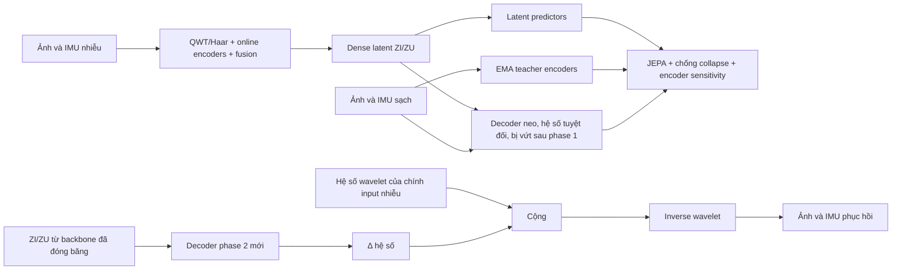

# QWT–JEPA v3 cho ảnh thiếu nhiễu sáng và IMU

Source: [leesanghyoek/qwt_jepa_ver3](https://github.com/leesanghyoek/qwt_jepa_ver3).
Trên Kaggle, bắt đầu từ [Cell 1: clone GitHub](KAGGLE_TRAIN_CELLS.md#cell-1--clone-source-từ-github-và-ghi-lại-commit),
sau đó chạy lần lượt các cell train và đánh giá.

Repository này triển khai pipeline hai giai đoạn theo
`QWT_JEPA_JACOBIAN_MIGRATION_GUIDE.md` và
`QWT_JEPA_V3_DETAILED_ARCHITECTURE_DIAGRAMS.md`:

## Tài liệu chạy Kaggle và kiến trúc thực tế

- [Các cell Kaggle, train, resume, đồ thị và kết quả](KAGGLE_TRAIN_CELLS.md).
- [Sơ đồ kiến trúc chi tiết và quy trình train](KIEN_TRUC_VA_QUY_TRINH_TRAIN.md).
- [Kết quả kiểm tra code và giới hạn còn lại](CODE_REVIEW_KAGGLE.md).

Backend ảnh hiện dùng bốn cây db4 dịch pha nguyên và pack 48 kênh. Round-trip đã
được kiểm thử; **chưa xác minh tương đương QWT reference/Hilbert pair**. Tên API
`qwt_dualtree_db4` được giữ để tương thích, không phải bằng chứng QWT chuẩn.

## Luồng tổng quát



Phase 1 **có** một decoder phụ làm *neo*: nó chấm điểm latent trên hệ số wavelet
sạch với trọng số `0.45`, rồi bị vứt bỏ khi phase 1 kết thúc. Không có neo này
JEPA vẫn đạt loss thấp trên một latent đã ném đi tín hiệu — đó đúng là kết quả
của lần train đầu tiên. Vẫn không có đường pixel-space trong phase 1
(`reconstruction_loss_weight: 0.0`).

Phase 2 tải checkpoint phase 1 hợp lệ, đóng băng encoder/fusion/normalizer, khởi
tạo **decoder hoàn toàn mới** và chỉ tối ưu hai decoder đó.

## Hai quyết định thiết kế quan trọng

**Decoder phase 2 dự đoán hiệu chỉnh, không dự đoán thay thế.** Với
`input_coefficient_residual: true`, đầu ra là `C_out = C_in + Δ(Z)` và head được
khởi tạo bằng 0, nên tại update 0 model trả lại **đúng** input. Đó là một sàn mà
model không thể tụt xuống dưới, và `Δ` chính là phần đóng góp đo được của latent:
ép `Δ = 0` là quay về baseline. Kiểm chứng end-to-end ở lần validate đầu tiên:

| | head tuyệt đối | **residual** | baseline (không làm gì) |
|---|---|---|---|
| PSNR | 6.26 | **11.43** | 11.40 |
| SSIM | 0.049 | **0.289** | 0.289 |
| accel | 1.631 | **0.612** | 0.613 |

**Decoder neo của phase 1 thì ngược lại: cố ý giữ hệ số tuyệt đối.** Cho nó dùng
residual sẽ để nó thoả mãn neo bằng `Δ ≈ 0` mà không ép được gì vào latent — phá
đúng mục đích của neo.

## Thành phần chính

- `qjepa/models/backbone.py`: QWT ảnh, Haar IMU, hai CNN encoder và gated fusion;
  trả `FI/FU/ZI/ZU`.
- `qjepa/models/pipeline.py`: hai wrapper phase riêng. `LatentPretrainingModel`
  chỉ nhận decoder neo khi `phase1.decoder_enabled` bật, và decoder đó không đi
  sang phase 2; `RestorationSystem` giữ backbone ở eval/frozen.
- `qjepa/models/decoders.py`: chỉ nhận `ZI/ZU`, không skip và không raw input.
  Upsample bằng sub-pixel conv (pixel shuffle) thay cho nội suy bilinear, vì
  bilinear là bộ lọc thông thấp nên không sinh được tần số cao. Ở chế độ residual,
  head zero-init và cộng vào hệ số của input.
- `qjepa/corruptions/image.py`: blur quang học, blur chuyển động, giảm độ phân
  giải, exposure thấp, gamma, white balance, vignette, shot/read/row noise, hot
  pixel, lượng tử và JPEG. Mỗi frame bốc tham số riêng nên độ sáng và độ nhoè
  thay đổi giữa các frame, không phải một hệ số cố định cho cả segment.
- `qjepa/corruptions/imu.py`: bandwidth blur, scale/cross-axis error, white noise
  có gain thay đổi theo thời gian, rung băng hẹp 8–45 Hz, spike, dropout và lượng
  tử. Bias instability bị **gate** sau `wander_probability: 0.25`: phần lớn window
  dao động *quanh* tín hiệu sạch, chỉ thỉnh thoảng mới lệch đi.
- `qjepa/training/phase1.py`: noisy-to-clean latent prediction, teacher EMA,
  variance/covariance trên tám raw maps và finite-difference Jacobian trước fusion.
- `qjepa/training/phase2.py`: L1 pixel + SmoothL1 accel/gyro cân bằng, **cộng
  thêm một số hạng riêng cho băng chi tiết** (LH/HL/HH của ảnh và nửa detail của
  Haar IMU) với trọng số `0.5`. Lý do: L1 pixel tối ưu về trung vị có điều kiện,
  mà với bài toán bất định như khử mờ thì trung vị đó *chính là ảnh mờ*, nên L1
  pixel một mình không thể tạo ra nét dù latent có tốt đến đâu. Optimizer chỉ
  chứa decoder.
- `qjepa/execution.py`: chọn thiết bị và bọc forward bằng `DataParallel` khi có
  hai GPU; chỉ dict tensor đi qua ranh giới gather nên loss vẫn thấy cả batch.
- `configs/pipeline_v3.yaml`: recipe chính RGB 256×256, IMU 128×6.
- `configs/kaggle_tartanair_v2.yaml`: cùng recipe đó, chỉ đổi đường dẫn/thiết bị/
  worker cho notebook Kaggle + dataset TartanAir V2.

## Chuẩn bị môi trường

```bash
python3 -m pip install -e '.[test]'
```

Có thể chạy trực tiếp từ root repository mà chưa cài package:

```bash
python3 -m qjepa --help
```

## Thiết bị chạy: một hoặc hai GPU

Pipeline chạy trong **một process** trên CPU, một GPU, hoặc hai GPU bằng
`torch.nn.DataParallel`. `runtime.gpu_count` nhận `auto` (mặc định, lấy tối đa hai
GPU đang thấy), `1` hoặc `2`; `train-phase1`, `train-phase2` và `evaluate` có cờ
`--gpus` để ghi đè cho một lệnh:

```bash
python3 -m qjepa train-phase1 --config configs/pipeline_v3.yaml \
  --manifest manifests/tartanair --output outputs/experiment_01 --gpus 2
```

`--gpus 2` **báo lỗi** nếu chỉ thấy một GPU, thay vì âm thầm chạy chậm trên một
GPU. Backend này không dùng `torchrun`/DDP: nếu `WORLD_SIZE>1` CLI sẽ từ chối.

Điểm quan trọng về ngữ nghĩa: `batch_size` trong config luôn là **batch toàn
cục**. Với B8 trên hai GPU mỗi GPU chạy 4 mẫu, nhưng chỉ *feature dense* được
gather về GPU chính rồi mới tính loss — variance/covariance và JEPA vẫn thấy đủ
8 mẫu. Thống kê chống collapse tính riêng từng GPU rồi lấy trung bình sẽ **sai**
(hai nửa batch hằng số cho variance loss khác hẳn cả batch), nên forward song
song chỉ trả dict tensor, không trả loss theo từng thiết bị.

Vì vậy số GPU là chi tiết thực thi, không phải siêu tham số train: nó không nằm
trong configuration hash, không đổi kết quả mong đợi, và có thể resume một run
1 GPU bằng 2 GPU hoặc ngược lại. Mỗi lệnh in một dòng `Execution: {...}` và ghi
cùng thông tin đó vào `metadata.execution` của checkpoint để truy vết sau này.

## Cấu trúc TartanAir được hỗ trợ

Mỗi trajectory cần có:

```text
<root>/<environment>/<Data_easy|Data_hard>/<Pxxx>/
├── image_lcam_front/*.png
└── imu/
    ├── acc.npy hoặc acc.txt
    ├── gyro.npy hoặc gyro.txt
    ├── imu_time.npy hoặc imu_time.txt
    └── cam_time.npy hoặc cam_time.txt
```

Manifest chia theo `(environment, trajectory_id)` trước khi tạo window. Hai bản
`Data_easy/Data_hard` của cùng chuyển động luôn nằm cùng split. Mỗi sample gồm
một frame và 128 hàng IMU liên tục; không padding và không nối qua trajectory.

`--data-root` phải là thư mục mà **con trực tiếp của nó là các environment**. Trỏ
cao hơn một bậc sẽ nhặt thêm bản sao khác của dataset; nếu bản sao đó nằm dưới
thư mục tên `train/valid/test` thì build-manifest dừng và nêu tên thư mục vi phạm.

Với dataset TartanAir V2 trên Kaggle, xem [kaggle_dataset.md](kaggle_dataset.md):
đối chiếu từng điểm với loader, cách split 83 motion key, và vì sao khoảng 13
frame mỗi trajectory bị loại (window 1,27 s phải bao quanh thời điểm chụp).

Tạo manifest và thống kê normalization từ các timestamp train sạch, mỗi timeline
trùng hoàn toàn chỉ được tính một lần:

```bash
python3 -m qjepa build-manifest \
  --config configs/pipeline_v3.yaml \
  --data-root /duong/dan/TartanAir \
  --output manifests/tartanair
```

Sau đó điền `data.manifest_dir` trong YAML hoặc truyền `--manifest` cho từng lệnh.

## Kiểm tra corruption camera tối

```bash
python3 -m qjepa preview-corruption \
  --config configs/pipeline_v3.yaml \
  --image anh_sach.png \
  --output outputs/corruption_panel.png
```

Panel gồm `clean | corrupted | absolute error`; file JSON cùng tên lưu toàn bộ
tham số đã bốc. Corruption dùng seed theo sample/trajectory nên có thể tái lập.
Thông số mặc định nhấn mạnh điều kiện tối (`exposure_gain=0.21..0.63`,
`tone_gamma=0.46..0.79`) và blur mạnh. Nên đo ảnh camera thật rồi chỉnh các khoảng trong YAML; nếu corruption mô
phỏng tối hơn hoặc khác noise profile thực tế quá nhiều, model sẽ học sai domain.

## Phase 1: chỉ học latent

```bash
python3 -m qjepa train-phase1 \
  --config configs/pipeline_v3.yaml \
  --manifest manifests/tartanair \
  --output outputs/experiment_01
```

Checkpoint `phase1/last.pt` bắt buộc có:

```text
pipeline_version = 3
phase = latent_pretrain
trained_with_reconstruction = <true khi bat neo, false khi tat>
phase1_decoder_forward_calls = <so lan decoder neo chay>
```

Hai trường cuối không còn bị ép về `false/0`, nhưng **phải nhất quán với nhau**:
`trained_with_reconstruction` đúng khi và chỉ khi decoder đã chạy ít nhất một
lần. Metadata không được phép nói dối về việc phase 1 đã dùng decoder hay chưa.

Batch phase 1 phải là B≥8 thật. Gradient accumulation không được dùng để giả lập
batch statistics cho variance/covariance. Trước khi phase 2 được phép chạy,
checkpoint còn phải đạt gate về same-position std, effective rank và raw feature
scale trên validation bank; ba lần cảnh báo liên tiếp sẽ dừng run để chẩn đoán.

Để so sánh đóng góp của Jacobian công bằng, chạy treatment bằng
`configs/pipeline_v3.yaml` và control bằng `configs/phase1_control.yaml`. Hai config
dùng cùng initialization seed, corruption seed và sampler seed; điểm khác duy nhất
là `encoder_sensitivity.enabled`.

## Phase 2: khôi phục từ latent đã học

```bash
python3 -m qjepa train-phase2 \
  --config configs/pipeline_v3.yaml \
  --manifest manifests/tartanair \
  --backbone-checkpoint outputs/experiment_01/phase1/last.pt \
  --output outputs/experiment_01
```

Lệnh từ chối checkpoint phase 1 sai provenance hoặc manifest hash không khớp.
Hai output là `phase2/last.pt` và `phase2/best_joint_validation.pt`.

Mỗi checkpoint in một dòng so sánh trực tiếp với baseline "không làm gì":

```text
validation update=250 | PSNR 11.43 vs 11.40 | SSIM 0.289 vs 0.289 | accel 0.612 vs 0.613 | VUOT baseline
```

Vì head zero-init, dòng validate **đầu tiên** đã phải là `VUOT baseline`. Nếu nó
báo `chua vuot` ngay lần đầu thì residual chưa thực sự bật — kiểm
`phase2.input_coefficient_residual` và `phase2.output_coefficients` trong config
đang dùng. `validate_config` từ chối config mà hai trường này mâu thuẫn nhau, nên
file không thể mô tả sai việc decoder đang làm gì.

## Đánh giá và inference

Đánh giá riêng clean/noisy, thiếu sáng, blur, sensor noise và các nhóm lỗi IMU:

```bash
python3 -m qjepa evaluate \
  --checkpoint outputs/experiment_01/phase2/best_joint_validation.pt \
  --manifest manifests/tartanair \
  --split test \
  --protocol \
  --output outputs/experiment_01/test_results
```

Mỗi phase tự xuất `training_curves.png`, `history.csv`, `training_summary.json`
khi hoàn tất. Lệnh `evaluate` xuất `metrics.json/csv`, `comparison.png`, panel
clean/noisy/restored/error, đồ thị IMU sáu trục và `.npz` sau gộp overlap. Có thể
vẽ lại từ log bằng `python3 -m qjepa plot-training --run-dir outputs/experiment_01`.

Khôi phục một ảnh và một window IMU. CSV nhận 6 cột IMU hoặc 7 cột gồm timestamp:

```bash
python3 -m qjepa infer \
  --checkpoint outputs/experiment_01/phase2/best_joint_validation.pt \
  --image frame.png \
  --imu imu_window.csv \
  --output outputs/inference_001
```

Output gồm `image_restored.png`, `imu_restored.csv` trong đơn vị m/s² và rad/s,
và `metadata.json`.

## Kiểm thử

```bash
python3 -m qjepa smoke --config configs/smoke.yaml
env PYTEST_DISABLE_PLUGIN_AUTOLOAD=1 pytest -q
```

Biến môi trường ở lệnh pytest chỉ tránh plugin ROS được cài toàn hệ thống tự nạp;
test của project không phụ thuộc ROS.

## Kết quả đã đo được

Đo trên TartanAir V2, split test, so với baseline "đưa thẳng input nhiễu ra":

| Cấu hình | Probe tuyến tính (IMU / ảnh) | PSNR | Baseline |
|---|---|---|---|
| Không neo phase 1 | 17% / 25% | thua baseline ở cả bốn metric | — |
| Neo `0.30`, head tuyệt đối | 43% / 49% | 17.87 | 16.56 |
| Neo `0.45`, head residual | *chưa train lại* | — | — |

**Probe tuyến tính** là hồi quy ridge từ latent đã đóng băng về mục tiêu sạch. Nó
là *cận dưới* của lượng thông tin rút được từ latent, và là chỉ số cho biết neo
có tác dụng hay không, độc lập với chất lượng decoder.

Giới hạn còn lại, đo bằng protocol 10 kịch bản: đầu ra của cấu hình "neo 0.30,
head tuyệt đối" **gần như độc lập với đầu vào** — input trải 107.4 dB PSNR thì
output chỉ nhúc nhích 1.94 dB, và một input gần sạch bị phá (`blur_only` vào
37.5 dB, ra 15.7 dB). Đó chính là lý do có residual. Nút thắt **không** nằm ở
decoder: decoder đã rút được 62–74% trong khi probe tuyến tính chỉ rút 43%, nên
thêm ResNet hay pointwise vào decoder không giải quyết được gì — giới hạn là số
chiều của `ZI`, mỗi ô latent phủ một khối 16×16 pixel.

Chưa làm: `encoder_skips` vẫn bị ghim `false` (chưa cài, và `encoders.py` cố ý
không trả feature trung gian), latent đa tỉ lệ, và adversarial loss.

## Giới hạn dữ liệu

JEPA teacher phase 1 và reconstruction loss phase 2 đều cần reference sạch trong
train. Ảnh từ camera kém chỉ dùng làm input deployment; nếu tập huấn luyện chỉ có
ảnh tối/nhiễu mà không có clean reference tương ứng, pipeline supervised này chưa
đủ thông tin để học target sạch. TartanAir clean có thể làm reference ban đầu,
nhưng cần fine-tune hoặc hiệu chỉnh corruption bằng dữ liệu camera thật để giảm
domain gap.
